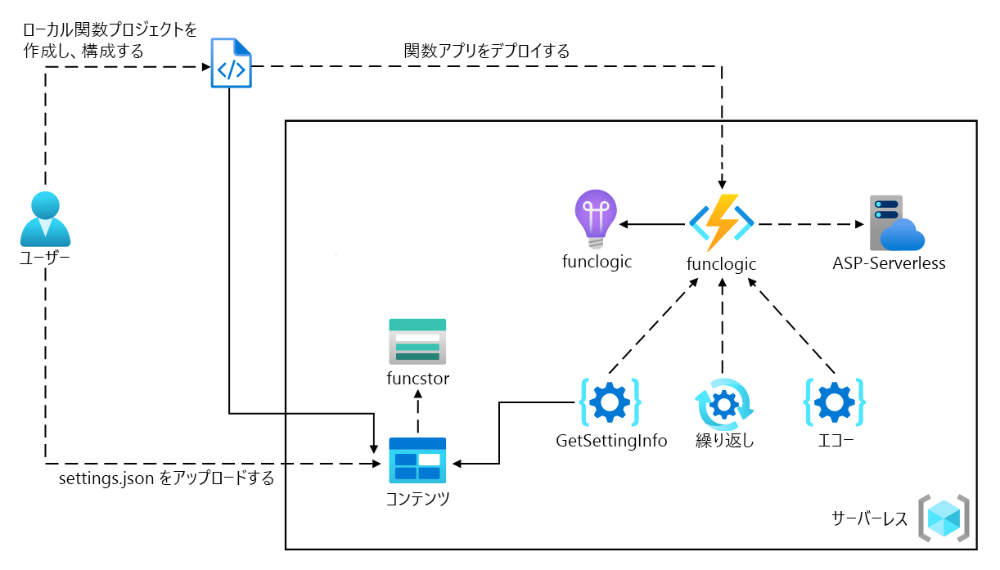

---
lab:
  az204Title: 'Lab 02: Implement task processing logic by using Azure Functions'
  az020Title: 'Lab 02: Implement task processing logic by using Azure Functions'
  az204Module: 'Module 02: Implement Azure Functions'
  az020Module: 'Module 02: Implement Azure Functions'
---

# <a name="lab-02-implement-task-processing-logic-by-using-azure-functions"></a>ラボ 02: Azure Functions を使用してタスク処理ロジックを実装する

## <a name="microsoft-azure-user-interface"></a>Microsoft Azure ユーザー インターフェイス

Given the dynamic nature of Microsoft cloud tools, you might experience Azure UI changes that occur after the development of this training content. As a result, the lab instructions and lab steps might not align correctly.

Microsoft updates this training course when the community alerts us to needed changes. However, cloud updates occur frequently, so you might encounter UI changes before this training content updates. <bpt id="p1">**</bpt>If this occurs, adapt to the changes, and then work through them in the labs as needed.<ept id="p1">**</ept>

## <a name="instructions"></a>Instructions

### <a name="before-you-start"></a>開始する前に

#### <a name="sign-in-to-the-lab-environment"></a>ラボ環境にサインインする

次の資格情報を使用して Windows 10 仮想マシン (VM) にサインインします。

- ユーザー名: **Admin**
- パスワード: **Pa55w.rd**

> **注**: 仮想ラボ環境に接続するための手順は、インストラクターから提供されます。

#### <a name="review-the-installed-applications"></a>インストールされているアプリケーションを確認する

Find the taskbar on your Windows 10 desktop. The taskbar contains the icons for the applications that you'll use in this lab, including:

- Microsoft Edge
- エクスプローラー
- Windows ターミナル
- Visual Studio Code

## <a name="architecture-diagram"></a>アーキテクチャの図



### <a name="exercise-1-create-azure-resources"></a>演習 1: Azure リソースを作成する

#### <a name="task-1-open-the-azure-portal"></a>タスク 1: Azure portal を開く

1. タスク バーで、**Microsoft Edge** アイコンを選択します。
1. ブラウザー ウィンドウで、Azure portal (<https://portal.azure.com>) に移動し、このラボで使用するアカウントでサインインします。

    > Microsoft クラウド ツールの動的な性質を考慮すると、このトレーニング コンテンツの開発の後に発生する Azure UI の変更に気付くかもしれません。

#### <a name="task-2-create-an-azure-storage-account"></a>タスク 2: Azure Storage アカウントを作成する

1. Azure portal で、 **[リソース、サービス、ドキュメントの検索]** テキスト ボックスを使用して**ストレージ アカウント**を検索し、結果の一覧で **[ストレージ アカウント]** を選択します。

1.  **[ストレージ アカウント]**  ブレードで **[+ 作成]** を選択します。

1. **[ストレージ アカウントを作成する]** ブレードの **[基本]** タブで、次のアクションを実行し、 **[確認および作成]** を選択します。

    | 設定 | アクション |
    | -- | -- |
    | **[サブスクリプション]** ドロップダウン リスト | 既定値のままにします |
    | **[リソース グループ]** セクション | **[新規作成]** を選択し、「**サーバーレス**」と入力して **[OK]** を選択します |
    | **[ストレージ アカウント名]**  テキスト ボックス | 「**funcstor** _[ご自分の名前]_ 」と入力します |
    | **[リージョン]** ドロップダウン リスト | **[(米国) 米国東部]** を選択します |
    | **[パフォーマンス]** セクション | **[Standard]** オプションを選択します |
    | **[冗長性]** ドロップダウン リスト | **[ローカル冗長ストレージ (LRS)]** を選択します |

    次のスクリーンショットには、 **[ストレージ アカウントを作成する]** ブレードで構成された設定が表示されています。

    ![[ストレージ アカウントを作成する] ブレードで構成された設定を表示したスクリーンショット](./media/l02_create_a_storage_account.png)

1. **[確認および作成]** タブで、前の手順で選択したオプションを確認します。

1. **[作成]** を選択して、指定した構成を使用してストレージ アカウントを作成します。

    > **注**: 作成タスクが完了するまで待ってから、このラボを続行してください。

1. **[概要]** ブレードで、 **[リソースに移動]** ボタンを選択して、新しく作成されたストレージ アカウントのブレードに移動します。

1.  **[ストレージ アカウント]**  ブレードの **[セキュリティとネットワーク]**  セクションで、 **[アクセス キー]** を選択します。

1.  **[アクセス キー]**  ブレードで、 **[キーの表示]** を選択します。

1. いずれかのキーを確認してから、いずれかの **[接続文字列]**  ボックスの値をクリップボードにコピーします。

     > その結果、ラボの指示とラボの手順が正しく整合しなくなる可能性があります。

1. Open Notepad, and then paste the copied connection string value to Notepad. You'll use this value later in this lab.

#### <a name="task-3-create-a-function-app"></a>タスク 3: 関数アプリを作成する

1. Azure portal のナビゲーション ウィンドウで、 **[リソースの作成]** リンクを選択します。

1. **[リソースの作成]** ブレードで、**[サービスとマーケットプレースの検索]** テキスト ボックスに「**関数**」と入力して Enter キーを押します。

1. **[マーケットプレース]** 検索結果ブレードで、 **[関数アプリ]** の結果を選択します。

1. **[関数アプリ]** ブレードで、 **[作成]** を選択します。

1. **[関数アプリの作成]** ブレードの **[基本]** タブで、次のアクションを実行してから、 **[次へ: ホスティング]** を選択します。

    | 設定 | アクション |
    | -- | -- |
    | **[サブスクリプション]** ドロップダウン リスト | 既定値のままにします |
    | **[リソース グループ]** セクション | **[サーバーレス]** を選択します |
    | **[関数アプリ名]**  テキスト ボックス | 「**funclogic** _[ご自分の名前]_ 」と入力します |
    | **[公開]** セクション | **[コード]** を選択します |
    | **[ランタイム スタック]** ドロップダウン リスト | **[.NET]** を選択します |
    | **[バージョン]** ドロップダウン リスト | **[6]** を選択します。 |
    | **[リージョン]** ドロップダウン リスト | **[米国東部]** リージョンを選択します |
    | **オペレーティング システム** オプション | **[Linux]** を選択します |
    | **[プランの種類]** ドロップダウン リスト | **[従量課金 (サーバーレス)]** を選択します |

    次のスクリーンショットには、 **[関数アプリの作成]** ブレードで構成された設定が表示されています。

    ![[関数アプリの作成] ブレードで構成された設定を表示しているスクリーンショット](./media/l02_create_a_function_app.png)

1. **[ホスティング]** タブで、次のアクションを実行し、 **[確認および作成]** を選択します。

    | 設定 | アクション |
    | -- | -- |
    | **[ストレージ アカウント]** ドロップダウン リスト | **[funcstor** _[ご自分の名前]]_ ストレージ アカウントを選択します。 |

1. **[確認と作成]** タブで、前の手順で選択したオプションを確認します。

1. **[作成]** を選択して、指定した構成を使用して関数アプリを作成します。

    > **注**: 作成タスクが完了するまで待ってから、このラボを続行してください。

#### <a name="review"></a>確認

この演習では、このラボで使用するすべてのリソースを作成しました。

### <a name="exercise-2-configure-a-local-azure-functions-project"></a>演習 2: ローカルの Azure Functions プロジェクトを構成する

#### <a name="task-1-initialize-a-function-project"></a>タスク 1: 関数プロジェクトを初期化する

1. タスク バーで、 **[Windows ターミナル]** アイコンを選択します。

1. 次のコマンドを実行して、現在のディレクトリを **Allfiles (F):\\Allfiles\\Labs\\02\\Starter\\func** の空のディレクトリに変更します。

    ```powershell
    cd F:\Allfiles\Labs\02\Starter\func
    ```

    > **注**: Windows エクスプローラーで、**F:\\Allfiles\\Labs\\02\\Starter\\func\\.gitignore** ファイルから**読み取り専用**属性を削除してください。

1. 次のコマンドを実行して、**dotnet** ランタイムを使用して、**Azure Functions Core Tools** を使用して現在のディレクトリ内に新しいローカルの Azure Functions プロジェクトを作成します。

    ```powershell
    func init --worker-runtime dotnet --force
    ```

    > **注**: **Azure Functions Core Tools** を使用して [新しいプロジェクトを作成する] ためのドキュメント [azure-functions-core-tools-new-project] を確認できます。
    
1. **[Windows ターミナル]** アプリケーションを閉じます。

#### <a name="task-2-configure-a-connection-string"></a>タスク 2: 接続文字列を構成する

1. **[スタート]** 画面で、 **[Visual Studio Code]** タイルを選択します。
1. **[ファイル]** メニューの **[フォルダーを開く]** を選択します。
1. 開く **[エクスプローラー]** ウィンドウで、**Allfiles (F):\\Allfiles\\Labs\\02\\Starter\\func** を参照し、 **[フォルダーの選択]** を選択します。
1. **[Visual Studio Code]** ウィンドウの **[エクスプローラー]** ペインで、**local.settings.json** ファイルを開きます。
1. **AzureWebJobsStorage** 設定の現在の値を確認します。

    ```json
    "AzureWebJobsStorage": "UseDevelopmentStorage=true",
    ```

1. **AzureWebJobsStorage** 要素の値を、このラボで前に記録したストレージ アカウントの **接続文字列**に変更します。
1. **local.settings.json** ファイルを保存します。

#### <a name="task-3-build-and-validate-a-project"></a>タスク 3: プロジェクトをビルドして検証する

1. タスク バーで、 **[Windows ターミナル]** アイコンを選択します。
1. 次のコマンドを実行して、現在のディレクトリを **Allfiles (F):\\Allfiles\\Labs\\02\\Starter\\func** ディレクトリに変更します。

    ```powershell
    cd F:\Allfiles\Labs\02\Starter\func
    ```

1. 次のコマンドを実行して、.NET Core 3.1 プロジェクトを**ビルド**します。

    ```powershell
    dotnet build
    ```

#### <a name="review"></a>確認

この演習では、Azure Functions の開発に使用するローカル プロジェクトを作成しました。

### <a name="exercise-3-create-a-function-thats-triggered-by-an-http-request"></a>演習 3: HTTP 要求によってトリガーされる関数を作成する

#### <a name="task-1-create-an-http-triggered-function"></a>タスク 1: HTTP によってトリガーされる関数を作成する

1. タスク バーで、 **[Windows ターミナル]** アイコンを選択します。
1. 次のコマンドを実行して、現在のディレクトリを **Allfiles (F):\\Allfiles\\Labs\\02\\Starter\\func** ディレクトリに変更します。

    ```powershell
    cd F:\Allfiles\Labs\02\Starter\func
    ```

1. 次のコマンドを実行して、**HTTP トリガー** テンプレートを使用して、**Azure Functions Core Tools** を使用して **Echo** という名前の新しい関数を作成します。

    ```powershell
    func new --template "HTTP trigger" --name "Echo"
    ```

    > **注**: **Azure Functions Core Tools** を使用して [新しい関数を作成する] ためのドキュメント [azure-functions-core-tools-new-function] を確認できます。

1. 現在実行中の **[Windows ターミナル]** アプリケーションを閉じます。

#### <a name="task-2-write-http-triggered-function-code"></a>タスク 2: HTTP によってトリガーされる関数コードを記述する

1. **[スタート]** 画面で、 **[Visual Studio Code]** タイルを選択します。
1. **[ファイル]** メニューの **[フォルダーを開く]** を選択します。
1. 開く **[エクスプローラー]** ウィンドウで、**Allfiles (F):\\Allfiles\\Labs\\02\\Starter\\func** を参照し、 **[フォルダーの選択]** を選択します。
1. **[Visual Studio Code]** ウィンドウの **[エクスプローラー]** ペインで、**Echo.cs** ファイルを開きます。
1. コード エディターで、実装の例を確認します。

    ```csharp
    using System;
    using System.IO;
    using System.Threading.Tasks;
    using Microsoft.AspNetCore.Mvc;
    using Microsoft.Azure.WebJobs;
    using Microsoft.Azure.WebJobs.Extensions.Http;
    using Microsoft.AspNetCore.Http;
    using Microsoft.Extensions.Logging;
    using Newtonsoft.Json;
    namespace func
    {
        public static class Echo
        {
            [FunctionName("Echo")]
            public static async Task<IActionResult> Run(
                [HttpTrigger(AuthorizationLevel.Function, "get", "post", Route = null)] HttpRequest req,
                ILogger log)
            {
                log.LogInformation("C# HTTP trigger function processed a request.");
                string name = req.Query["name"];
                string requestBody = await new StreamReader(req.Body).ReadToEndAsync();
                dynamic data = JsonConvert.DeserializeObject(requestBody);
                name = name ?? data?.name;
                string responseMessage = string.IsNullOrEmpty(name)
                    ? "This HTTP triggered function executed successfully. Pass a name in the query string or in the request body for a personalized response."
                    : $"Hello, {name}. This HTTP triggered function executed successfully.";
                return new OkObjectResult(responseMessage);
            }
        }
    }
    ```

1. **Echo.cs** ファイル内のすべての内容を削除します。
1. 次のコード行を追加して、**Microsoft.AspNetCore.Mvc**、**Microsoft.Azure.WebJobs**、**Microsoft.AspNetCore.Http**、**Microsoft.Extensions.Logging** の各名前空間の **using ディレクティブ**を追加します。

    ```csharp
    using Microsoft.AspNetCore.Mvc;
    using Microsoft.Azure.WebJobs;
    using Microsoft.AspNetCore.Http;
    using Microsoft.Extensions.Logging;
    ```

1. **Echo** という名前の新しい **public static** クラスを作成します。

    ```csharp
    public static class Echo
    { }
    ```

1. **Echo.cs** ファイルを再び確認します。次の行が含まれているはずです。

    ```csharp
    using Microsoft.AspNetCore.Mvc;
    using Microsoft.Azure.WebJobs;
    using Microsoft.AspNetCore.Http;
    using Microsoft.Extensions.Logging;
    public static class Echo
    { }
    ```

1. **Echo** クラス内に次のコード ブロックを追加して、型 **IActionResult** の変数を返すと共に、型 **HttpRequest** と **ILogger** の変数も *request* と *logger* という名前のパラメーターとして受け取る **Run** という名前の新しい **public static** メソッドを作成します。

    ```csharp
    public static IActionResult Run(
        HttpRequest request,
        ILogger logger)
    { }
    ```

1. 次のコードを追加して、その **name** パラメーターが **Echo** の値に設定された型 **FunctionNameAttribute** の属性を **Run** メソッドに追加します。

    ```csharp
    [FunctionName("Echo")]
    public static IActionResult Run(
        HttpRequest request,
        ILogger logger)
    { }
    ```

1. 次のコードを追加して、その **methods** パラメーター配列が **POST** の単一値に設定された型 **HttpTriggerAttribute** の属性を **request** パラメーターに追加します。

    ```csharp
    [FunctionName("Echo")]
    public static IActionResult Run(
        [HttpTrigger("POST")] HttpRequest request,
        ILogger logger)
    { }
    ```

1. **Echo.cs** ファイルを再び確認します。次のコードが含まれているはずです。

    ```csharp
    using Microsoft.AspNetCore.Mvc;
    using Microsoft.Azure.WebJobs;
    using Microsoft.AspNetCore.Http;
    using Microsoft.Extensions.Logging;
    public static class Echo
    {
        [FunctionName("Echo")]
        public static IActionResult Run(
            [HttpTrigger("POST")] HttpRequest request,
            ILogger logger)
        { }
    }
    ```

1. **Run** メソッドで、固定メッセージをログに記録するための次のコード行を入力します。

    ```csharp
    logger.LogInformation("Received a request");
    ```

1. HTTP 要求の本文を HTTP 応答としてエコーするための次のコード行を入力します。

    ```csharp
    return new OkObjectResult(request.Body);
    ```

1. **Echo.cs** ファイルを再び確認します。次のコードが含まれているはずです。

    ```csharp
    using Microsoft.AspNetCore.Mvc;
    using Microsoft.Azure.WebJobs;
    using Microsoft.AspNetCore.Http;
    using Microsoft.Extensions.Logging;
    public static class Echo
    {
        [FunctionName("Echo")]
        public static IActionResult Run(
            [HttpTrigger("POST")] HttpRequest request,
            ILogger logger)
        {
            logger.LogInformation("Received a request");
            return new OkObjectResult(request.Body);
        }
    }
    ```

1. **[保存]** を選択して、変更内容を **Echo.cs** ファイルに保存します。

#### <a name="task-3-test-the-http-triggered-function-by-using-httprepl"></a>タスク 3: httprepl を使用して、HTTP によってトリガーされる関数をテストする

1. タスク バーで、 **[Windows ターミナル]** アイコンを選択します。
1. 次のコマンドを実行して、現在のディレクトリを **Allfiles (F):\\Allfiles\\Labs\\02\\Starter\\func** ディレクトリに変更します。

    ```powershell
    cd F:\Allfiles\Labs\02\Starter\func
    ```

1. 次のコマンドを実行して、関数アプリ プロジェクトを実行します。

    ```powershell
    func start --build
    ```

    > **注**: **Azure Functions Core Tools** を使用して[関数アプリ プロジェクトをローカルで開始する](https://docs.microsoft.com/azure/azure-functions/functions-develop-local)ためのドキュメントを確認できます。
    
1. Microsoft は、コミュニティから必要な変更の通知があったときに、このトレーニング コースを更新します。

    ```powershell
    cd F:\Allfiles\Labs\02\Starter\func
    ```
    
1. コマンド プロンプトから、次のコマンドを実行して **httprepl** ツールをインストールして起動し、ベース URI (Uniform Resource Identifier) を ``http://localhost:7071`` に設定します。

    ```powershell
    dotnet tool install -g Microsoft.dotnet-httprepl
    httprepl http://localhost:7071
    ```

    > ただし、クラウドの更新は頻繁に発生するため、このトレーニング コンテンツの更新の前に UI の変更に気付く可能性があります。
1. ツールのプロンプトから、次のコマンドを実行して、相対 **api** ディレクトリを参照します。

    ```powershell
    cd api
    ```

1. 次のコマンドを実行して、相対的な **echo** ディレクトリを参照します。

    ```powershell
    cd echo
    ```

1. 次のコマンドを実行して **post** コマンドを実行し、 **\-\-content** オプションを使用して、**3** の数値に設定された HTTP 要求本文を送信します。

    ```powershell
    post --content 3
    ```

1. 次のコマンドを実行して **post** コマンドを実行し、 **\-\-content** オプションを使用して、**5** の数値に設定された HTTP 要求本文を送信します。

    ```powershell
    post --content 5
    ```

1. 次のコマンドを実行して **post** コマンドを実行し、 **\-\-content** オプションを使用して、**Hello** の文字列値に設定された HTTP 要求本文を送信します。

    ```powershell
    post --content "Hello"
    ```

1. 次のコマンドを実行して **post** コマンドを実行し、 **\-\-content** オプションを使用して、 **{"msg": "Successful"}** の JSON (JavaScript Object Notation) 値に設定された HTTP 要求本文を送信します。

    ```powershell
    post --content "{"msg": "Successful"}"
    ```

1. 次のコマンドを実行して、**httprepl** アプリケーションを終了します。

    ```powershell
    exit
    ```

1. **[Windows ターミナル]** アプリケーションの現在実行中のすべてのインスタンスを閉じます。

#### <a name="review"></a>確認

この演習では、HTTP POST 要求を経由して送信されたコンテンツをエコーする基本的な関数を作成しました。

### <a name="exercise-4-create-a-function-that-triggers-on-a-schedule"></a>演習 4: スケジュールに従ってトリガーされる関数を作成する

#### <a name="task-1-create-a-schedule-triggered-function"></a>タスク 1: スケジュールによってトリガーされる関数を作成する

1. タスク バーで、 **[Windows ターミナル]** アイコンを選択します。
1. 次のコマンドを実行して、現在のディレクトリを **Allfiles (F):\\Allfiles\\Labs\\02\\Starter\\func** ディレクトリに変更します。

    ```powershell
    cd F:\Allfiles\Labs\02\Starter\func
    ```

1. コマンド プロンプトから、次のコマンドを実行して **Azure Functions Core Tools** を使用し、**タイマー トリガー** テンプレートを使って **Recurring** という名前の新しい関数を作成します。

    ```powershell
    func new --template "Timer trigger" --name "Recurring"
    ```

    > **注**: **Azure Functions Core Tools** を使用して [新しい関数を作成する] ためのドキュメント [azure-functions-core-tools-new-function] を確認できます。
    
1. 現在実行中の **[Windows ターミナル]** アプリケーションを閉じます。

#### <a name="task-2-observe-function-code"></a>タスク 2: 関数コードを確認する

1. **[スタート]** 画面で、 **[Visual Studio Code]** タイルを選択します。
1. **[ファイル]** メニューの **[フォルダーを開く]** を選択します。
1. 開く **[エクスプローラー]** ウィンドウで、**Allfiles (F):\\Allfiles\\Labs\\02\\Starter\\func** を参照し、 **[フォルダーの選択]** を選択します。
1. **[Visual Studio Code]** ウィンドウの **[エクスプローラー]** ペインで、**Recurring.cs** ファイルを開きます。
1. コード エディターで、実装を確認します。

    ```csharp
    using System;
    using Microsoft.Azure.WebJobs;
    using Microsoft.Azure.WebJobs.Host;
    using Microsoft.Extensions.Logging;    
    namespace func
    {
        public static class Recurring
        {
            [FunctionName("Recurring")]
            public static void Run([TimerTrigger("0 */5 * * * *")]TimerInfo myTimer, ILogger log)
            {
                log.LogInformation($"C# Timer trigger function executed at: {DateTime.Now}");
            }
        }
    }
    ```

#### <a name="task-3-observe-function-runs"></a>タスク 3: 関数の実行を確認する

1. タスク バーで、 **[Windows ターミナル]** アイコンを選択します。
1. 次のコマンドを実行して、現在のディレクトリを **Allfiles (F):\\Allfiles\\Labs\\02\\Starter\\func** ディレクトリに変更します。

    ```powershell
    cd F:\Allfiles\Labs\02\Starter\func
    ```

1. コマンド プロンプトから、次のコマンドを実行して、関数アプリ プロジェクトを実行します。

    ```powershell
    func start --build
    ```

    > **注**: **Azure Functions Core Tools** を使用して [関数アプリ プロジェクトをローカルで開始する] ためのドキュメント [azure-functions-core-tools-start-function] を確認できます。
1. **これが発生した場合は、その変更に適応し、ラボでは必要に応じてそれらに対応してください。**
1. 現在実行中の **[Windows ターミナル]** アプリケーションを閉じます。

#### <a name="task-4-update-the-function-integration-configuration"></a>タスク 4: 関数統合構成を更新する

1. **[スタート]** 画面で、 **[Visual Studio Code]** タイルを選択します。
1. **[ファイル]** メニューの **[フォルダーを開く]** を選択します。
1. 開く **[エクスプローラー]** ウィンドウで、**Allfiles (F):\\Allfiles\\Labs\\02\\Starter\\func** を参照し、 **[フォルダーの選択]** を選択します。
1. **[Visual Studio Code]** ウィンドウの **[エクスプローラー]** ペインで、**Recurring.cs** ファイルを開きます。
1. コード エディターで、既存の **Run** メソッド シグネチャを確認します。

    ```csharp
    [FunctionName("Recurring")]
    public void Run([TimerTrigger("0 */5 * * * *")]TimerInfo myTimer, ILogger log)
    ```

1. **Run** メソッド シグネチャのコード ブロックを更新して、スケジュールが **30 秒**ごとに 1 回実行されるように変更します。

    ```csharp
    [FunctionName("Recurring")]
    public void Run([TimerTrigger("*/30 * * * * *")]TimerInfo myTimer, ILogger log)
    ```

1. **[保存]** を選択して、変更内容を **Recurring.cs** ファイルに保存します。

#### <a name="task-5-observe-function-runs"></a>タスク 5: 関数の実行を確認する

1. タスク バーで、 **[Windows ターミナル]** アイコンを選択します。

1. 次のコマンドを実行して、現在のディレクトリを **Allfiles (F):\\Allfiles\\Labs\\02\    \Starter\\func** ディレクトリに変更します。

    ```powershell
    cd F:\Allfiles\Labs\02\Starter\func
    ```

1. 1. コマンド プロンプトから、次のコマンドを実行して、関数アプリ プロジェクトを実行します。

    ```powershell
    func start --build
    ```
    
    > **注**: **Azure Functions Core Tools** を使用して [関数アプリ プロジェクトをローカルで開始する] ためのドキュメント [azure-functions-core-tools-start-function] を確認できます。
    
1. Observe the function run that occurs about every 30 seconds. Each function run should render a simple message to the log.

1. 現在実行中の **[Windows ターミナル]** アプリケーションを閉じます。

1. [Visual Studio Code] ウィンドウを閉じます。

#### <a name="review"></a>確認

この演習では、固定スケジュールに基づいて自動的に実行される関数を作成しました。

### <a name="exercise-5-create-a-function-that-integrates-with-other-services"></a>演習 5: 他のサービスと統合する関数を作成する

#### <a name="task-1-upload-sample-content-to-azure-blob-storage"></a>タスク 1: サンプル コンテンツを Azure Blob Storage にアップロードする

1. Azure portal の**ナビゲーション** ウィンドウで、 **[リソース グループ]** リンクを選択します。
1. **[リソース グループ]** ブレードで、このラボで前に作成した **[Serverless]** リソース グループを選択します。
1. **[Serverless]** ブレードで、このラボで前に作成した **[funcstor** _[yourname]]_ ストレージ アカウントを選択します。
1. **[ストレージ アカウント]** ブレードで、 **[データ ストレージ]** セクションの **[コンテナー]** リンクを選択します。
1. **[コンテナー]** セクションで、 **[+ コンテナー]** を選択します。
1. **[新しいコンテナー]** ポップアップ ウィンドウで、次のアクションを実行し、 **[作成]** を選択します。

    | 設定 | アクション |
    | -- | -- |
    | **[名前]** テキスト ボックス  | 「**content**」と入力します |
    | **[パブリック アクセス レベル]** ドロップダウン リスト  | **[非公開 (匿名アクセスなし)]** を選択します |

1. **[コンテナー]** セクションに戻り、最近作成された **[content]** コンテナーを選択します。
1. **[コンテナー]** ブレードで、 **[アップロード]** を選択します。
1. **[BLOB のアップロード]** ウィンドウで、次のアクションを実行し、 **[アップロード]** を選択します。

    | 設定 | アクション |
    | -- | -- |
    | **[ファイル]** セクション  | **[フォルダー]** アイコンを選択します |
    | **[エクスプローラー]** ウィンドウ  | **Allfiles (F):\\Allfiles\\Labs\\02\\Starter** を参照し、**settings.json** ファイルを選択してから **[開く]** を選択します |
    | **[ファイルが既に存在する場合は上書きする]** チェック ボックス | このチェック ボックスがオンになっていることを確認します |

      > **注**: BLOB がアップロードされるまで待ってから、このラボを続行してください。

#### <a name="task-2-create-an-http-triggered-function"></a>タスク 2: HTTP によってトリガーされる関数を作成する

1. タスク バーで、 **[Windows ターミナル]** アイコンを選択します。
1. 次のコマンドを実行して、現在のディレクトリを **Allfiles (F):\\Allfiles\\Labs\\02\\Starter\\func** ディレクトリに変更します。

    ```powershell
    cd F:\Allfiles\Labs\02\Starter\func
    ```

1. コマンド プロンプトから、次のコマンドを実行して、**HTTP トリガー** テンプレートを使用して、**Azure Functions Core Tools** を使い **GetSettingInfo** という名前の新しい関数を作成します。

    ```powershell
    func new --template "HTTP trigger" --name "GetSettingInfo"
    ```

    > **注**: **Azure Functions Core Tools** を使用して [新しい関数を作成する] ためのドキュメント [azure-functions-core-tools-new-function] を確認できます。
1. 現在実行中の **[Windows ターミナル]** アプリケーションを閉じます。

#### <a name="task-3-write-http-triggered-and-blob-inputted-function-code"></a>タスク 3: HTTP によってトリガーされる、BLOB が入力された関数コードを記述する

1. **[スタート]** 画面で、 **[Visual Studio Code]** タイルを選択します。
1. **[ファイル]** メニューの **[フォルダーを開く]** を選択します。
1. 開く **[エクスプローラー]** ウィンドウで、**Allfiles (F):\\Allfiles\\Labs\\02\\Starter\\func** を参照し、 **[フォルダーの選択]** を選択します。
1. **[Visual Studio Code]** ウィンドウの **[エクスプローラー]** ペインで、**GetSettingInfo.cs** ファイルを開きます。
1. コード エディターで、実装の例を確認します。

    ```csharp
    using System;
    using System.IO;
    using System.Threading.Tasks;
    using Microsoft.AspNetCore.Mvc;
    using Microsoft.Azure.WebJobs;
    using Microsoft.Azure.WebJobs.Extensions.Http;
    using Microsoft.AspNetCore.Http;
    using Microsoft.Extensions.Logging;
    using Newtonsoft.Json;    
    namespace func
    {
        public static class GetSettingInfo
        {
            [FunctionName("GetSettingInfo")]
            public static async Task<IActionResult> Run(
                [HttpTrigger(AuthorizationLevel.Function, "get", "post", Route = null)] HttpRequest req,
                ILogger log)
            {
                log.LogInformation("C# HTTP trigger function processed a request.");    
                string name = req.Query["name"];    
                string requestBody = await new StreamReader(req.Body).ReadToEndAsync();
                dynamic data = JsonConvert.DeserializeObject(requestBody);
                name = name ?? data?.name;    
                string responseMessage = string.IsNullOrEmpty(name)
                    ? "This HTTP triggered function executed successfully. Pass a name in the query string or in the request body for a personalized response."
                    : $"Hello, {name}. This HTTP triggered function executed successfully.";    
                return new OkObjectResult(responseMessage);
            }
        }
    }
    ```

1. **GetSettingInfo.cs** ファイル内のすべての内容を削除します。

1. 次のコード行を追加して、**Microsoft.AspNetCore.Http**、**Microsoft.AspNetCore.Mvc**、**Microsoft.Azure.WebJobs** の各名前空間の **using ディレクティブ**を追加します。

    ```csharp
    using Microsoft.AspNetCore.Http;
    using Microsoft.AspNetCore.Mvc;
    using Microsoft.Azure.WebJobs;
    ```

1. **GetSettingInfo** という名前の新しい **public static** クラスを作成します。

    ```csharp
    public static class GetSettingInfo
    { }
    ```

1. **GetSettingInfo.cs** ファイルを再び確認します。次のコードが含まれているはずです。

    ```csharp
    using Microsoft.AspNetCore.Http;
    using Microsoft.AspNetCore.Mvc;
    using Microsoft.Azure.WebJobs;
    public static class GetSettingInfo
    { }
    ```

1. **GetSettingInfo** クラス内に次のコード ブロックを追加して、型 **IActionResult** の変数を返すと共に、型 **HttpRequest** と **string** の変数も *request* と *json* という名前のパラメーターとして受け取る **Run** という名前の新しい **public static** 式形式のメソッドを作成します。

    ```csharp
    public static IActionResult Run(
        HttpRequest request,
        string json)
        => null;
    ```

    > **注**: 戻り値を **null** に設定しているのは一時的な操作にすぎません。

1. 次のコードを追加して、その **name** パラメーターが **GetSettingInfo** の値に設定された型 **FunctionNameAttribute** の属性を **Run** メソッドに追加します。

    ```csharp
    [FunctionName("GetSettingInfo")]
    public static IActionResult Run(
        HttpRequest request,
        string json)
        => null;
    ```

1. 次のコードを追加して、その **methods** パラメーター配列が **GET** の単一値に設定された型 **HttpTriggerAttribute** の属性を **request** パラメーターに追加します。

    ```csharp
    [FunctionName("GetSettingInfo")]
    public static IActionResult Run(
        [HttpTrigger("GET")] HttpRequest request,
        string json)
        => null;
    ```

1. 次のコードを追加して、その **blobPath** パラメーターが **content/settings.json** の値に設定された型 **BlobAttribute** の属性を **json** パラメーターに追加します。

    ```csharp
    [FunctionName("GetSettingInfo")]
    public static IActionResult Run(
        [HttpTrigger("GET")] HttpRequest request,
        [Blob("content/settings.json")] string json)
        => null;
    ```

1. 次のコードを追加して、**json** メソッド パラメーターの値を唯一のコンストラクター パラメーターとして渡す **OkObjectResult** クラスの新しいインスタンスを返すように **Run** 式形式のメソッドを更新します。

    ```csharp
    [FunctionName("GetSettingInfo")]
    public static IActionResult Run(
        [HttpTrigger("GET")] HttpRequest request,
        [Blob("content/settings.json")] string json)
        => new OkObjectResult(json);
    ```

1. **GetSettingInfo.cs** ファイルを再び確認します。次のコードが含まれているはずです。

    ```csharp
    using Microsoft.AspNetCore.Http;
    using Microsoft.AspNetCore.Mvc;
    using Microsoft.Azure.WebJobs;
    public static class GetSettingInfo
    {
        [FunctionName("GetSettingInfo")]
        public static IActionResult Run(
            [HttpTrigger("GET")] HttpRequest request,
            [Blob("content/settings.json")] string json)
            => new OkObjectResult(json);
    }
    ```

1. **[保存]** を選択して、変更内容を **GetSettingInfo.cs** ファイルに保存します。

#### <a name="task-4-register-azure-storage-blob-extensions"></a>タスク 4: Azure Storage Blob の拡張機能を登録する

1. タスク バーで、 **[Windows ターミナル]** アイコンを選択します。
1. 次のコマンドを実行して、現在のディレクトリを **Allfiles (F):\\Allfiles\\Labs\\02\\Starter\\func** ディレクトリに変更します。

    ```powershell
    cd F:\Allfiles\Labs\02\Starter\func
    ```

1. コマンド プロンプトから、次のコマンドを実行して、[Microsoft.Azure.WebJobs.Extensions.Storage](https://www.nuget.org/packages/Microsoft.Azure.WebJobs.Extensions.Storage/) の拡張機能を登録します。

    ```powershell
    func extensions install --package Microsoft.Azure.WebJobs.Extensions.Storage --version 5.0.1
    ```

1. 次のコマンドを実行して、.NET プロジェクトをビルドし、拡張機能が正しくインストールされたことを検証します。

    ```powershell
    dotnet build
    ```

1. **[Windows ターミナル]** アプリケーションの現在実行中のすべてのインスタンスを閉じます。

#### <a name="task-5-test-the-function-by-using-httprepl"></a>タスク 5: httprepl を使用して関数をテストする

1. タスク バーで、 **[Windows ターミナル]** アイコンを選択します。
1. 次のコマンドを実行して、現在のディレクトリを **Allfiles (F):\\Allfiles\\Labs\\02\\Starter\\func** ディレクトリに変更します。

    ```powershell
    cd F:\Allfiles\Labs\02\Starter\func
    ```

1. コマンド プロンプトから、次のコマンドを実行して、関数アプリ プロジェクトを実行します。

    ```powershell
    func start --build
    ```

    > **注**: **Azure Functions Core Tools** を使用して [関数アプリ プロジェクトをローカルで開始する] ためのドキュメント [azure-functions-core-tools-start-function] を確認できます。
1. タスク バーで、 **[Windows ターミナル]** アイコンをもう一度選択して、**Windows ターミナル** アプリケーションの新しいインスタンスを開きます。
1. コマンド プロンプトから、次のコマンドを実行して **httprepl** ツールを起動し、ベース URI (Uniform Resource Identifier) を ``http://localhost:7071`` に設定します。

    ```powershell
    httprepl http://localhost:7071
    ```

    > <bpt id="p1">**</bpt>Note<ept id="p1">**</ept>: An error message is displayed by the <bpt id="p2">**</bpt>httprepl<ept id="p2">**</ept> tool. This message occurs because the tool is searching for a Swagger definition file to use to traverse the API. Because your function project doesn't produce a Swagger definition file, you'll need to traverse the API manually.

1. ツール プロンプトが表示されたら、次のコマンドを実行して、相対的な **api** エンドポイントを参照します。

    ```powershell
    cd api
    ```

1. 次のコマンドを実行して、相対的な **getsettinginfo** エンドポイントを参照します。

    ```powershell
    cd getsettinginfo
    ```

1. 次のコマンドを実行して、現在のエンドポイントに対する **get** コマンドを実行します。

    ```powershell
    get
    ```

1. 関数アプリからの応答の JSON コンテンツを確認します。次の行が含まれているはずです。

    ```json
    {
        "version": "0.2.4",
        "root": "/usr/libexec/mews_principal/",
        "device": {
            "id": "21e46d2b2b926cba031a23c6919"
        },
        "notifications": {
            "email": "joseph.price@contoso.com",
            "phone": "(425) 555-0162 x4151"
        }
    }
    ```

1. 次のコマンドを実行して、**httprepl** アプリケーションを終了します。

    ```powershell
    exit
    ```

1. **[Windows ターミナル]** アプリケーションの現在実行中のすべてのインスタンスを閉じます。

#### <a name="review"></a>確認

この演習では、ストレージ内の JSON ファイルのコンテンツを返す関数を作成しました。

### <a name="exercise-6-deploy-a-local-function-project-to-an-azure-functions-app"></a>演習 6: ローカル関数プロジェクトを Azure Functions アプリにデプロイする

#### <a name="task-1-deploy-using-the-azure-functions-core-tools"></a>タスク 1: Azure Functions Core Tools を使用してデプロイする

1. タスク バーで、 **[Windows ターミナル]** アイコンを選択します。
1. 次のコマンドを実行して、現在のディレクトリを **Allfiles (F):\\Allfiles\\Labs\\02\\Starter\\func** ディレクトリに変更します。

    ```powershell
    cd F:\Allfiles\Labs\02\Starter\func
    ```

1. コマンド プロンプトから、次のコマンドを実行して、Azure コマンド ライン インターフェイス (CLI) にログインします。

    ```powershell
    az login
    ```

1. **Microsoft Edge** ブラウザー ウィンドウで、このラボで使用している Microsoft または Azure Active Directory アカウントの名前とパスワードを入力し、 **[サインイン]** を選択します。
1. Return to the currently open <bpt id="p1">**</bpt>Windows Terminal<ept id="p1">**</ept> window. Wait for the sign-in process to finish.
1. コマンド プロンプトから、次のコマンドを実行して関数アプリ プロジェクトを発行します (`<function-app-name>` プレースホルダー を、このラボで前に作成した関数アプリの名前に置き換えます)。

    ```powershell
    func azure functionapp publish <function-app-name>
    ```

    > <bpt id="p1">**</bpt>Note<ept id="p1">**</ept>: For example, if your <bpt id="p2">**</bpt>Function App name<ept id="p2">**</ept> is <bpt id="p3">**</bpt>funclogicstudent<ept id="p3">**</ept>, your command would be <ph id="ph1">``func azure functionapp publish funclogicstudent``</ph>. You can review the documentation to [publish the local function app project][azure-functions-core-tools-publish-azure] using the <bpt id="p1">**</bpt>Azure Functions Core Tools<ept id="p1">**</ept>.

1. デプロイが完了するまで待ってから、このラボを続行してください。
1. 現在実行中の **[Windows ターミナル]** アプリケーションを閉じます。

#### <a name="task-2-validate-deployment"></a>タスク 2: デプロイを検証する

1. タスク バーで、 **[Microsoft Edge]** アイコンを選択し、Azure portal (<https://portal.azure.com>) が含まれているタブを選択します。
1. Azure portal の **[ナビゲーション]** ペインで、 **[リソース グループ]** リンクを選択します。
1. **[リソース グループ]** ブレードで、このラボで前に作成した **[Serverless]** リソース グループを選択します。
1. **[Serverless]** ブレードで、このラボで前に作成した **[funclogic** _[yourname]]_ 関数アプリを選択します。
1. **[関数アプリ]** ブレードで、 **[関数]** セクションの **[関数]** オプションを選択します。
1. **[関数]** ペインで、既存の **[GetSettingInfo]** 関数を選択します。
1. **[関数]** ブレードで、 **[開発者]** セクションの **[コードとテスト]** オプションを選択します。
1. 関数エディターで、 **[テストと実行]** を選択します。
1. 自動的に表示されるペインの **[HTTP メソッド]** ドロップダウン リストで、 **[GET]** を選択します。
1. **[実行]** を選択して、関数をテストします。
1. In the <bpt id="p1">**</bpt>HTTP response content<ept id="p1">**</ept>, review the results of the test run. The JSON content should now include the following code:

    ```json
    {
        "version": "0.2.4",
        "root": "/usr/libexec/mews_principal/",
        "device": {
            "id": "21e46d2b2b926cba031a23c6919"
        },
        "notifications": {
            "email": "joseph.price@contoso.com",
            "phone": "(425) 555-0162 x4151"
        }
    }
    ```

#### <a name="review"></a>確認

この演習では、ローカル関数プロジェクトを Azure Functions にデプロイし、それらの関数が Azure で動作することを検証しました。

### <a name="exercise-7-clean-up-your-subscription"></a>演習 7: サブスクリプションをクリーンアップする

#### <a name="task-1-open-azure-cloud-shell-and-list-resource-groups"></a>タスク 1: Azure Cloud Shell を開き、リソース グループを一覧表示する

1.  In the Azure portal, select the <bpt id="p1">**</bpt>Cloud Shell<ept id="p1">**</ept> icon <ph id="ph1"></ph> to open a new Bash session. If Cloud Shell defaults to a PowerShell session, select <bpt id="p1">**</bpt>PowerShell<ept id="p1">**</ept>, and in the drop-down menu, select <bpt id="p2">**</bpt>Bash<ept id="p2">**</ept>.

    > <bpt id="p1">**</bpt>Note<ept id="p1">**</ept>: If this is the first time you're starting <bpt id="p2">**</bpt>Cloud Shell<ept id="p2">**</ept>, when prompted to select either <bpt id="p3">**</bpt>Bash<ept id="p3">**</ept> or <bpt id="p4">**</bpt>PowerShell<ept id="p4">**</ept>, select <bpt id="p5">**</bpt>PowerShell<ept id="p5">**</ept>. When you're presented with the <bpt id="p1">**</bpt>You have no storage mounted<ept id="p1">**</ept> message, select the subscription you're using in this lab, and then select <bpt id="p2">**</bpt>Create storage<ept id="p2">**</ept>.

#### <a name="task-2-delete-a-resource-group"></a>タスク 2: リソース グループを削除する

1. **[Cloud Shell]** ペインで、次のコマンドを実行して、 **[Serverless]** リソース グループを削除します。

    ```powershell
    az group delete --name Serverless --no-wait --yes
    ```
     > **注**: このコマンドは非同期的に実行される ( *--no-wait* パラメーターによって決定されます) ため、同じ Bash セッション内で直後に別の Azure CLI コマンドを実行できますが、リソース グループが削除されるまでに数分かかります。

1. portal の **[Cloud Shell]** ペインを閉じます。

#### <a name="task-3-close-the-active-application"></a>タスク 3: アクティブなアプリケーションを閉じる

- 現在実行中の Microsoft Edge アプリケーションを閉じます。

#### <a name="review"></a>確認

この演習では、このラボで使用したリソース グループを削除してサブスクリプションをクリーンアップしました。
