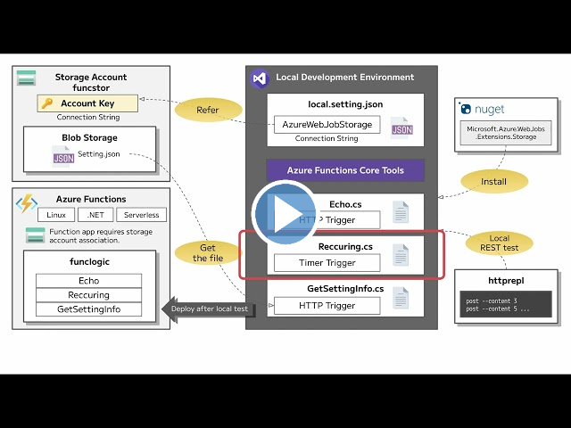

---
lab:
  az204Title: 'Lab 02: Implement task processing logic by using Azure Functions'
  az204Module: 'Learning Path 02: Implement Azure Functions'
---

# ラボ 02: Azure Functions を使用してタスク処理ロジックを実装する

## Microsoft Azure ユーザー インターフェイス

Microsoft クラウド ツールの動的な性質を考慮すると、このトレーニング コンテンツの開発の後に発生する Azure UI の変更に気付くかもしれません。 その結果、ラボの指示とラボの手順が正しく整合しなくなる可能性があります。

Microsoft は、コミュニティから必要な変更の通知があったときに、このトレーニング コースを更新します。 ただし、クラウドの更新は頻繁に発生するため、このトレーニング コンテンツの更新の前に UI の変更に気付く可能性があります。 **これが発生した場合は、その変更に適応し、ラボでは必要に応じてそれらに対応してください。**

## Instructions

### 開始する前に

#### ラボ環境にサインインする

次の資格情報を使用して Windows 10 仮想マシン (VM) にサインインします。

- ユーザー名: `Admin`
- パスワード: `Pa55w.rd`

> **注**: 仮想ラボ環境に接続するための手順は、インストラクターから提供されます。

#### インストールされているアプリケーションを確認する

Windows 10 デスクトップでタスク バーを見つけます。 タスク バーには、このラボで使用する次のようなアプリケーションのアイコンが含まれています。

- Microsoft Edge
- エクスプローラー
- Windows ターミナル
- Visual Studio Code

## 課題シナリオ

このラボでは、HTTP POST コマンドを使用して、入力されて関数に送信されるテキストをエコーする単純な Azure 関数を作成する機能を示します。 これにより、HTTP 経由で関数をどのようにトリガーできるかが示されます。 

さらに、固定スケジュールで実行するように設定することで、Azure 関数を実行する方法を示します。 この関数では、スケジュールがトリガーされるたびにログにメッセージを書き込みます。

最後に、Azure 関数をストレージ アカウントなどの他の Azure リソースにどのように接続できるかを示します。 この関数では、作成したストレージ アカウントに接続し、Azure ストレージ アカウントに格納されているファイルのコンテンツを返します。

<em>''この **[ビデオ リンク](https://youtu.be/-3tneDvkYDo)** を右クリックし、[新しいタブまたは新しいウィンドウでリンクを開く] を選択して、このビデオを表示します。''</em>

 

### アーキテクチャの図


### 演習 1: Azure リソースを作成する

#### タスク 1: Azure portal を開く

1. タスク バーで、**Microsoft Edge** アイコンを選択します。
1. ブラウザー ウィンドウで、Azure portal (`https://portal.azure.com`) に移動してから、このラボで使用するアカウントでサインインします。

    > **注**: Azure portal に初めてサインインしている場合は、ポータルのツアーが表示されます。 このツアーをスキップする場合は、 **[作業開始]** を選択してポータルの使用を開始します。

#### タスク 2: Azure Storage アカウントを作成する

1. Azure portal で、 **[リソース、サービス、ドキュメントの検索]** テキスト ボックスを使用して**ストレージ アカウント**を検索し、結果の一覧で **[ストレージ アカウント]** を選択します。

1.  **[ストレージ アカウント]**  ブレードで **[+ 作成]** を選択します。

1. **[ストレージ アカウントを作成する]** ブレードの **[基本]** タブで、次のアクションを実行し、 **[確認]** を選択します。

    | 設定 | アクション |
    | -- | -- |
    | **[サブスクリプション]** ドロップダウン リスト | 既定値のままにします |
    | **[リソース グループ]** セクション | **[新規作成]** を選択し、「**サーバーレス**」と入力して **[OK]** を選択します |
    | **[ストレージ アカウント名]**  テキスト ボックス | 「**funcstor** _[ご自分の名前]_ 」と入力します |
    | **[リージョン]** ドロップダウン リスト | **[(米国) 米国東部]** を選択します |
    | **[パフォーマンス]** セクション | **[Standard]** オプションを選択します |
    | **[冗長性]** ドロップダウン リスト | **[ローカル冗長ストレージ (LRS)]** を選択します |

    次のスクリーンショットには、 **[ストレージ アカウントを作成する]** ブレードで構成された設定が表示されています。

    ![[ストレージ アカウントを作成する] ブレードで構成された設定を表示したスクリーンショット](./media/l02_create_a_storage_account.png)

1. **[確認]** タブで、前の手順で選択したオプションを確認します。

1. **[作成]** を選択して、指定した構成を使用してストレージ アカウントを作成します。

    > **注**: 作成タスクが完了するまで待ってから、このラボを続行してください。

1. **[概要]** ブレードで、 **[リソースに移動]** ボタンを選択して、新しく作成されたストレージ アカウントのブレードに移動します。

1.  **[ストレージ アカウント]**  ブレードの **[セキュリティとネットワーク]**  セクションで、 **[アクセス キー]** を選択します。

1.  **[アクセス キー]**  ブレードで、 **[キーの表示]** を選択します。

1. いずれかのキーを確認してから、いずれかの **[接続文字列]**  ボックスの値をクリップボードにコピーします。

     > **注**: どの接続文字列を選択しても問題ありません。 これらは交換可能です。

1. メモ帳を開き、コピーした接続文字列の値をメモ帳に貼り付けます。 この値は、このラボの後の方で使用します。

#### タスク 3: 関数アプリを作成する

1. Azure portal のナビゲーション ウィンドウで、 **[リソースの作成]** リンクを選択します。

1. **[リソースの作成]** ブレードで、**[サービスとマーケットプレースの検索]** テキスト ボックスに「**関数**」と入力して Enter キーを押します。

1. **[マーケットプレース]** 検索結果ブレードで、 **[関数アプリ]** の結果を選択します。

1. **[関数アプリ]** ブレードで、 **[作成]** を選択します。

1. **[関数アプリの作成]** ブレードの **[基本]** タブで、次のアクションを実行してから、 **[次へ: ストレージ]** を選択します。

    | 設定 | アクション |
    | -- | -- |
    | **[サブスクリプション]** ドロップダウン リスト | 既定値のままにします |
    | **[リソース グループ]** セクション | **[サーバーレス]** を選択します |
    | **[関数アプリ名]**  テキスト ボックス | 「**funclogic** _[ご自分の名前]_ 」と入力します |
    | **[公開]** セクション | **[コード]** を選択します |
    | **[ランタイム スタック]** ドロップダウン リスト | **[.NET]** を選択します |
    | **[バージョン]** ドロップダウン リスト | **[6]** を選択します。 |
    | **[リージョン]** ドロップダウン リスト | **[米国東部]** リージョンを選択します |
    | **オペレーティング システム** オプション | **[Linux]** を選択します |
    | **[プランの種類]** ドロップダウン リスト | **[従量課金 (サーバーレス)]** を選択します |

    次のスクリーンショットには、 **[関数アプリの作成]** ブレードで構成された設定が表示されています。

    ![[関数アプリの作成] ブレードで構成された設定を表示しているスクリーンショット](./media/l02_create_a_function_app.png)

1. **[ストレージ]** タブで、次のアクションを実行してから、 **[確認と作成]** を選択します。

    | 設定 | アクション |
    | -- | -- |
    | **[ストレージ アカウント]** ドロップダウン リスト | **[funcstor** _[ご自分の名前]]_ ストレージ アカウントを選択します。 |

1. **[確認と作成]** タブで、前の手順で選択したオプションを確認します。

1. **[作成]** を選択して、指定した構成を使用して関数アプリを作成します。

    > **注**: 作成タスクが完了するまで待ってから、このラボを続行してください。

#### 確認

この演習では、このラボで使用するすべてのリソースを作成しました。

### 演習 2: ローカルの Azure Functions プロジェクトを構成する

#### タスク 1: 関数プロジェクトを初期化する

1. タスク バーで、 **[Windows ターミナル]** アイコンを選択します。

1. 次のコマンドを実行して、現在のディレクトリを **Allfiles (F):\\Allfiles\\Labs\\02\\Starter\\func** の空のディレクトリに変更します。

    ```powershell
    cd F:\Allfiles\Labs\02\Starter\func
    ```

    > **注**: Windows エクスプローラーで、**F:\\Allfiles\\Labs\\02\\Starter\\func\\.gitignore** ファイルから**読み取り専用**属性を削除してください。

1. 次のコマンドを実行して、**dotnet** ランタイムを使用して、**Azure Functions Core Tools** を使用して現在のディレクトリ内に新しいローカルの Azure Functions プロジェクトを作成します。

    ```powershell
    func init --worker-runtime dotnet --force
    ```

    > **注**: **Azure Functions Core Tools** を使用して [新しいプロジェクトを作成する] ためのドキュメント [azure-functions-core-tools-new-project] を確認できます。
    
1. **[Windows ターミナル]** アプリケーションを閉じます。

#### タスク 2: 接続文字列を構成する

1. **[スタート]** 画面で、 **[Visual Studio Code]** タイルを選択します。
1. **[ファイル]** メニューの **[フォルダーを開く]** を選択します。
1. 開く **[エクスプローラー]** ウィンドウで、**Allfiles (F):\\Allfiles\\Labs\\02\\Starter\\func** を参照し、 **[フォルダーの選択]** を選択します。
1. **[Visual Studio Code]** ウィンドウの **[エクスプローラー]** ペインで、**local.settings.json** ファイルを開きます。
1. **AzureWebJobsStorage** 設定の現在の値を確認します。

    ```json
    "AzureWebJobsStorage": "UseDevelopmentStorage=true",
    ```

1. **AzureWebJobsStorage** 要素の値を、このラボで前に記録したストレージ アカウントの **接続文字列**に変更します。
1. **local.settings.json** ファイルを保存します。

#### タスク 3: プロジェクトをビルドして検証する

1. タスク バーで、 **[Windows ターミナル]** アイコンを選択します。
1. 次のコマンドを実行して、現在のディレクトリを **Allfiles (F):\\Allfiles\\Labs\\02\\Starter\\func** ディレクトリに変更します。

    ```powershell
    cd F:\Allfiles\Labs\02\Starter\func
    ```

1. 次のコマンドを実行して、.NET Core 3.1 プロジェクトを**ビルド**します。

    ```powershell
    dotnet build
    ```

#### 確認

この演習では、Azure Functions の開発に使用するローカル プロジェクトを作成しました。

### 演習 3: HTTP 要求によってトリガーされる関数を作成する

#### タスク 1: HTTP によってトリガーされる関数を作成する

1. タスク バーで、 **[Windows ターミナル]** アイコンを選択します。
1. 次のコマンドを実行して、現在のディレクトリを **Allfiles (F):\\Allfiles\\Labs\\02\\Starter\\func** ディレクトリに変更します。

    ```powershell
    cd F:\Allfiles\Labs\02\Starter\func
    ```

1. 次のコマンドを実行して、**HTTP トリガー** テンプレートを使用して、**Azure Functions Core Tools** を使用して **Echo** という名前の新しい関数を作成します。

    ```powershell
    func new --template "HTTP trigger" --name "Echo"
    ```

    > **注**: **Azure Functions Core Tools** を使用して [新しい関数を作成する] ためのドキュメント [azure-functions-core-tools-new-function] を確認できます。

1. 現在実行中の **[Windows ターミナル]** アプリケーションを閉じます。

#### タスク 2: HTTP によってトリガーされる関数コードを記述する

1. **[スタート]** 画面で、 **[Visual Studio Code]** タイルを選択します。
1. **[ファイル]** メニューの **[フォルダーを開く]** を選択します。
1. 開く **[エクスプローラー]** ウィンドウで、**Allfiles (F):\\Allfiles\\Labs\\02\\Starter\\func** を参照し、 **[フォルダーの選択]** を選択します。
1. **[Visual Studio Code]** ウィンドウの **[エクスプローラー]** ペインで、**Echo.cs** ファイルを開きます。

1. **Echo.cs** ファイル内のすべてのコンテンツを削除し、次のコードを追加します。 これにより、POST 要求を受け取り、その要求本文を OkObjectResult として返す "Echo" という、HTTP によってトリガーされる関数が定義されます。 ILogger インターフェイスは、情報のログ記録にも使用されます。 この関数を使用して、HTTP 要求と応答をテストできます。

    ```csharp
    using Microsoft.AspNetCore.Mvc;
    using Microsoft.Azure.WebJobs;
    using Microsoft.AspNetCore.Http;
    using Microsoft.Extensions.Logging;
    /*The following lines of code to add using directives for the 
    Microsoft.AspNetCore.Mvc, Microsoft.Azure.WebJobs, 
    Microsoft.AspNetCore.Http, and Microsoft.Extensions.Logging namespaces.*/
    public static class Echo
    {/*The following code block to create a new public static method 
    named Run that returns a variable of type IActionResult and that 
    also takes in variables of type HttpRequest and ILogger as parameters
    named request and logger.*/
        [FunctionName("Echo")]
        public static IActionResult Run(        
            [HttpTrigger("POST")] HttpRequest request,
            ILogger logger)
        {
            logger.LogInformation("Received a request");
            return new OkObjectResult(request.Body);
            /*The following line of code to echo the body of the HTTP request as the HTTP response.*/
        }
    }
    ```

1. **[保存]** を選択して、変更内容を **Echo.cs** ファイルに保存します。

#### タスク 3: httprepl を使用して、HTTP によってトリガーされる関数をテストする

1. タスク バーで、 **[Windows ターミナル]** アイコンを選択します。
1. 次のコマンドを実行して、現在のディレクトリを **Allfiles (F):\\Allfiles\\Labs\\02\\Starter\\func** ディレクトリに変更します。

    ```powershell
    cd F:\Allfiles\Labs\02\Starter\func
    ```

1. 次のコマンドを実行して、関数アプリ プロジェクトを実行します。

    ```powershell
    func start --build
    ```

    > **注**: **Azure Functions Core Tools** を使用して[関数アプリ プロジェクトをローカルで開始する](https://docs.microsoft.com/azure/azure-functions/functions-develop-local)ためのドキュメントを確認できます。
    
1. タスク バーで、 **[Windows ターミナル]** アイコンを再び選択して、アプリケーションの新しいインスタンスを開きます。 次のコマンドを実行して、現在のディレクトリを **Allfiles (F):\\Allfiles\\Labs\\02\\Starter\\func** の空のディレクトリに変更します。

    ```powershell
    cd F:\Allfiles\Labs\02\Starter\func
    ```
    
1. コマンド プロンプトから、次のコマンドを実行して **httprepl** ツールをインストールして起動し、ベース URI (Uniform Resource Identifier) を **http://localhost:7071** に設定します。

    ```powershell
    dotnet tool install -g Microsoft.dotnet-httprepl
    ```

    ```powershell
    httprepl http://localhost:7071
    ```

    > **注**: **httprepl** ツールによって、エラー メッセージが表示されます。 このメッセージは、このツールが、API をスキャンするために使用する Swagger 定義ファイルを検索しているために発生します。 関数プロジェクトで Swagger 定義ファイルは生成されないため、API を手動でスキャンする必要があります。
1. ツールのプロンプトから、次のコマンドを実行して、相対 **api** ディレクトリを参照します。

    ```powershell
    cd api
    ```

1. 次のコマンドを実行して、相対的な **echo** ディレクトリを参照します。

    ```powershell
    cd echo
    ```

1. 次のコマンドを実行して **post** コマンドを実行し、 **\-\-content** オプションを使用して、**3** の数値に設定された HTTP 要求本文を送信します。

    ```powershell
    post --content 3
    ```

1. 次のコマンドを実行して **post** コマンドを実行し、 **\-\-content** オプションを使用して、**5** の数値に設定された HTTP 要求本文を送信します。

    ```powershell
    post --content 5
    ```

1. 次のコマンドを実行して **post** コマンドを実行し、 **\-\-content** オプションを使用して、**Hello** の文字列値に設定された HTTP 要求本文を送信します。

    ```powershell
    post --content "Hello"
    ```

1. 次のコマンドを実行して **post** コマンドを実行し、 **\-\-content** オプションを使用して、 **{"msg": "Successful"}** の JSON (JavaScript Object Notation) 値に設定された HTTP 要求本文を送信します。

    ```powershell
    post --content "{"msg": "Successful"}"
    ```

1. 次のコマンドを実行して、**httprepl** アプリケーションを終了します。

    ```powershell
    exit
    ```

1. **[Windows ターミナル]** アプリケーションの現在実行中のすべてのインスタンスを閉じます。

#### 確認

この演習では、HTTP POST 要求を経由して送信されたコンテンツをエコーする基本的な関数を作成しました。

### 演習 4: スケジュールに従ってトリガーされる関数を作成する

#### タスク 1: スケジュールによってトリガーされる関数を作成する

1. タスク バーで、 **[Windows ターミナル]** アイコンを選択します。
1. 次のコマンドを実行して、現在のディレクトリを **Allfiles (F):\\Allfiles\\Labs\\02\\Starter\\func** ディレクトリに変更します。

    ```powershell
    cd F:\Allfiles\Labs\02\Starter\func
    ```

1. コマンド プロンプトから、次のコマンドを実行して **Azure Functions Core Tools** を使用し、**タイマー トリガー** テンプレートを使って **Recurring** という名前の新しい関数を作成します。

    ```powershell
    func new --template "Timer trigger" --name "Recurring"
    ```

    > **注**: **Azure Functions Core Tools** を使用して [新しい関数を作成する] ためのドキュメント [azure-functions-core-tools-new-function] を確認できます。
    
1. 現在実行中の **[Windows ターミナル]** アプリケーションを閉じます。

#### タスク 2: 関数コードを確認する

1. **[スタート]** 画面で、 **[Visual Studio Code]** タイルを選択します。
1. **[ファイル]** メニューの **[フォルダーを開く]** を選択します。
1. 開く **[エクスプローラー]** ウィンドウで、**Allfiles (F):\\Allfiles\\Labs\\02\\Starter\\func** を参照し、 **[フォルダーの選択]** を選択します。
1. **[Visual Studio Code]** ウィンドウの **[エクスプローラー]** ペインで、**Recurring.cs** ファイルを開きます。
1. コード エディターで、実装を確認します。

    ```csharp
    using System;
    using Microsoft.Azure.WebJobs;
    using Microsoft.Azure.WebJobs.Host;
    using Microsoft.Extensions.Logging;    
    namespace func
    {
        public static class Recurring
        {
            [FunctionName("Recurring")]
            public static void Run([TimerTrigger("0 */5 * * * *")]TimerInfo myTimer, ILogger log)
            {
                log.LogInformation($"C# Timer trigger function executed at: {DateTime.Now}");
            }
        }
    }
    ```

#### タスク 3: 関数の実行を確認する

1. タスク バーで、 **[Windows ターミナル]** アイコンを選択します。
1. 次のコマンドを実行して、現在のディレクトリを **Allfiles (F):\\Allfiles\\Labs\\02\\Starter\\func** ディレクトリに変更します。

    ```powershell
    cd F:\Allfiles\Labs\02\Starter\func
    ```

1. コマンド プロンプトから、次のコマンドを実行して、関数アプリ プロジェクトを実行します。

    ```powershell
    func start --build
    ```

    > **注**: **Azure Functions Core Tools** を使用して [関数アプリ プロジェクトをローカルで開始する] ためのドキュメント [azure-functions-core-tools-start-function] を確認できます。
1. 約 5 分ごとに発生する関数の実行を確認します。 関数が実行されるたびに、単純なメッセージがログにレンダリングされます。
1. 現在実行中の **[Windows ターミナル]** アプリケーションを閉じます。

#### タスク 4: 関数統合構成を更新する

1. **[スタート]** 画面で、 **[Visual Studio Code]** タイルを選択します。
1. **[ファイル]** メニューの **[フォルダーを開く]** を選択します。
1. 開く **[エクスプローラー]** ウィンドウで、**Allfiles (F):\\Allfiles\\Labs\\02\\Starter\\func** を参照し、 **[フォルダーの選択]** を選択します。
1. **[Visual Studio Code]** ウィンドウの **[エクスプローラー]** ペインで、**Recurring.cs** ファイルを開きます。
1. コード エディターで、既存の **Run** メソッド シグネチャを確認します。

    ```csharp
    [FunctionName("Recurring")]
    public static void Run([TimerTrigger("0 */5 * * * *")]TimerInfo myTimer, ILogger log)
    ```

1. **Run** メソッド シグネチャのコード ブロックを更新して、スケジュールが **30 秒**ごとに 1 回実行されるように変更します。

    ```csharp
    [FunctionName("Recurring")]
    public static void Run([TimerTrigger("*/30 * * * * *")]TimerInfo myTimer, ILogger log)
    ```

1. **[保存]** を選択して、変更内容を **Recurring.cs** ファイルに保存します。

#### タスク 5: 関数の実行を確認する

1. タスク バーで、 **[Windows ターミナル]** アイコンを選択します。

1. 次のコマンドを実行して、現在のディレクトリを **Allfiles (F):\\Allfiles\\Labs\\02\    \Starter\\func** ディレクトリに変更します。

    ```powershell
    cd F:\Allfiles\Labs\02\Starter\func
    ```

1. 1. コマンド プロンプトから、次のコマンドを実行して、関数アプリ プロジェクトを実行します。

    ```powershell
    func start --build
    ```
    
    > **注**: **Azure Functions Core Tools** を使用して [関数アプリ プロジェクトをローカルで開始する] ためのドキュメント [azure-functions-core-tools-start-function] を確認できます。
    
1. 約 30 秒ごとに発生する関数の実行を確認します。 関数が実行されるたびに、単純なメッセージがログにレンダリングされます。

1. 現在実行中の **[Windows ターミナル]** アプリケーションを閉じます。

1. [Visual Studio Code] ウィンドウを閉じます。

#### 確認

この演習では、固定スケジュールに基づいて自動的に実行される関数を作成しました。

### 演習 5: 他のサービスと統合する関数を作成する

#### タスク 1: サンプル コンテンツを Azure Blob Storage にアップロードする

1. Azure portal の**ナビゲーション** ウィンドウで、 **[リソース グループ]** リンクを選択します。
1. **[リソース グループ]** ブレードで、このラボで前に作成した **[Serverless]** リソース グループを選択します。
1. **[Serverless]** ブレードで、このラボで前に作成した **[funcstor** _[yourname]]_ ストレージ アカウントを選択します。
1. **[ストレージ アカウント]** ブレードで、 **[データ ストレージ]** セクションの **[コンテナー]** リンクを選択します。
1. **[コンテナー]** セクションで、 **[+ コンテナー]** を選択します。
1. **[新しいコンテナー]** ポップアップ ウィンドウで、次のアクションを実行し、 **[作成]** を選択します。

    | 設定 | アクション |
    | -- | -- |
    | **[名前]** テキスト ボックス  | 「**content**」と入力します |
    | **[パブリック アクセス レベル]** ドロップダウン リスト  | **[非公開 (匿名アクセスなし)]** を選択します |

1. **[コンテナー]** セクションに戻り、最近作成された **[content]** コンテナーを選択します。
1. **[コンテナー]** ブレードで、 **[アップロード]** を選択します。
1. **[BLOB のアップロード]** ウィンドウで、次のアクションを実行し、 **[アップロード]** を選択します。

    | 設定 | アクション |
    | -- | -- |
    | **[ファイル]** セクション  | **[ファイルの参照]** を選択するか、ドラッグ アンド ドロップ機能を使用します |
    | **[エクスプローラー]** ウィンドウ  | **Allfiles (F):\\Allfiles\\Labs\\02\\Starter** を参照し、**settings.json** ファイルを選択してから **[開く]** を選択します |
    | **[ファイルが既に存在する場合は上書きする]** チェック ボックス | このチェック ボックスがオンになっていることを確認します |

      > **注**: BLOB がアップロードされるまで待ってから、このラボを続行してください。

#### タスク 2: HTTP によってトリガーされる関数を作成する

1. タスク バーで、 **[Windows ターミナル]** アイコンを選択します。
1. 次のコマンドを実行して、現在のディレクトリを **Allfiles (F):\\Allfiles\\Labs\\02\\Starter\\func** ディレクトリに変更します。

    ```powershell
    cd F:\Allfiles\Labs\02\Starter\func
    ```

1. コマンド プロンプトから、次のコマンドを実行して、**HTTP トリガー** テンプレートを使用して、**Azure Functions Core Tools** を使い **GetSettingInfo** という名前の新しい関数を作成します。

    ```powershell
    func new --template "HTTP trigger" --name "GetSettingInfo"
    ```

    > **注**: **Azure Functions Core Tools** を使用して [新しい関数を作成する] ためのドキュメント [azure-functions-core-tools-new-function] を確認できます。
1. 現在実行中の **[Windows ターミナル]** アプリケーションを閉じます。

#### タスク 3: HTTP によってトリガーされる、BLOB が入力された関数コードを記述する

1. **[スタート]** 画面で、 **[Visual Studio Code]** タイルを選択します。
1. **[ファイル]** メニューの **[フォルダーを開く]** を選択します。
1. 開く **[エクスプローラー]** ウィンドウで、**Allfiles (F):\\Allfiles\\Labs\\02\\Starter\\func** を参照し、 **[フォルダーの選択]** を選択します。
1. **[Visual Studio Code]** ウィンドウの **[エクスプローラー]** ペインで、**GetSettingInfo.cs** ファイルを開きます。

1. **GetSettingInfo.cs** ファイル内のすべてのコンテンツを削除し、次のコードを追加します。 このコードでは、HTTP GET 要求に応答して、Azure Blob Storage コンテナー内の JSON ファイルのコンテンツを返します。

    ```csharp
    /*The following lines of code to add using directives for the
        Microsoft.AspNetCore.Http, Microsoft.AspNetCore.Mvc, and 
        Microsoft.Azure.WebJobs namespaces.*/
    using Microsoft.AspNetCore.Http;
    using Microsoft.AspNetCore.Mvc;
    using Microsoft.Azure.WebJobs;

    public static class GetSettingInfo
    {
        [FunctionName("GetSettingInfo")]
        //Specify that the name of the Azure Function is "GetSettingInfo".
        public static IActionResult Run(        
            [HttpTrigger("GET")] HttpRequest request,
            [Blob("content/settings.json")] string json)
            => new OkObjectResult(json); 

            /*The following code to update the Run expression-bodied method
             to return a new instance of the OkObjectResult class passing 
             in the value of the json method parameter as the sole 
             constructor parameter.*/         
    }
    ```

1. **[保存]** を選択して、変更内容を **GetSettingInfo.cs** ファイルに保存します。

#### タスク 4: Azure Storage Blob の拡張機能を登録する

1. タスク バーで、 **[Windows ターミナル]** アイコンを選択します。
1. 次のコマンドを実行して、現在のディレクトリを **Allfiles (F):\\Allfiles\\Labs\\02\\Starter\\func** ディレクトリに変更します。

    ```powershell
    cd F:\Allfiles\Labs\02\Starter\func
    ```

1. コマンド プロンプトから、次のコマンドを実行して、[Microsoft.Azure.WebJobs.Extensions.Storage](https://www.nuget.org/packages/Microsoft.Azure.WebJobs.Extensions.Storage/) の拡張機能を登録します。

    ```powershell
    func extensions install --package Microsoft.Azure.WebJobs.Extensions.Storage --version 5.0.1
    ```

1. 次のコマンドを実行して、.NET プロジェクトをビルドし、拡張機能が正しくインストールされたことを検証します。

    ```powershell
    dotnet build
    ```

1. **[Windows ターミナル]** アプリケーションの現在実行中のすべてのインスタンスを閉じます。

#### タスク 5: httprepl を使用して関数をテストする

1. タスク バーで、 **[Windows ターミナル]** アイコンを選択します。
1. 次のコマンドを実行して、現在のディレクトリを **Allfiles (F):\\Allfiles\\Labs\\02\\Starter\\func** ディレクトリに変更します。

    ```powershell
    cd F:\Allfiles\Labs\02\Starter\func
    ```

1. コマンド プロンプトから、次のコマンドを実行して、関数アプリ プロジェクトを実行します。

    ```powershell
    func start --build
    ```

    > **注**: **Azure Functions Core Tools** を使用して [関数アプリ プロジェクトをローカルで開始する] ためのドキュメント [azure-functions-core-tools-start-function] を確認できます。
1. タスク バーで、 **[Windows ターミナル]** アイコンをもう一度選択して、**Windows ターミナル** アプリケーションの新しいインスタンスを開きます。
1. コマンド プロンプトから、次のコマンドを実行して **httprepl** ツールを起動し、ベース URI (Uniform Resource Identifier) を ``http://localhost:7071`` に設定します。

    ```powershell
    httprepl http://localhost:7071
    ```

    > **注**: **httprepl** ツールによって、エラー メッセージが表示されます。 このメッセージは、このツールが、API をスキャンするために使用する Swagger 定義ファイルを検索しているために発生します。 関数プロジェクトで Swagger 定義ファイルは生成されないため、API を手動でスキャンする必要があります。

1. ツール プロンプトが表示されたら、次のコマンドを実行して、相対的な **api** エンドポイントを参照します。

    ```powershell
    cd api
    ```

1. 次のコマンドを実行して、相対的な **getsettinginfo** エンドポイントを参照します。

    ```powershell
    cd getsettinginfo
    ```

1. 次のコマンドを実行して、現在のエンドポイントに対する **get** コマンドを実行します。

    ```powershell
    get
    ```

1. 関数アプリからの応答の JSON コンテンツを確認します。次の行が含まれているはずです。

    ```json
    {
        "version": "0.2.4",
        "root": "/usr/libexec/mews_principal/",
        "device": {
            "id": "21e46d2b2b926cba031a23c6919"
        },
        "notifications": {
            "email": "joseph.price@contoso.com",
            "phone": "(425) 555-0162 x4151"
        }
    }
    ```

1. 次のコマンドを実行して、**httprepl** アプリケーションを終了します。

    ```powershell
    exit
    ```

1. **[Windows ターミナル]** アプリケーションの現在実行中のすべてのインスタンスを閉じます。

#### 確認

この演習では、ストレージ内の JSON ファイルのコンテンツを返す関数を作成しました。

### 演習 6: ローカル関数プロジェクトを Azure Functions アプリにデプロイする

#### タスク 1: Azure Functions Core Tools を使用してデプロイする

1. タスク バーで、 **[Windows ターミナル]** アイコンを選択します。
1. 次のコマンドを実行して、現在のディレクトリを **Allfiles (F):\\Allfiles\\Labs\\02\\Starter\\func** ディレクトリに変更します。

    ```powershell
    cd F:\Allfiles\Labs\02\Starter\func
    ```

1. コマンド プロンプトから、次のコマンドを実行して、Azure コマンド ライン インターフェイス (CLI) にログインします。

    ```powershell
    az login
    ```

1. **Microsoft Edge** ブラウザー ウィンドウで、このラボで使用している Microsoft または Azure Active Directory アカウントの名前とパスワードを入力し、 **[サインイン]** を選択します。
1. 現在開いている **[Windows ターミナル]** ウィンドウに戻ります。 サインイン プロセスが完了するまで待ちます。
1. コマンド プロンプトから、次のコマンドを実行して関数アプリ プロジェクトを発行します (`<function-app-name>` プレースホルダー を、このラボで前に作成した関数アプリの名前に置き換えます)。

    ```powershell
    func azure functionapp publish <function-app-name>
    ```

    > **注**: たとえば、**関数アプリ名**が **funclogicstudent** である場合、コマンドは ``func azure functionapp publish funclogicstudent`` になります。 **Azure Functions Core Tools** を使用して [ローカル関数アプリ プロジェクトを公開する] ためのドキュメント [azure-functions-core-tools-publish-azure] を確認できます。

1. デプロイが完了するまで待ってから、このラボを続行してください。
1. 現在実行中の **[Windows ターミナル]** アプリケーションを閉じます。

#### タスク 2: デプロイを検証する

1. タスク バーで、 **[Microsoft Edge]** アイコンを選択し、Azure portal が表示されているタブを選びます。
2. Azure portal の**ナビゲーション** ウィンドウで、 **[リソース グループ]** リンクを選択します。
3. **[リソース グループ]** ブレードで、このラボで前に作成した **[Serverless]** リソース グループを選択します。
4. **[Serverless]** ブレードで、このラボで前に作成した **[funclogic** _[yourname]]_ 関数アプリを選択します。
5. Function App の [**概要**] ブレードで、[**関数**] ペインを選択します。
6. **[関数]** ペインで、既存の **[GetSettingInfo]** 関数を選択します。
7. **[関数]** ブレードで、 **[開発者]** セクションの **[コードとテスト]** オプションを選択します。
8. 関数エディターで、 **[テストと実行]** を選択します。
9. 自動的に表示されるペインの **[HTTP メソッド]** ドロップダウン リストで、 **[GET]** を選択します。
10. **[実行]** を選択して、関数をテストします。
11. **[HTTP 応答コンテンツ]** で、テストの実行の結果を確認します。 JSON コンテンツには、次のコードが含まれているはずです。

    ```json
    {
        "version": "0.2.4",
        "root": "/usr/libexec/mews_principal/",
        "device": {
            "id": "21e46d2b2b926cba031a23c6919"
        },
        "notifications": {
            "email": "joseph.price@contoso.com",
            "phone": "(425) 555-0162 x4151"
        }
    }
    ```

#### 確認

この演習では、ローカル関数プロジェクトを Azure Functions にデプロイし、それらの関数が Azure で動作することを検証しました。
