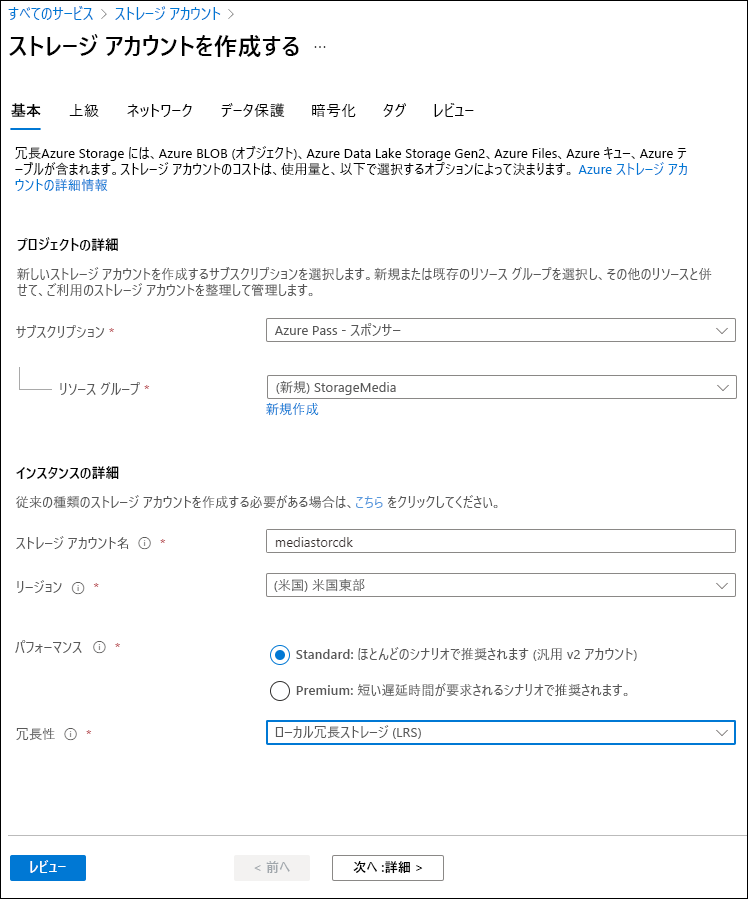

---
lab:
    az204Title: 'ラボ 03: Azure Storage SDK for .NET を使用して Azure Storage リソースとメタデータを取得する'
    az020Title: 'ラボ 03: Azure Storage SDK for .NET を使用して Azure Storage リソースとメタデータを取得する'
    az204Module: 'モジュール 03: BLOB ストレージを使用するソリューションを開発する'
    az020Module: 'モジュール 03: BLOB ストレージを使用するソリューションを開発する'
---

# ラボ 03: Azure Storage SDK for .NET を使用して Azure Storage リソースとメタデータを取得する

## Microsoft Azure ユーザー インターフェイス

Microsoft クラウド ツールのダイナミックな性質を考えると、このトレーニング コンテンツの開発後に Azure ユーザー インターフェイス (UI) の変更が発生する可能性があります。その結果、ラボの手順やステップが、正しく整合しない可能性があります。

Microsoft では、コミュニティから変更の必要性を通知されたとき、トレーニング コースを更新しています。しかし、クラウドの更新は頻繁に行われているため、このトレーニング コースを更新する前に、UI の変更に気づく場合があります。**その場合は、変更に適宜対応して、ラボで要求されている内容を処理してください。**

## 手順

### 開始する前に

#### ラボ環境へのログイン

次の認証情報を使用して、Windows 10 仮想マシン (VM) にログインします。

-   ユーザー名: **Admin**

-   パスワード: **Pa55w.rd**

> **注**: 講師が仮想ラボ環境に接続するための手順を説明します。

#### インストールされているアプリケーションを確認します

Windows 10 デスクトップでタスク バーを探します。タスク バーには、以下をはじめとする、このラボで使用するアプリケーションのアイコンが含まれています。

-   Microsoft Edge

-   エクスプローラー

## アーキテクチャの図


### 演習 1: Azure リソースを作成する

#### タスク 1: Azure portal を開く

1.  タスク バーで、**Microsoft Edge** アイコンを選択します。

1. ブラウザー ウィンドウで、Azure portal (<https://portal.azure.com>) を閲覧してから、このラボで使用するアカウントでログインします。

   > **注**: Azure portal に初めてログインする場合は、ポータルのツアーが表示されます。ツアーをスキップしてポータルの使用を開始するには、「**開始**」を選択します。

#### タスク 2: ストレージ アカウントを作成します

1.  Azure portal で、「**リソース、サービス、およびドキュメントの検索**」テキスト ボックスを使用して「**ストレージ アカウント**」を検索し、結果のリストで「**ストレージ アカウント**」を選択します。

1.  「**ストレージ アカウント**」ブレードで、「**+ 作成**」を選択します。

1.  「**ストレージ アカウントの作成**」ブレードの「**基本**」タブで、次のアクションを実行してから、「**確認および作成**」を選択します。

   | 設定                           | アクション                                                       |
   | --------------------------------- | ------------------------------------------------------------ |
   | **サブスクリプション** ドロップダウン リスト   | 既定値のままにします。                                    |
   | **リソース グループ** セクション        | 「**新規作成**」を選択し、「**StorageMedia**」と入力してから、「**OK**」を選択します。 |
   | **ストレージ アカウント名**テキスト ボックス | 「**mediastor**_[yourname]_」と入力します。                             |
   | **リージョン** ドロップダウン リスト         | 「**米国東部**」を選択します。                                     |
   | **パフォーマンス** セクション           | **Standard** オプションを選択します。                              |
   | **冗長性**ドロップダウン リスト     | 「**ローカル冗長ストレージ (LRS)**」を選択します。                  |

   次のスクリーンショットは、「**ストレージ アカウントの作成**」ブレード上で構成された設定を示しています。
 
   
   
1.  「**確認および作成**」タブで、以前の手順で選択したオプションを確認します。

1.  指定した構成を使用してストレージ アカウントを作成するには、「**作成**」を選択します。

    > **注**: 演習を進める前に、作成タスクが完了するまで待ちます。

1.  「**リソースに移動**」を選択します。

1.  「**ストレージ アカウント**」ブレードで、「**設定**」セクションを見つけ、「**エンドポイント**」リンクを選択します。

1.  「**エンドポイント**」セクションで、「**Blob Service**」テキスト ボックスの値を記録します。

    > **注**: このエンドポイント値は、このラボの後半で使用します。

1.  「**ストレージ アカウント**」ブレードで、「**セキュリティ + ネットワーク**」セクションを見つけ、「**アクセス キー**」リンクを選択します。

1.  「**アクセス キー**」セクションで、次の操作を実行します。

    「**ストレージ アカウント名**」テキスト ボックスに値を記録します。
    
    b. 「**キーの表示**」を選択します。

    c. キーのいずれかを選択し、いずれかの「**キー**」ボックスに値を記録します。

    > **注**: これらの値は、このラボの後半で使用します。

#### 確認

この演習では、ラボの残りの部分で使用する新しいストレージ アカウントを作成しました。

### 演習 2: コンテナーに BLOB をアップロードする

#### タスク 1: ストレージ アカウント コンテナーを作成する

1. 「**ストレージ アカウント**」ブレードで、「**データ ストレージ**」セクションにある「**コンテナー**」を選択します。

1. 「**コンテナー**」セクションで、「**+ コンテナー**」を選択します。

1. 「**新規コンテナー**」ポップアップ ウィンドウ、次のアクションを実行してから、「**作成**」を選択します。

    | 設定                                | アクション                                    |
    | -------------------------------------- | ----------------------------------------- |
    | 「**名前**」テキスト ボックス                      | 「**raster-graphics**」を入力します。                |
    | 「**パブリック アクセス レベル**」ドロップダウン リスト | 「**プライベート (匿名アクセスなし)**」を選択します。 |

1. 「**コンテナー**」セクションで、「**+ コンテナー**」を選択します。

1. 「**新規コンテナー**」ポップアップ ウィンドウ、次のアクションを実行してから、「**作成**」を選択します。

    | 設定                                | アクション                                    |
    | -------------------------------------- | ----------------------------------------- |
    | 「**名前**」テキスト ボックス                      | 「**compressed-audio**」を入力します。               |
    | 「**パブリック アクセス レベル**」ドロップダウン リスト | 「**プライベート (匿名アクセスなし)**」を選択します。 |

1. 「**コンテナー**」セクションで、コンテナーの更新済み一覧を確認します。

    次のスクリーンショットは、「**ストレージ アカウントの作成**」ブレード上で構成された設定を示しています。

    

#### タスク 2: ストレージ アカウント BLOB をアップロードする

1.  **コンテナー** セクションで、新しく作成された **raster-graphics** コンテナーを選択します。

1.	「**コンテナー**」 ブレードで、「**アップロード**」 を選択します。

1.	「**BLOB のアップロード**」ウィンドウで、次のアクションを実行してから、「**アップロード**」を選択します。

   | 設定                           | アクション                                                       |
   | --------------------------------- | ------------------------------------------------------------ |
   | 「**ファイル**」セクション   | 「**フォルダー**」アイコンを選択します。                                    |
   | 「**ファイル エクスプローラー**」ウィンドウ        | 「**Allfiles (F):\\Allfiles\\Labs\\03\\Starter\\Images**」を参照して、「**graph.jpg**」ファイルを選択してから、「**開く**」を選択します。 |
   | 「**ファイルがすでに存在する場合は上書きする**」チェック ボックス | チェック ボックスがオンになっていることを確認します。                        |
   
   > **注**: この演習を続行する前に、BLOB がアップロードされるのを待ちます。

#### 確認

この演習では、ストレージ アカウントにプレース ホルダー コンテナーを作成し、コンテナーの 1 つに BLOB を設定しました。

### 演習 3: .NET SDK を使用してコンテナーにアクセスする

#### タスク 1: .NET プロジェクトを作成する

1.  「**スタート**」画面で、「**Visual Studio Code**」タイルを選択します。

1.  「**ファイル**」メニューで、「**フォルダーを開く**」を選択し、「**Allfiles (F):\\Allfiles\\Labs\\03\\Starter\\BlobManager**」を参照してから、「**フォルダ－の選択**」を選択します。

1.  **Visual Studio Code** ウィンドウで、**エクスプローラー** ペインのショートカット メニューをアクティブ化してから、**「統合ターミナルで開く」** を選択します。

1.  コマンド プロンプトで、次のコマンドを実行して、現在フォルダーに **BlobManager** という名前の新しい .NET プロジェクトを作成します。

    ```
    dotnet new console --name BlobManager --output .
    ```

    > **注**: **dotnet new** コマンドは、プロジェクトと同じ名前のフォルダーに新しい**コンソール** プロジェクトを作成します。

1.  コマンド プロンプトで次のコマンドを実行し、NuGet から **Azure.Storage.Blobs** のバージョン 12.0.0 をインポートします。

    ```
    dotnet add package Azure.Storage.Blobs --version 12.0.0
    ```

    > **注**: **dotnet add package** コマンドは、NuGet から **Azure.Storage.BLOB** パッケージを追加します。詳細については、[Azure Storage BLOB](https://www.nuget.org/packages/Azure.Storage.Blobs/12.0.0) を参照してください。

1.  コマンド プロンプトで、次のコマンドを実行して、.NET Web アプリケーションをビルドします。

    ```
    dotnet build
    ```

1.  「**ターミナルの強制終了**」または「**ごみ箱**」アイコンを選択して、現在開いているターミナルと関連するプロセスを閉じます。

#### タスク 2: ストレージにアクセスするためのプログラム クラスを変更する

1.  **Visual Studio Code** ウィンドウの**エクスプローラー** ペインで、**Program.cs** ファイルを開きます。

1.  **Program.cs** ファイルのコード エディター タブで、既存のファイルのすべてのコードを削除します。

1.  次のコード行を追加して、NuGet からインポートした **Microsoft.Azure.Blobs** パッケージから **Azure.Storage**、**Azure.Storage.Blobs**、**Azure.Storage.Blobs.Models** 名前空間をインポートします。

    ```csharp
    using Azure.Storage;
    using Azure.Storage.Blobs;
    using Azure.Storage.Blobs.Models;
    ```
    
1.  このファイルで使用される組み込み名前空間の **using** ディレクティブを追加するために、次のコード行を追加します。

    ```csharp
    using System;
    using System.Threading.Tasks;
    ```

1.  次のコードを入力して、新しい **Program** クラスを作成します。

    ```csharp
    public class Program
    {
    }
    ```

1.  **Program** クラスに次のコード行を入力して、**blobServiceEndpoint** という名前の新しい文字列定数を作成します。

    ```csharp
    private const string blobServiceEndpoint = "";
    ```

1.  この課題で前に記録したストレージ アカウントの「**プライマリ Blob Service エンドポイント**」に値を設定して、**blobServiceEndpoint** 文字列定数を更新します。

1.  **Program** クラスに次のコード行を入力して、**storageAccountName** という名前の新しい文字列定数を作成します。

    ```csharp
    private const string storageAccountName = "";
    ```

1.  このラボで前に記録したストレージ アカウントの「**ストレージ アカウント名**」に値を設定して、**storageAccountName** 文字列定数を更新します。

1.  **Program** クラスに次のコード行を入力して、**storageAccountKey** という名前の新しい文字列定数を作成します。

    ```csharp
    private const string storageAccountKey = "";
    ```

1.  このラボで前に記録したストレージ アカウントの「**キー**」に値を設定して、**storageAccountKey** 文字列定数を更新します。

1.  **Program** クラスで、次のコードを入力して新しい非同期 **Main** メソッドを作成します。

    ```csharp
    public static async Task Main(string[] args)
    {
    }
    ```

1.  **Program.cs** ファイルを確認します。以下が含まれているはずです。

    ```csharp
    using Azure.Storage;
    using Azure.Storage.Blobs;
    using Azure.Storage.Blobs.Models;
    using System;
    using System.Threading.Tasks;
    
    public class Program
    {
        private const string blobServiceEndpoint = "<primary-blob-service-endpoint>";
        private const string storageAccountName = "<storage-account-name>";
        private const string storageAccountKey = "<key>";
    
        public static async Task Main(string[] args)
        {
        }
    }
    ```

#### タスク 3: Azure Storage Blob サービス エンドポイントに接続する

1.  **Main** メソッドに次のコード行を追加して、コンストラクター パラメーターとして **storageAccountName** と **storageAccountKey** 定数を使用して、**StorageSharedKeyCredential** クラスの新しいインスタンスを作成します。

    ```csharp
    StorageSharedKeyCredential accountCredentials = new StorageSharedKeyCredential(storageAccountName, storageAccountKey);
    ```

1.  **Main** メソッドに次のコード行を追加して、**blobServiceEndpoint** 定数と *accountCredentials* 変数をコンストラクター パラメーターとして使用して **BlobServiceClient** クラスの新しいインスタンスを作成します。

    ```csharp
    BlobServiceClient serviceClient = new BlobServiceClient(new Uri(blobServiceEndpoint), accountCredentials);
    ```

1.  **Main** メソッドに次のコード行を追加して、サービスからアカウント メタデータを取得する **BlobServiceClient** クラスの **GetAccountInfoAsync** メソッドを呼び出します。

    ```csharp
    AccountInfo info = await serviceClient.GetAccountInfoAsync();
    ```
    
1.  **Main** メソッドに次のコード行を追加して、ウェルカム メッセージをレンダリングします。

    ```csharp
    await Console.Out.WriteLineAsync($"Connected to Azure Storage Account");
    ```
    
1.  **Main** メソッドに次のコード行を追加して、ストレージ アカウント名をレンダリングします。

    ```csharp
    await Console.Out.WriteLineAsync($"Account name:\t{storageAccountName}");
    ```
    
1.  **Main** メソッドに次のコード行を追加して、ストレージ アカウントの種類をレンダリングします。

    ```csharp
    await Console.Out.WriteLineAsync($"Account kind:\t{info?.AccountKind}");
    ```
    
1.  **Main** メソッドに次のコード行を追加して、ストレージ アカウントの現在選択されている在庫保管単位 (SKU) をレンダリングします。

    ```
    await Console.Out.WriteLineAsync($"Account sku:\t{info?.SkuName}");
    ```

1.  **Main** メソッドをレビューします。この中には以下が含まれているはずです。

    ```csharp
    public static async Task Main(string[] args)
    {
        StorageSharedKeyCredential accountCredentials = new StorageSharedKeyCredential(storageAccountName, storageAccountKey);

        BlobServiceClient serviceClient = new BlobServiceClient(new Uri(blobServiceEndpoint), accountCredentials);

        AccountInfo info = await serviceClient.GetAccountInfoAsync();

        await Console.Out.WriteLineAsync($"Connected to Azure Storage Account");
        await Console.Out.WriteLineAsync($"Account name:\t{storageAccountName}");
        await Console.Out.WriteLineAsync($"Account kind:\t{info?.AccountKind}");
        await Console.Out.WriteLineAsync($"Account sku:\t{info?.SkuName}");
    }
    ```

1.  **Program.cs** ファイルを保存します。

1.  **Visual Studio Code** ウィンドウで、**エクスプローラー** ペインのショートカット メニューをアクティブ化してから、**「統合ターミナルで開く」** を選択します。

1.  開いたコマンド プロンプトで、次のコマンドを実行して、.NET Web アプリケーションを実行します。

    ```
    dotnet run
    ```

    > **注**: ビルド エラーがある場合は、 **Allfiles (F):\\Allfiles\\Labs\\03\\Solution\\BlobManager** フォルダーの **Program.cs** ファイルを確認してください。

1.  現在実行中のコンソール アプリケーションからの出力を監視します。出力には、サービスから取得されたストレージ アカウントのメタデータが含まれています。

1.  「**ターミナルの強制終了**」または「**ごみ箱**」アイコンを選択して、現在開いているターミナルと関連するプロセスを閉じます。

#### タスク 4: 既存のコンテナーを列挙する

1.  **Program** クラスに次のコードを入力して、非同期で単一の **BlobServiceClient** パラメーター型を持つ **EnumerateContainersAsync** という名前の新しい**プライベート静的**メソッドを作成します。

    ```csharp
    private static async Task EnumerateContainersAsync(BlobServiceClient client)
    {        
    }
    ```

1.  **EnumerateContainersAsync** メソッドに次のコードを入力して、**BlobServiceClient** クラスの **GetBlobContainersAsync** メソッドの呼び出しの結果を反復処理する、非同期の **foreach** ループを作成します。

    ```csharp
    await foreach (BlobContainerItem container in client.GetBlobContainersAsync())
    {
    }
    ```

1.  **foreach** ループ内に次のコードを入力して、各コンテナーの名前を出力します。

    ```csharp
    await Console.Out.WriteLineAsync($"Container:\t{container.Name}");
    ```

1.  **EnumerateContainersAsync** メソッドをレビューします。この中には以下が含まれているはずです。

    ```csharp
    private static async Task EnumerateContainersAsync(BlobServiceClient client)
    {        
        await foreach (BlobContainerItem container in client.GetBlobContainersAsync())
        {
            await Console.Out.WriteLineAsync($"Container:\t{container.Name}");
        }
    }
    ```

1.  **Main** メソッドの末尾に次のコードを入力し、*serviceClient* 変数をパラメーターとして **EnumerateContainersAsync** メソッドを呼び出します。

    ```csharp
    await EnumerateContainersAsync(serviceClient);
    ```

1.  **Main** メソッドを監視します。現在以下が含まれます。

    ```csharp
    public static async Task Main(string[] args)
    {
        // Existing code has not been repeated here for brevity

        await EnumerateContainersAsync(serviceClient);
    }
    ```

1.  **Program.cs** ファイルを保存します。

1.  **Visual Studio Code** ウィンドウで、**エクスプローラー** ペインのショートカット メニューをアクティブ化してから、**「統合ターミナルで開く」** を選択します。

1.  開いたコマンド プロンプトで、次のコマンドを実行して、.NET Web アプリケーションを実行します。

    ```
    dotnet run
    ```

    > **注**: ビルド エラーがある場合は、 **Allfiles (F):\\Allfiles\\Labs\\03\\Solution\\BlobManager** フォルダーの **Program.cs** ファイルを確認してください。

1.  現在実行中のコンソール アプリケーションからの出力を監視します。更新された出力には、アカウント内のすべての既存のコンテナーの一覧が含まれます。

1.  「**ターミナルの強制終了**」または「**ごみ箱**」アイコンを選択して、現在開いているターミナルと関連するプロセスを閉じます。

#### 確認

このエクササイズでは、 Azure Storage SDK を使用して既存のコンテナーにアクセスしました。

### 演習 4: .NET SDK を使用して BLOB Uniform Resource Identifiers（URI）を取得する

#### タスク 1: SDK を使用して既存のコンテナー内の BLOB を列挙する

1.  **Program** クラスに次のコードを入力して、非同期で **BlobServiceClient** と**文字列** の 2 つのパラメーター型を持つ、**EnumerateBlobsAsync** という名前の新しい**静的プライベート**メソッドを作成します。

    ```csharp
    private static async Task EnumerateBlobsAsync(BlobServiceClient client, string containerName)
    {      
    }
    ```

1.  **EnumerateBlobsAsync** メソッドに次のコードを入力して、**containerName** パラメーターを渡す **BlobServiceClient** クラスの **GetBlobContainerClient** メソッドを使用して、**BlobContainerClient** クラスの新しいインスタンスを取得します。

    ```csharp
    BlobContainerClient container = client.GetBlobContainerClient(containerName);
    ```

1.  **EnumerateBlobsAsync** メソッドに次のコードを入力し、列挙されるコンテナー名をレンダリングします。

    ```csharp
    await Console.Out.WriteLineAsync($"Searching:\t{container.Name}");
    ```

1.  **EnumerateBlobsAsync** メソッドに次のコードを入力して、**BlobContainerClient** クラスの **GetBlobsAsync** メソッドの呼び出しの結果を反復処理する非同期の **foreach** ループを作成します。

    ```csharp
    await foreach (BlobItem blob in container.GetBlobsAsync())
    {        
    }
    ```

1.  **foreach** ループ内に次のコードを入力して、各 BLOB 名を出力します。

    ```csharp
     await Console.Out.WriteLineAsync($"Existing Blob:\t{blob.Name}");
    ```

1.  **EnumerateBlobsAsync** メソッドをレビューします。この中には以下が含まれているはずです。

    ```csharp
    private static async Task EnumerateBlobsAsync(BlobServiceClient client, string containerName)
    {      
        BlobContainerClient container = client.GetBlobContainerClient(containerName);
        
        await Console.Out.WriteLineAsync($"Searching:\t{container.Name}");
        
        await foreach (BlobItem blob in container.GetBlobsAsync())
        {        
             await Console.Out.WriteLineAsync($"Existing Blob:\t{blob.Name}");
        }
    }
    ```

1.  **Main** メソッドの最後に次のコードを入力して、**raster-graphics** の値を持つ *existingContainerName* という名前の変数を作成します。

    ```csharp
    string existingContainerName = "raster-graphics";
    ```

1.  **Main** メソッドの末尾に次のコードを入力して、パラメーターとして *serviceClient* と *existingContainerName* 変数を渡して、**EnumerateBlobsAsync** メソッドを呼び出します。

    ```csharp
    await EnumerateBlobsAsync(serviceClient, existingContainerName);
    ```

1.  **Main** メソッドを監視します。現在以下が含まれます。

    ```csharp
    public static async Task Main(string[] args)
    {
        // Existing code has not been repeated here for brevity
        
        await EnumerateContainersAsync(serviceClient);

        string existingContainerName = "raster-graphics";
        await EnumerateBlobsAsync(serviceClient, existingContainerName);
    }
    ```

1.  **Program.cs** ファイルを保存します。

1.  **Visual Studio Code** ウィンドウで、**エクスプローラー** ペインのショートカット メニューをアクティブ化してから、**「統合ターミナルで開く」** を選択します。

1.  開いたコマンド プロンプトで、次のコマンドを実行して、.NET Web アプリケーションを実行します。

    ```
    dotnet run
    ```

    > **注**: ビルド エラーがある場合は、 **Allfiles (F):\\Allfiles\\Labs\\03\\Solution\\BlobManager** フォルダーの **Program.cs** ファイルを確認してください。

1.  現在実行中のコンソール アプリケーションからの出力を確認します。更新された出力には、既存のコンテナーと BLOB に関するメタデータが含まれます。

1.  「**ターミナルの強制終了**」または「**ごみ箱**」アイコンを選択して、現在開いているターミナルと関連するプロセスを閉じます。

#### タスク 2: SDK を使用して新しいコンテナーを作成する

1.  **Program** クラスに次のコードを入力して、非同期で 2 つのパラメーター型の **BlobServiceClient** と **string** を持つ **GetContainerAsync** という名前の新しい **private static** メソッドを作成します。

    ```csharp
    private static async Task<BlobContainerClient> GetContainerAsync(BlobServiceClient client, string containerName)
    {      
    }
    ```

1.  **GetContainerAsync** メソッドに次のコードを入力して、**containerName** パラメーターを渡す **BlobServiceClient** クラスの **GetBlobContainerClient** メソッドを使用して **BlobContainerClient** クラスの新しいインスタンスを取得します。

    ```csharp
    BlobContainerClient container = client.GetBlobContainerClient(containerName);
    ```

1.  **GetContainerAsync** メソッドに次のコードを入力して、**BlobContainerClient** クラスの **CreateIfNotExistsAsync** メソッドを呼び出します。

    ```csharp
    await container.CreateIfNotExistsAsync(PublicAccessType.Blob);
    ```

1.  **GetContainerAsync** メソッドに次のコードを入力して、作成された可能性のあるコンテナー名をレンダリングします。

    ```csharp
    await Console.Out.WriteLineAsync($"New Container:\t{container.Name}");
    ```

1.  **GetContainerAsync** メソッドに次のコードを入力して、**GetContainerAsync** メソッドの結果として、**container** という名前の **BlobContainerClient** クラスのインスタンスを返します。

    ```csharp
    return container;
    ```

1.  **GetContainerAsync** メソッドをレビューします。この中には以下が含まれているはずです。

    ```csharp
    private static async Task<BlobContainerClient> GetContainerAsync(BlobServiceClient client, string containerName)
    {      
        BlobContainerClient container = client.GetBlobContainerClient(containerName);
        
        await container.CreateIfNotExistsAsync(PublicAccessType.Blob);
        
        await Console.Out.WriteLineAsync($"New Container:\t{container.Name}");
        
        return container;
    }
    ```

1.  **Main** メソッドの最後に次のコードを入力して、**vector-graphics** の値を持つ *newContainerName* という名前の変数を作成します。

    ```csharp
    string newContainerName = "vector-graphics";
    ```

1.  **Main** メソッドの最後に次のコードを入力して、**GetContainerAsync** メソッドを呼び出し、パラメーターとして *serviceClient* と *newContainerName* 変数を渡し、結果を **BlobContainerClient** 型の *containerClient* という名前の変数に格納します。

    ```csharp
    BlobContainerClient containerClient = await GetContainerAsync(serviceClient, newContainerName);
    ```

1.  **Main** メソッドをレビューします。この中には以下が含まれているはずです。

    ```csharp
    public static async Task Main(string[] args)
    {
        // Existing code has not been repeated here for brevity
        
        await EnumerateContainersAsync(serviceClient);

        string existingContainerName = "raster-graphics";
        await EnumerateBlobsAsync(serviceClient, existingContainerName);
        
        string newContainerName = "vector-graphics";
        BlobContainerClient containerClient = await GetContainerAsync(serviceClient, newContainerName);
    }
    ```

1.  **Program.cs** ファイルを保存します。

1.  **Visual Studio Code** ウィンドウで、**エクスプローラー** ペインのショートカット メニューをアクティブ化してから、**「統合ターミナルで開く」** を選択します。

1.  開いたコマンド プロンプトで、次のコマンドを実行して、.NET Web アプリケーションを実行します。

    ```
    dotnet run
    ```

    > **注**: ビルド エラーがある場合は、 **Allfiles (F):\\Allfiles\\Labs\\03\\Solution\\BlobManager** フォルダーの **Program.cs** ファイルを確認してください。

1.  現在実行中のコンソール アプリケーションからの出力を監視します。更新された出力には、既存のコンテナーと BLOB に関するメタデータが含まれます。

1.  「**ターミナルの強制終了**」または「**ごみ箱**」アイコンを選択して、現在開いているターミナルと関連するプロセスを閉じます。

#### タスク 3: ポータルを使用して新しい BLOB をアップロードする

1.  Azure portal の「**ナビゲーション**」ペインで、「**リソース グループ**」リンクを選択します。

1.  「**リソース グループ**」ブレードで、このラボの前半で作成した「**StorageMedia**」リソース グループを選択します。

1.  「**StorageMedia**」ブレードで、このラボの前半で作成した「**mediastor**_[yourname]_」ストレージ アカウントを選択します。

1.  「**ストレージ アカウント**」ブレードで、「**データ ストレージ**」セクションにある「**コンテナー**」を選択します。

1.  **「コンテナー」** セクションで、新しく作成された **vector-graphics** コンテナーを選択します。新しいコンテナーを監視するには、ページの更新が必要な場合があります。

1.	「**コンテナー**」 ブレードで、「**アップロード**」 を選択します。

1.	「**BLOB のアップロード**」ウィンドウで、次のアクションを実行してから、「**アップロード**」を選択します。

    | 設定                           | アクション                                                       |
    | --------------------------------- | ------------------------------------------------------------ |
    | 「**ファイル**」セクション   | 「**フォルダー**」アイコンを選択します。                                    |
    | 「**ファイル エクスプローラー**」ウィンドウ        |  「**Allfiles (F):\\Allfiles\\Labs\\03\\Starter\\Images**」で、「**graph.svg**」ファイルを選択してから、「**開く**」を選択します。 |
    | 「**ファイルがすでに存在する場合は上書きする**」チェック ボックス | チェック ボックスがオンになっていることを確認します。                        |

    > **注**: この演習を続行する前に、BLOB がアップロードされるのを待ちます。

#### タスク 4: SDK を使用して BLOB URI にアクセスする

1.  **Visual Studio Code** ウィンドウに切り替えます。

1.  **Program** クラスに次のコードを入力して、非同期で 2 つのパラメーター型 **BlobContainerClient** と **string** を持つ、**GetBlobAsync** という名前の新しい **private static** メソッドを作成します。

    ```csharp
    private static async Task<BlobClient> GetBlobAsync(BlobContainerClient client, string blobName)
    {      
    }
    ```

1.  **GetBlobAsync** メソッドに次のコードを入力して、**BlobName** パラメーターを渡す **BlobContainer** クラスの **GetBlobClient** メソッドを使用して、**BlobClient** クラスの新しいインスタンスを取得します。

    ```csharp
    BlobClient blob = client.GetBlobClient(blobName);
    ```

1.  **GetBlobAsync** メソッドに次のコードを入力して、参照された BLOB の名前をレンダリングします。

    ```csharp
    await Console.Out.WriteLineAsync($"Blob Found:\t{blob.Name}");
    ```

1.  **GetBlobAsync** メソッドに次のコードを入力して、**GetBlobAsync** メソッドの結果として、**blob** という名前の **BlobClient** クラスのインスタンスを返却します。

    ```csharp
    return blob;
    ```

1.  **GetBlobAsync** メソッドをレビューします。この中には以下が含まれているはずです。

    ```csharp
    private static async Task<BlobClient> GetBlobAsync(BlobContainerClient client, string blobName)
    {      
        BlobClient blob = client.GetBlobClient(blobName);
        await Console.Out.WriteLineAsync($"Blob Found:\t{blob.Name}");
        return blob;
    }
    ```

1.  **Main** メソッドの最後に次のコードを入力して、 **graph.svg** の値を持つ *uploadedBlobName* という名前の変数を作成します。

    ```csharp
    string uploadedBlobName = "graph.svg";
    ```

1.  **Main** メソッドの最後に次のコードを入力して、**GetBlobAsync** メソッドを呼び出し、パラメーターとして *containerClient* と *uploadedBlobName* 変数を渡す、**BlobClient** 型の *blobClient* という名前の変数に結果を格納します。

    ```csharp
    BlobClient blobClient = await GetBlobAsync(containerClient, uploadedBlobName);
    ```

1.  **Main** メソッドの末尾に次のコードを入力して、*blobClient* 変数の **Uri** プロパティをレンダリングします。

    ```csharp
    await Console.Out.WriteLineAsync($"Blob Url:\t{blobClient.Uri}");
    ```

1.  **Main** メソッドを監視します。現在以下が含まれます。

    ```csharp
    public static async Task Main(string[] args)
    {
        // Existing code has not been repeated here for brevity
        
        await EnumerateContainersAsync(serviceClient);

        string existingContainerName = "raster-graphics";
        await EnumerateBlobsAsync(serviceClient, existingContainerName);
        
        string newContainerName = "vector-graphics";
        BlobContainerClient containerClient = await GetContainerAsync(serviceClient, newContainerName);
        
        string uploadedBlobName = "graph.svg";
        BlobClient blobClient = await GetBlobAsync(containerClient, uploadedBlobName);

        await Console.Out.WriteLineAsync($"Blob Url:\t{blobClient.Uri}");
    }
    ```

1.  **Program.cs** ファイルを保存します。

1.  **Visual Studio Code** ウィンドウで、**エクスプローラー** ペインのショートカット メニューをアクティブ化してから、**「統合ターミナルで開く」** を選択します。

1.  開いたコマンド プロンプトで、次のコマンドを実行して、.NET Web アプリケーションを実行します。

    ```
    dotnet run
    ```

    > **注**: ビルド エラーがある場合は、 **Allfiles (F):\\Allfiles\\Labs\\03\\Solution\\BlobManager** フォルダーの **Program.cs** ファイルを確認してください。

1.  現在実行中のコンソール アプリケーションからの出力を監視します。更新された出力には、BLOB にオンラインでアクセスするための最終的な URL が含まれます。この URL の値を記録して、後でラボで使用します。

    > **注**: URL は、次の文字列のようになる可能性があります。 `https://mediastor*[yourname]*.blob.core.windows.net/vector-graphics/graph.svg`

1.  「**ターミナルの強制終了**」または「**ごみ箱**」アイコンを選択して、現在開いているターミナルと関連するプロセスを閉じます。

#### タスク 5: ブラウザーを使用して URI をテストする

1.  タスクバーで、**Microsoft Edge** アイコンのショートカット メニューをアクティブ化してから、**「新しいウィンドウ」** を選択します。

1.  新しいブラウザー ウインドウで、このラボで以前にコピーした URL を参照して BLOB を確認します。

1.  これで、ブラウザー ウィンドウにスケーラブル ベクター グラフィックス (SVG) ファイルが表示されます。

#### 確認

この実習では、Storage SDK を使用してコンテナーを作成し BLOB を管理しました。

### 演習 5: サブスクリプションのクリーンアップ

#### タスク 1: Azure Cloud Shellを開き、リソース グループを一覧表示する

1.  Azure portal で、**Cloud Shell** アイコン  を選択して、新しい Bash セッションを開始します。Cloud Shell が既定の PowerShell セッションである場合は、**「PowerShell」** を選択し、ドロップダウン メニューで、**「Bash」** を選択します。

    > **注**: 初めての **Cloud Shell** の起動であり、プロンプトが表示された場合は、**「Bash」** または **「PowerShell」** を選択して、**「PowerShell** を選択します。**「ストレージがマウントされていません」** というメッセージが表示されたら、このラボで使用しているサブスクリプションを選択してから、**「ストレージの作成」** を選択します。

#### タスク 2: リソース グループの削除

1.  「**Cloud Shell**」ペインで、次のコマンドを実行して、**StorageMedia** リソース グループを削除します。

    ```
    az group delete --name StorageMedia --no-wait --yes
    ```
     >**注**: コマンドは非同期に実行されるので (*--no-wait* パラメーターで決定される)、同じ Bash セッション内ですぐに別の Azure CLI コマンドを実行できますが、リソース グループが実際に削除されるまでに数分かかります。

1. ポータルで、**Cloud Shell** ペインを閉じます。

#### タスク 3: アクティブなアプリケーションを閉じる

- 現在実行中の Microsoft Edge アプリケーションを閉じます。

#### 確認

この演習では、この課題で使用するリソース グループを削除して、サブスクリプションをクリーンアップしました。
