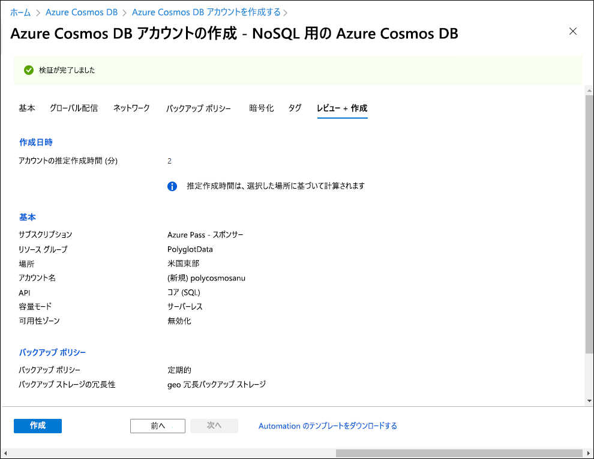
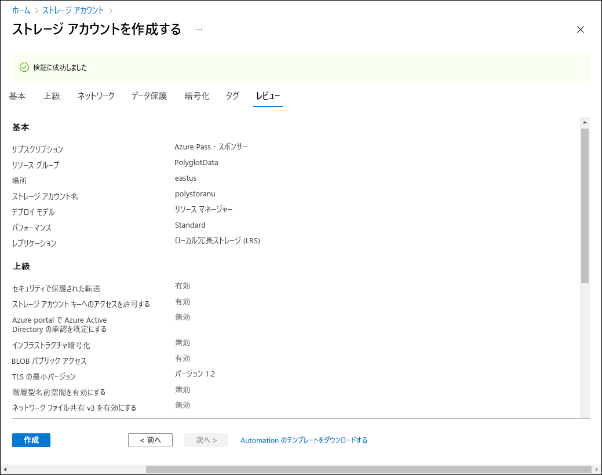

---
lab:
  az204Title: 'Lab 04: Construct a polyglot data solution'
  az204Module: 'Learning Path 04: Develop solutions that use Cosmos DB storage'
---

# ラボ 04: ポリグロットなデータ ソリューションを構築する

## Microsoft Azure ユーザー インターフェイス

Microsoft クラウド ツールの動的な性質を考慮すると、このトレーニング コンテンツの開発の後に発生する Azure UI の変更に気付くかもしれません。 その結果、ラボの指示とラボの手順が正しく整合しなくなる可能性があります。

Microsoft は、コミュニティから必要な変更の通知があったときに、このトレーニング コースを更新します。 ただし、クラウドの更新は頻繁に発生するため、このトレーニング コンテンツの更新の前に UI の変更に気付く可能性があります。 **これが発生した場合は、その変更に適応し、ラボでは必要に応じてそれらに対応してください。**

## Instructions

### 開始する前に

#### ラボ環境にサインインする

次の資格情報を使用して Windows 10 仮想マシン (VM) にサインインします。

- ユーザー名: `Admin`
- パスワード: `Pa55w.rd`

> **注**: 仮想ラボ環境に接続するための手順は、インストラクターから提供されます。

#### インストールされているアプリケーションを確認する

Windows 10 デスクトップでタスク バーを見つけます。 タスク バーには、このラボで使用する次のようなアプリケーションのアイコンが含まれています。

- Microsoft Edge
- エクスプローラー
- Visual Studio Code

## 課題シナリオ

このラボでは、Azure Cosmos DB リソースとストレージ アカウント リソースを作成します。 C# と .NET を使用して、Cosmos DB リソースにアクセスし、それにデータをアップロードします。

さらに、Contoso はユーザーフレンドリーなインターフェイスを介して Cosmos DB のデータにアクセスする必要がある場合があるため、Web ブラウザーで Cosmos DB のデータにアクセスして表示する .NET ソリューションを実装します。

最後に、Cosmos DB インスタンスの整合性レベルを設定し、変更フィード通知用の Azure 関数を実装します。

## アーキテクチャの図


### 演習 1: Azure でのデータ ストア リソースの作成

#### タスク 1: Azure portal を開く

1. タスク バーで、**Microsoft Edge** アイコンを選択します。

1. 開いたブラウザー ウィンドウで、Azure portal (`https://portal.azure.com`) に移動してから、このラボで使用するアカウントでサインインします。

   > **注**:初めて Azure portal にサインインする場合は、このポータルのツアーが表示されます。 **[作業開始]** を選択してツアーをスキップし、ポータルの使用を開始します。

#### タスク 2: Azure Cosmos DB アカウント リソースを作成する

1. Azure portal で、 **[リソース、サービス、ドキュメントの検索]** テキスト ボックスを使用して、**Azure Cosmos DB** を検索し、結果の一覧で **[Azure Cosmos DB]** を選択します。

1. **[Azure Cosmos DB]** ブレードで、**[作成]** を選択します。

1. **[Azure Cosmos DB アカウントの作成]** ブレードで、**[Azure Cosmos DB for NoSQL]** ボックス内の **[作成]** を選択します。

1. **[Azure Cosmos DB アカウントの作成 - Azure Cosmos DB for NoSQL]** ページの **[基本]** タブで、次の操作を実行し、 **[確認および作成]** を選択します。

   | 設定                     | アクション                                                                                                                   |
   | --------------------------- | ------------------------------------------------------------------------------------------------------------------------ |
   | **[サブスクリプション]** リスト       | 既定値を保持します                                                                                                          |
   | **[リソース グループ]** セクション  | **[新規作成]** を選択します                                                                                                    |
   | **[名前]** テキスト ボックス           | 「**Polyglotdata**」と入力し、 **[OK]** を選択します                                                                                 |
   | **[AccountName]** テキスト ボックス    | 「**polycosmos** _[ご自分の名前]_ 」と入力します                                                                                         |
   | **[場所]** ドロップダウン リスト | お使いのラボ コンピューターの場所に最も近く、Cosmos DB アカウントを作成できる Azure リージョンを選択します |
   | **[容量モード]** セクション   | **[サーバーレス]** を選択します                                                                                                    |

   次のスクリーンショットは、 **[Azure Cosmos DB アカウントの作成 - Azure Cosmos DB for NoSQL]** ページで構成された設定を示しています。

   

1. **[Azure Cosmos DB アカウントの作成 - Azure Cosmos DB for NoSQL]** ページの **[確認および作成]** タブで、前の手順で選択したオプションを確認します。

1. **[作成]** を選択して、指定した構成を使用して Azure Cosmos DB アカウントを作成します。

   > **注**: 作成タスクが完了するまで待ってから、このラボを続行してください。

1. **[リソースに移動]** を選択します。

1. **[Azure Cosmos DB アカウント]** ブレードで、**[設定]** セクションを見つけて、**[キー]** リンクを選択します。

1. **[キー ]** ウィンドウの **[読み取り/書き込みキー]** タブで、 **[URI]**、 **[PRIMARY KEY]**、**[PRIMARY CONNECTION STRING]** のテキスト ボックスの値を記録します。 これらの値は、このラボの後半で使用します。

#### タスク 3: Azure Storage アカウント リソースを作成する

1. Azure portal で、 **[リソース、サービス、ドキュメントの検索]** テキスト ボックスを使用して**ストレージ アカウント**を検索し、結果の一覧で **[ストレージ アカウント]** を選択します。

1. **[ストレージ アカウント]** ブレードで **[+ 作成]** を選択します。

1. **[ストレージ アカウントの作成]** ブレードの **[基本]** タブで、次のアクションを実行し、 **[確認]** を選択します。

   | 設定                           | アクション                                                                                  |
   | --------------------------------- | --------------------------------------------------------------------------------------- |
   | **[サブスクリプション]** リスト             | 既定値を保持します                                                                         |
   | **[リソース グループ]** セクション        | **[PolyglotData]** を選択します                                                                 |
   | **[ストレージ アカウント名]** テキスト ボックス | 「**polystor** _[ご自分の名前]_ 」と入力します                                                          |
   | **[リージョン]** ドロップダウン リスト         | この演習で先ほど Cosmos DB アカウントを作成したのと同じリージョンを選択します |
   | **[パフォーマンス]** セクション           | **[Standard]** を選択します。                                                                     |
   | **[冗長性]** ドロップダウン リスト     | **[ローカル冗長ストレージ (LRS)]** を選択します                                              |

   次のスクリーンショットは、 **[ストレージ アカウントの作成]** ブレードで構成された設定を示しています。

   

1. **[ストレージ アカウントの作成]** ブレードの **[確認]** タブで、前の手順で選択したオプションを確認します。

1. **[作成]** を選択して、指定した構成を使用してストレージ アカウントを作成します。

   > **注**: 作成タスクが完了するまで待ってから、このラボを続行してください。

#### 確認

この演習では、このラボで実装するポリグロットなデータ ソリューションに必要な Azure リソースを作成しました。 作成した Azure リソースには、Azure Cosmos DB アカウントと Azure Storage アカウントがあります。

### 演習 2: データを確認してアップロードする

#### タスク 1: Azure Blob Storage に画像をアップロードする

1. Azure portal のナビゲーション ウィンドウで、 **[ストレージ アカウント]** ブレードに戻り、このラボの前の演習で作成した **polystor** _[yourname]_ ストレージ アカウントを選択します。

1. [**polystor** _[yourname]_ ストレージ アカウント] ブレードで、 **[データ ストレージ]** セクションの **[コンテナー]** リンクを選択します。

1. **[コンテナー]** セクションで、 **[+ コンテナー]** を選択します。

1. **[新しいコンテナー]** ポップアップ ウィンドウで、次のアクションを実行し、 **[作成]** を選択します。

   | 設定                                | アクション                                   |
   | -------------------------------------- | ---------------------------------------- |
   | **[名前]** テキスト ボックス                      | 「**images**」と入力します                         |
   | **[パブリック アクセス レベル]** ドロップダウン リスト | **[非公開 (匿名アクセスなし)]** を選択します |

1. **[コンテナー]** セクションに戻り、新しく作成された **images** コンテナーを選択します。

1. **[コンテナー]** ブレードの **[設定]** セクションを見つけて、 **[プロパティ]** リンクを選択します。

1. **[プロパティ]** ウィンドウで、 **[URL]** テキスト ボックス内の値をメモ して記録します。 この値は、このラボの後半で使用します。

1. 次に [**共有アクセス トークン**] をクリックし、[**SAS トークンと URL の生成**] をクリックして、既定の設定でアクセス トークンを生成します。 後で必要になるので、**Blob SAS トークン** の値をメモしておきます。

1. ブレードの **[概要]** リンクを見つけて選択します。
1. ブレードで **[アップロード]** を選択します。

1. **[BLOB のアップロード]** ポップアップで、次のアクションを実行します。

   a. **[ファイル]** セクションで、 **[ファイルの参照]** を選択するか、ドラッグ アンド ドロップ機能を使用します。

   b. **[ファイル エクスプローラー]** ウィンドウで、**Allfiles (F):\\Allfiles\\Labs\\04\\Starter\\Images** を参照し、42 個の **.jpg** イメージ ファイルをすべて選択して、 **[開く]** を選択します。

   c. **[ファイルが既に存在する場合は上書きする]** が選択されていることを確認し、 **[アップロード]** を選択します。

   > **注**: すべての BLOB がアップロードされるまで待ってから、このラボを続行してください。

#### タスク 2: JSON データを確認する

1. ラボ コンピューターから Visual Studio Code を起動します。

1. **[ファイル]** メニューから **[ファイルを開く]** を選択して、**Allfiles (F):\\Allfiles\\Labs\\04\\Starter\\AdventureWorks\\AdventureWorks.Upload** を参照し、**models.json** を選択してから **[開く]** を選択します。

1. **models.json** ファイルの形式を確認し、このファイルに JSON オブジェクトの配列が含まれていて、**Products** プロパティの一部がオブジェクトの配列の入れ子になっている点に注目してください。

   > **注**: これにより、JSON ファイルを Cosmos DB コレクションにアップロードする前に、ファイルの内容を逆シリアル化するために定義するクラスが決定されます。

1. **models.json** ファイル内で、プロパティの 1 つが **Category** という名前である点に注目してください。

   > **注**: **Category** プロパティを使用して、ターゲット Cosmos DB コレクションのパーティションを定義します。

1. Visual Studio Code を閉じます。

#### タスク 3: Cosmos DB データベースとコレクションを作成し、JSON データのアップロードを実行する

1. **[スタート]** 画面で、 **[Visual Studio Code]** タイルを選択します。

1. **[ファイル]** メニューの **[フォルダーを開く]** を選択します。

1. 開いた **[ファイル エクスプローラー]** ウィンドウで、**Allfiles (F):\\Allfiles\\Labs\\04\\Starter\\AdventureWorks** を参照してから、 **[フォルダーの選択]** を選択します。

1. **Visual Studio Code** ウィンドウのメニュー バーで、 **[ターミナル]** を選択し、 **[新しいターミナル]** を選択します。

1. ターミナルで、現在のディレクトリが **AdventureWorks** に設定されていることを確認し (設定されていない場合はそれに変更します)、次のコマンドを実行して、ターミナル コンテキストを **AdventureWorks.Upload** フォルダーに切り替えます。

   ```
   cd .\AdventureWorks.Upload\
   ```

   > **注**: 次の手順を実行する前に、Windows エクスプローラーを開き、**Allfiles (F):\\Allfiles\\Labs\\04\\Starter\\AdventureWorks\\AdventureWorks.Upload\\AdventureWorks.Upload.csproj** ファイルから**読み取り専用**属性を削除します。

1. ターミナル プロンプトから次のコマンドを実行して、Azure Cosmos DB .NET クライアント ライブラリを現在開いているプロジェクトに追加します。

   > **注**: 次のコマンドに進む前に、現在以下のパスにいることを確認してください: **(F):\\Allfiles\\Labs\\04\\Starter\\AdventureWorks\\AdventureWorks.Upload\\**

   ```
   dotnet add package Microsoft.Azure.Cosmos --version 3.28.0
   ```
   
   > **注**: **dotnet add package** コマンドを実行すると、**NuGet** から **Microsoft.Azure.Cosmos** パッケージが追加されます。 詳細については、「[Microsoft.Azure.Cosmos](https://www.nuget.org/packages/Microsoft.Azure.Cosmos)」を参照してください。

1. ターミナルに出力されたビルドの結果を確認します。 ビルドは、エラーや警告メッセージを表示せずに正常に完了する必要があります。

1. **[Visual Studio Code]** ウィンドウの **[エクスプローラー]** ペインで、**AdventureWorks.Upload** プロジェクトを展開します。

1. **Program.cs** ファイルを開きます。

1. **Program.cs** ファイルで、**using** ディレクティブを確認し、**Microsoft.Azure.Cosmos**、**System.IO;** 、**System.Text.Json**、**System.Threading.Tasks**、**System.Collections.Generic** が含まれることに注目します。 これにより、ラボ コンピューター上のローカル ファイルから Cosmos DB データベース内のコレクションに、JSON 項目を非同期アップロードできます。

1. **Program.cs** ファイルの 14 行目で、空の文字列を、このラボで前に記録した Cosmos DB アカウントの **URI** プロパティに置き換えて、**EndpointUrl** の値を設定します。 値が二重引用符で囲まれていることを確認します。

1. 15 行目で、空の文字列を、このラボで前に記録した Cosmos DB アカウントの **PRIMARY KEY** プロパティに置き換えて、**AuthorizationKey** の値を設定します。 値が二重引用符で囲まれていることを確認します。

1. 18 行目で、空の文字列を **"/Category"** に置き換えて、**PartitionKey** の値を設定します。

1. 19 行目で、空の文字列を **"F:\\\\Allfiles\\\\Labs\\\\04\\\\Starter\\\\AdventureWorks\\\\AdventureWorks.Upload\\\\models.json"** に置き換えて、**JsonFilePath** の値を設定します。

1. try ブロック内で、**CosmosClient** クラスの **CreateDatabaseIfNotExistsAsync** メソッドの呼び出しに注目します。 これにより、データベースが存在しない場合にデータベースが作成されます。

1. **Database** クラスの **DefineContainer** メソッドの呼び出しに注目します。 これにより、JSON 項目が存在しない場合に、JSON 項目をホストするコンテナーが作成されます。

   > **注**: **DefineContainer** メソッドには、コストを最小限に抑えるオプションが含まれています。このオプションでは、既定のインデックス作成ポリシー (すべての属性のインデックスが自動的に作成される) を変更できます。

1. **using** ステートメントについて、テキスト ファイルからの JSON 項目の読み取りを **StreamReader** オブジェクトに依存し、それらの項目を、**Program.cs** ファイルで詳細に定義されている **Model** クラスのオブジェクトに逆シリアル化していることに注目します。

1. foreach ループについて、逆シリアル化されたオブジェクトのコレクションを繰り返し、各オブジェクトをターゲット コレクションに非同期的に挿入することに注目します。

1. このラボで前に確認した JSON 形式のファイルに格納されている、オブジェクトの形式を反映する **Model** クラスと **Product** クラスを確認します。

1. **Program.cs** ファイルを保存して閉じます。

   > **注**: ファイルが 読み取り専用であるというプロンプトを受け取った場合は、 **[上書き]** を選択します。

1. ターミナルで次のコマンドを実行して、不足している NuGet パッケージを復元し、フォルダーにプロジェクトをビルドします。

   ```
   dotnet build
   ```

   > **注**: **dotnet build** コマンドを実行すると、フォルダー内のすべてのプロジェクトをビルドする前に、不足している NuGet パッケージが自動的に復元されます。

1. ターミナル プロンプトで、次のコマンドを実行して、.NET Core コンソール アプリケーションを実行します。

   ```
   dotnet run
   ```

   > **注**: **dotnet run** コマンドを実行すると、プロジェクトに対する変更が自動的にビルドされ、デバッガーをアタッチせずに Web アプリケーションが起動されます。 このコマンドを実行すると、ターゲット コレクションに挿入された項目の数や挿入操作の期間など、データの読み込み進行状況を示すメッセージが出力されます。

1. ターミナルに出力されたコマンドの実行結果を確認します。 実行は正常に完了し、ターゲット Cosmos DB コレクションに挿入された項目が 119 個あるというメッセージが表示されます。

1. **[ターミナルの強制終了]** (**ごみ箱** アイコン) を選択して、ターミナル ペインと関連プロセスを閉じます。

#### タスク 4: JSON データのアップロードを検証する

1. ラボ コンピューターで、Azure portal が表示されている **Microsoft Edge** ブラウザー ウィンドウに切り替えます。

1. Azure portal で、 **[リソース、サービス、ドキュメントの検索]** テキスト ボックスを選択し、 **[最近のリソース]** の一覧で、このラボで前に作成した **polycosmos** _<自分の名前>_ Azure Cosmos DB アカウントを選択します。

1. **[Azure Cosmos DB アカウント]** ブレードで、**[データ エクスプローラー]** リンクを見つけて選択します。

1. **[データ エクスプローラー]** ペインで、 **Retail** データベース ノードを展開します。

1. **Online** コンテナー ノードを展開し、 **[新しい SQL クエリ]** を選択します。

   > **注**: このオプションのラベルは非表示になる場合があります。 ラベルを表示するには、 **[データ エクスプローラー]** ペイン内のアイコンにカーソルを合わせます。

1. [クエリ] タブで、次のテキストを入力します。

   ```sql
   SELECT * FROM models
   ```

1. **[クエリの実行]** を選択し、クエリによって返された JSON 項目の一覧を確認します。

1. クエリ エディターに戻り、既存のテキストを次のテキストに置き換えます。

   ```sql
   SELECT VALUE COUNT(1) FROM models
   ```

1. **[クエリの実行]** を選択し、**COUNT** 集計操作の結果を確認します。

1. **[Visual Studio Code]** ウィンドウに切り替えます。

#### 確認

この演習では、.NET SDK for Azure Cosmos DB を使用して、Azure Cosmos DB にデータを挿入しました。 次に実装する Web アプリケーションでは、このデータが使用されます。

### 演習 3: .NET Web アプリケーションを構成する

#### タスク 1: データ ストアへの参照を更新し、Web アプリケーションをビルドする

1. **[Visual Studio Code]** ウィンドウの **[エクスプローラー]** ペインで、**AdventureWorks.Web** プロジェクトを展開します。

1. **appsettings.json** ファイルを開きます。

1. 3 行目の JSON オブジェクトで **、ConnectionStrings.AdventureWorksCosmosContext** パスを探します。 現在の値は空です。

   ```json
   "ConnectionStrings": {
       "AdventureWorksCosmosContext": "",
   },
   ```

1. **AdventureWorksCosmosContext** プロパティの値に、このラボで前に記録した Azure Cosmos DB アカウントの **PRIMARY CONNECTION STRING** の値を設定して、更新します。

1. 6 行目の JSON オブジェクトで、**Settings.BlobContainerUrl** パスを探します。 現在の値は空です。

   ```json
   "Settings": {
       "BlobContainerUrl": "",
       "BlobSASToken": "",
       ...
   }
   ```

1. **BlobContainerUrl** プロパティと **BlobSASToken** プロパティを更新して、その値を **images** という名前の Azure Storage BLOB コンテナーの **URL** プロパティと、このラボで前に記録した BLOB の SAS トークンの値に設定します。

1. **appsettings.json** ファイルを保存して閉じます。

   > **注**: ファイルが 読み取り専用であるというプロンプトを受け取った場合は、 **[上書き]** を選択します。

1. **Visual Studio Code** のウィンドウで、エクスプローラー ウィンドウにある **AdventureWorks.Context** フォルダーを右クリックし、[**統合ターミナルで開く**] を選択します。

   ![[統合ターミナルで開く] を表示するスクリーンショット](media/l04_vscode_open_in_integreated_terminal.png)

   > **注**: 次の手順を実行する前に、Windows エクスプローラーを開き、 **Allfiles (F):\Allfiles\Labs\04\Starter\AdventureWorks\AdventureWorks.Context\AdventureWorks.Context.csproj** ファイルから読み取り専用属性を削除します。

1. ターミナル プロンプトで、現在のディレクトリが **AdventureWorks.Context** に設定されていることを確認し (設定されていない場合はそれに変更します)、次のコマンドを実行して、NuGet から **Microsoft.Azure.Cosmos** をインポートします。

   > **注**: 次のコマンドを続行する前に、現在以下のパスにいることを確認してください: **(F):\\Allfiles\\Labs\\04\\Starter\\AdventureWorks\\AdventureWorks.Context\\**

   ```
   dotnet add package Microsoft.Azure.Cosmos --version 3.28.0
   ```

1. ターミナル プロンプトから、次のコマンドを実行して **AdventureWorks.Context** プロジェクトをビルドします。

   ```
   dotnet build
   ```

1. ターミナルに出力されたビルドの結果を確認します。 ビルドは、エラーや警告メッセージを表示せずに正常に完了する必要があります。

#### タスク 2: Azure Cosmos DB への接続を構成する

1. **[Visual Studio Code]** ウィンドウの **[エクスプローラー]** ペインで、**AdventureWorks.Context** プロジェクトを展開します。

1. **AdventureWorks.Context** フォルダー ノードのショートカット メニューから、 **[新しいファイル]** を選択します。

1. 新しいファイル プロンプトで、「**AdventureWorksCosmosContext.cs**」と入力します。

1. **AdventureWorksCosmosContext.cs** ファイルのコード エディター タブから、次のコードを追加します。

   ```csharp
   using AdventureWorks.Models;
   using Microsoft.Azure.Cosmos;
   using Microsoft.Azure.Cosmos.Linq;
   using System;
   using System.Collections.Generic;
   using System.Linq;
   using System.Threading.Tasks;

   namespace AdventureWorks.Context
   {
       /* AdventureWorksCosmosContext class will implement the
       IAdventureWorksProductContext interface */
      public class AdventureWorksCosmosContext : IAdventureWorksProductContext
      {
           /* Create a new read-only Container variable named _container */
           private readonly Container _container;

         public AdventureWorksCosmosContext(string connectionString, string database = "Retail", string container = "Online")
         {
           /* Create a new instance of the CosmosClient class, and then obtain
             both a Database and Container instance from the client */
           _container = new CosmosClient(connectionString)
           .GetDatabase(database)
           .GetContainer(container);
         }

         public async Task<Model> FindModelAsync(Guid id)
         {
           /* Create a LINQ query, transform it into an iterator, iterate over the result set,
              and then return the single item in the result set */
           var iterator = _container.GetItemLinqQueryable<Model>()
           .Where(m => m.id == id).ToFeedIterator<Model>();
           List<Model> matches = new List<Model>();
           while (iterator.HasMoreResults)
           {
               var next = await iterator.ReadNextAsync();
               matches.AddRange(next);
           }

           return matches.SingleOrDefault();
         }

         public async Task<List<Model>> GetModelsAsync()
         {
           /* Run an SQL query, get the query result iterator, iterate over the result set,
               and then return the union of all results */
           string query = $@"SELECT * FROM items";
           var iterator = _container.GetItemQueryIterator<Model>(query);
           List<Model> matches = new List<Model>();
           while (iterator.HasMoreResults)
           {
               var next = await iterator.ReadNextAsync();
               matches.AddRange(next);
           }

           return matches;
         }

         public async Task<Product> FindProductAsync(Guid id)
         {
           /* Run an SQL query, get the query result iterator, iterate over the result set,
              and then return the single item in the result set */
           string query = $@"SELECT VALUE products
                       FROM models
                       JOIN products in models.Products
                       WHERE products.id = '{id}'";
           var iterator = _container.GetItemQueryIterator<Product>(query);
           List<Product> matches = new List<Product>();
           while (iterator.HasMoreResults)
           {
               var next = await iterator.ReadNextAsync();
               matches.AddRange(next);
           }

           return matches.SingleOrDefault();
         }

      }
   }
   ```

1. **AdventureWorksCosmosContext.cs** ファイルを保存して閉じます。
1. ターミナル プロンプトから、現在のディレクトリを **AdventureWorks.Context** に設定し、次のコマンドを実行して .NET Web アプリケーションをビルドします。

   ```
   dotnet build
   ```

   > **注**: ビルド エラーがある場合は、**Allfiles    > (F):\\Allfiles\\Labs\\04\\Solution\\AdventureWorks\\AdventureWorks.Context** フォルダーの **AdventureWorksCosmosContext.cs** ファイルを確認してください。

#### タスク 3: .NET アプリケーションのスタートアップ ロジックを確認する

1. **[Visual Studio Code]** ウィンドウの **[エクスプローラー]** ペインで、**AdventureWorks.Web** プロジェクトを展開します。

1. **Startup.cs** ファイルを開きます。

1. **Startup** クラスで、既存の **ConfigureProductService** メソッドを確認します。

   ```csharp
   public void ConfigureProductService(IServiceCollection services)
   {
       services.AddScoped<IAdventureWorksProductContext, AdventureWorksCosmosContext>(provider =>
           new AdventureWorksCosmosContext(
               _configuration.GetConnectionString(nameof(AdventureWorksCosmosContext))
           )
       );
   }
   ```

   > **注**: 製品サービスでは、データベースとして Cosmos DB を使用します。

1. 変更を行わずに **Startup.cs** ファイルを閉じます。

#### タスク 4: .NET アプリケーションがデータ ストアに正常に接続されたことを検証する

1. Visual Studio Code で、ターミナル プロンプトから次のコマンドを実行して、ターミナル コンテキストを **AdventureWorks.Web** フォルダーに切り替えます。

   ```
   cd ..\AdventureWorks.Web\
   ```

1. ターミナル プロンプトで、次のコマンドを実行して、ASP.NET Web アプリケーションを実行します。

   > **注**: 次のコマンドに進む前に、現在以下のパスにいることを確認してください: **(F):\\Allfiles\\Labs\\04\\Starter\\AdventureWorks\\AdventureWorks.Web\\**

   ```
   dotnet run
   ```

   > **注**: **dotnet run** コマンドを実行すると、プロジェクトに対する変更が自動的にビルドされ、デバッガーをアタッチせずに Web アプリケーションが起動されます。 このコマンドを実行すると、実行中のアプリケーションの URL と割り当てられたすべてのポートが出力されます。

1. タスク バーで、 **[Microsoft Edge]** アイコンを選択します。

1. ブラウザー ウィンドウを開き、現在実行中の Web アプリケーションを参照します (<http://localhost:5000>)。

1. Web アプリケーションで、フロント ページから表示されるモデルの一覧を確認します。

1. **Touring-1000** モデルを見つけて、 **[詳細の表示]** を選択します。

1. **Touring-1000** 製品の詳細ページで、オプションの一覧を確認します。

1. Web アプリケーションが表示されているブラウザー ウィンドウを閉じます。

1. **[Visual Studio Code]** ウィンドウに切り替えてから、 **[ターミナルの強制終了]** ( **[ごみ箱]** アイコン) を選択して、現在開いているターミナルと関連するプロセスを閉じます。

#### 確認

この演習では、.NET SDK を使用して Azure Cosmos DB コレクションに対してクエリを実行する C# コードを作成しました。
