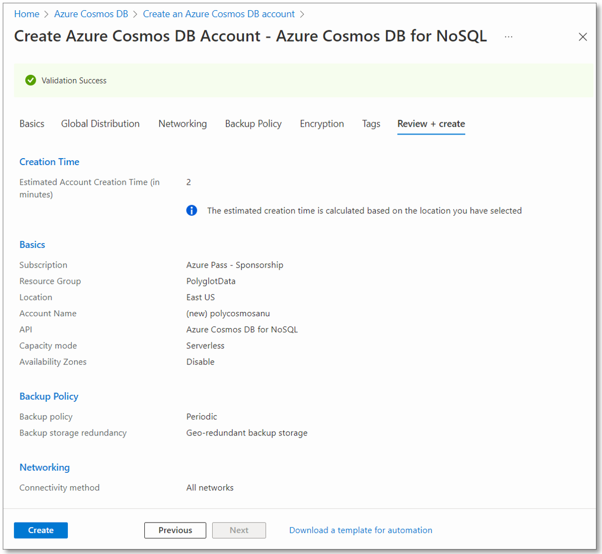

---
lab:
    az204Title: 'ラボ 04: ポリグロット データ ソリューションの構築'
    az020Title: 'ラボ 04: ポリグロット データ ソリューションの構築'
    az204Module: 'モジュール 04: Cosmos DB ストレージを使用するソリューションの開発'
    az020Module: 'モジュール 04: Cosmos DB ストレージを使用するソリューションの開発'
---

# ラボ 04: ポリグロット データ ソリューションの構築

## Microsoft Azure ユーザー インターフェイス

Microsoft クラウド ツールは頻繁に更新されるため、このトレーニング コンテンツ作成後に一部の Azure UI が変更されている可能性があります。その結果、ラボの手順やステップが、正しく整合しない可能性があります。

Microsoft では、コミュニティから変更の必要性を通知されたとき、トレーニング コースを更新しています。しかし、クラウドの更新は頻繁に行われているため、このトレーニング コースを更新する前に、UI の変更に気づく場合があります。**その場合は、変更に適宜対応して、ラボで要求されている内容を処理してください。**

## 手順

### 開始する前に

#### ラボ環境へのログイン

次の認証情報を使用して、Windows 10 仮想マシン (VM) にログインします。
    
-   ユーザー名: **Admin**

-   パスワード: **Pa55w.rd**

> **注**: 講師が仮想ラボ環境に接続するための手順を説明します。

#### インストールされているアプリケーションを確認します

Windows 10 デスクトップでタスク バーを探します。タスク バーには、以下をはじめとする、このラボで使用するアプリケーションのアイコンが含まれています。
    
-   Microsoft Edge

-   エクスプローラー

-   Visual Studio Code

## アーキテクチャの図


### 演習 1: Azure でデータ ストア リソースを作成する

#### タスク 1: Azure portal を開く

1.  タスク バーで、**Microsoft Edge** アイコンを選択します。

1.  開いたブラウザー ウィンドウで、Azure portal ([portal.azure.com](https://portal.azure.com)) を閲覧してから、このラボで使用するアカウントでログインします。

    > **注**: Azure portal に初めてログインする場合は、ポータルのツアーが表示されます。ツアーをスキップしてポータルの使用を開始するには、「**開始**」を選択します。

#### タスク 2: Azure Cosmos DB アカウント リソースの作成

1.  Azure portal で、「**リソース、サービス、およびドキュメントの検索**」テキスト ボックスを使用して「**Azure Cosmos DB**」を検索し、結果のリストで「**Azure Cosmos DB**」を選択します。

1.  「**Azure Cosmos DB**」ブレードで、「**+ 作成**」を選択します。

1.  「**API オプションの選択**」ブレードで、「**コア (SQL) - 推奨**」ボックスで「**作成**」を選択します。

1.  「**Azure Cosmos DB の作成 - コア (SQL)**」ブレードの「**基本**」タブで、次のアクションを実行してから、「**確認および作成**」を選択します。

    | 設定                     | アクション                                                       |
    | --------------------------- | ------------------------------------------------------------ |
    | 「**サブスクリプション**」リスト       | 既定を保持します。                                             |
    | 「**リソース グループ**」セクション  | 「**新規作成**」を選択します。                                       |
    | 「**名前**」テキスト ボックス           | 「**Polyglotdata**」と入力し、「**OK**」を選択します。                                      |
    | 「**AccountName**」テキスト ボックス    | 「**polycosmos**_[yourname]_」と入力します。                            |
    | 「**場所**」ドロップダウン リスト | ラボ コンピューターの場所に最も近く、Cosmos DB アカウントを作成できる Azure リージョンを選択します。 |
    | 「**容量モード**」セクション   | 「**サーバーなし**」を選択します。 |
    
    次のスクリーンショットは、「**Azure Cosmos DB アカウントの作成 - コア (SQL)**」ブレードで構成された設定を示しています。
    
    
    
1.  「**Azure Cosmos DB アカウントの作成 - コア (SQL)**」ブレードの「**確認および作成**」タブで、前の手順で選択したオプションを確認します。 

1.  指定した構成を使用して Azure Cosmos DB アカウントを作成するには、「**作成**」を選択します。

    > **注**: 演習を進める前に、作成タスクが完了するまで待ちます。

1.  「**リソースに移動**」を選択します。

1.  「**Azure Cosmos DB アカウント**」ブレードで、「**設定**」セクションを見つけ、「**キー**」リンクを選択します。

1.  「**キー**」ペインの「**読み取りと書き込みのキー**」タブで、「**URI**」、「**主キー**」、および「**プライマリ接続文字列**」テキスト ボックスの値を記録します。これらの値は、このラボの後半で使用します。

#### タスク 3: Azure Storage アカウント リソースを作成する

1.  Azure portal で、「**リソース、サービス、およびドキュメントの検索**」テキスト ボックスを使用して、「**ストレージ アカウント**」を検索し、結果のリストで「**ストレージ アカウント**」を選択します。

1.  「**ストレージ アカウント**」ブレードで、「**+ 作成**」を選択します。

1.  「**ストレージ アカウントの作成**」ブレードの「**基本**」タブで、次のアクションを実行してから、「**確認および作成**」を選択します。


    | 設定                     | アクション                                                       |
    | --------------------------- | ------------------------------------------------------------ |
    | 「**サブスクリプション**」リスト       | 既定を保持します。                                             |
    | 「**リソース グループ**」セクション  | 「**PolyglotData**」を選択します。                                       |
    | 「**ストレージ アカウント名**」テキスト ボックス | 「**polystor**_[yourname]_」と入力します。                                      |
    | 「**リージョン**」ドロップダウン リスト   | この演習の前半で Cosmos DB アカウントを作成したのと同じリージョンを選択します。  |
    | 「**パフォーマンス**」セクション | 「**標準**」を選択します。 |
    | 「**冗長性**」ロップダウン リスト | 「**ローカル冗長ストレージ (LRS)**」を選択します。 |
    
    
    次のスクリーンショットは、「**ストレージ アカウントの作成**」ブレード上で構成された設定を示しています。
          
     
     
1.  「**ストレージ アカウントの作成**」ブレードの「**確認および作成**」タブで、前の手順で選択したオプションを確認します。

1.  指定した構成を使用してストレージ アカウントを作成するには、「**作成**」 を選択します。

    > **注**: このラボを進める前に、作成タスクが完了するまで待ちます。

#### 確認

この演習では、このラボで実装するポリグロット データ ソリューションに必要な Azure リソースを作成しました。作成した Azure リソースには、Azure Cosmos DB アカウントと Azure Storage アカウントが含まれます。

### 演習 2: データを確認およびアップロードする

#### タスク 1: Azure Blob Storage に画像をアップロードする

1.  Azure portal の「ナビゲーション」ウィンドウで、「**ストレージ アカウント**」ブレードに戻り、このラボの前の演習で作成した「**polystor**_[yourname]_」ストレージ アカウントを選択します。

1.  「**polystor**_[yourname]_」ブレードで、「**データ ストレージ**」セクションにある「**コンテナー**」を選択します。

1.  「**コンテナー**」セクションで、「**+ コンテナー**」を選択します。

1.  「**新規コンテナー**」ポップアップ ウィンドウ、次のアクションを実行してから、「**作成**」を選択します。

    | 設定                     | アクション                                                       |
    | --------------------------- | ------------------------------------------------------------ |
    | 「**名前**」テキスト ボックス       | 「**images**」と入力します。                                             |
    | 「**パブリック アクセス レベル**」ドロップダウン リスト | 「**Blob (BLOB の場合のみ匿名読み取りアクセス)**」を選択します。 |
    
   
1.  「**コンテナー**」セクションに戻 り、新しく作成した「**イメージ**」コンテナーを選択します。

1.  「**コンテナー**」ブレードの「**設定**」セクションを見つけて、「**プロパティ**」リンクを選択します。

1.  「**プロパティ**」ペインで、値をメモして、「**URL**」テキスト ボックスに記録します。この値は、このラボの後半で使用します。

1.  ブレードで「**概要**」リンクを見つけて選択します。

1.  ブレードで、「**アップロード**」を選択します。

1.  「**BLOB をアップロード**」ポップアップで、次の操作を実行します。
    
    a.  **「ファイル」** セクションで、**「フォルダー」** アイコンを選択します。
    
    b. 「**File Explorer**」ウィンドウで、「**Allfiles(F):\\Allfiles\\Labs\\04\\Starter\\Images**」を参照し、42 個の個別の **「.jpg」** 画像ファイルをすべて選択してから、「**開く**」を選択します。
    
    c.  **「ファイルが存在する場合は上書きする」** が選択されていること確認してから、**「アップロード」** を選択します。

    > **注**: このラボを続行する前に、すべての BLOB がアップロードされるのを待ちます。

#### タスク 2: JSON データを確認する

1.  ラボ コンピューターで、Visual Studio Code を起動します。

1.  「**ファイル**」メニューで、「**フォルダーを開く**」を選択し、「**Allfiles (F):\\Allfiles\\Labs\\04\\Starter\\AdventureWorks\\AdventureWorks.Upload**」を参照して、「**models.json**」を選択してから、「**開く**」を選択します。

1.  **models.json** ファイルの形式を確認し、**Products** プロパティの一部であるオブジェクトのネストされた配列を含む JSON オブジェクトの配列が含まれていることに注意してください。

    > **注**: これにより、JSON ファイルのコンテンツを Cosmos DB コレクションにアップロードする前に逆シリアル化するために定義するクラスが決まります。

1.  **models.json** ファイル内で、プロパティの 1 つが **Category** という名前であることに注意してください。

    > **注**: **Category** プロパティを使用して、ターゲットの Cosmos DB コレクションのパーティション化を定義します。

1.  Visual Studio Code を閉じます。

#### タスク 3: Cosmos DB データベースとコレクションを作成し、JSON データのアップロードを実行する

1.  「**スタート**」画面で、「**Visual Studio Code**」タイルを選択します。

1.  「**ファイル**」メニューで、「**フォルダーを開く**」を選択します。

1.  開かれる「**File Explorer**」ウィンドウで、「**Allfiles (F):\\Allfiles\\Labs\\04\\Starter\\AdventureWorks**」に移動し、「**フォルダーの選択**」を選択します。

1.  「**Visual Studio Code**」ウィンドウの「**エクスプローラー**」ペインで空の領域を選択し、ショートカット メニューをアクティブ化してから、「**統合ターミナルで開く**」を選択します。

1.  ターミナル プロンプトから、現在のディレクトリが **AdventureWorks** に設定されていることを確認し (そうでない場合は変更します)、次のコマンドを実行して、ターミナル コンテキストを **AdventureWorks.Upload** フォルダーに切り替えます。

    ```
    cd .\AdventureWorks.Upload\
    ```

1.  ターミナル プロンプトから、次のコマンドを実行して、現在開いているプロジェクトに Azure Cosmos DB.NET クライアント ライブラリを追加します。

    ```
    dotnet add package Microsoft.Azure.Cosmos --version 3.20.1
    ```

    > **注**: **dotnet add package** コマンドは、**NuGet** から **Microsoft.Azure.Cosmos** パッケージを追加します。詳細については、[Microsoft.Azure.Cosmos](https://www.nuget.org/packages/Microsoft.Azure.Cosmos/3.20.1) を参照してください。

1.  端末に印刷されたビルドの結果を確認します。ビルドは問題なくまた、警告メッセージもなく正常に完了します。

1.  「**Visual Studio Code**」ウィンドウの「**エクスプローラー**」ペインで、**AdventureWorks.Upload** プロジェクトを展開します。

1.  **Program.cs** ファイルを開きます。

1.  **Program.cs** ファイルで、**using** ディレクティブを確認し、**Microsoft.Azure.Cosmos**、**System.IO**、**System.Text.Json**、**System.Threading.Tasks**、および **System.Collections.Generic** が含まれていることに注意してください。これにより、ラボ コンピューターのローカル ファイルから Cosmos DB データベースのコレクションへの JSONア イテムの非同期アップロードが可能になります。

1.  **Program.cs** ファイルの 14 行目で、空の文字列をこのラボで以前に記録した Cosmos DB アカウントの **URI** プロパティに置き換えて、**EndpointUrl** の値を設定します。値が二重引用符で囲まれていることを確認してください。

1.  15 行目で、空の文字列を、このラボで以前に記録した Cosmos DB アカウントの **PRIMARY KEY** プロパティに置き換えて、**AuthorizationKey** の値を設定します。値が二重引用符で囲まれていることを確認してください。

1.  18行目で、空の文字列を **"/Category"** に置き換えて、**PrimaryKey** の値を設定します。

1.  19行目で、空の文字列を **"F:\\\\Allfiles\\\\Labs\\\\04\\\\Starter\\\\AdventureWorks\\\\AdventureWorks.Upload\\\\models.json"** に置き換えて、**JsonFilePath** の値を設定します。

1.  try ブロック内で、**CosmosClient** クラスの **CreateDatabaseIfNotExistsAsync** メソッドの呼び出しに注意してください。データベースがまだ存在しない場合は、これによりデータベースが作成されます。

1.  **Database** クラスの **DefineContainer** メソッドの呼び出しに注意してください。これにより、JSON アイテムがまだ存在しない場合に、JSON アイテムをホストするコンテナーが作成されます。

    > **注**: **DefineContainer** メソッドには、既定のインデックス作成ポリシー (すべての属性に自動的にインデックスを付ける) を変更できるコスト最小化オプションが含まれています。

1.  **StreamReader** オブジェクトに依存してテキスト ファイルから JSON アイテムを読み取り、**Program.cs** ファイルでさらに定義された **Model** クラスのオブジェクトに逆シリアル化する **using** ステートメントに注意してください。

1.  逆シリアル化されたオブジェクトのコレクションを反復処理し、それぞれをターゲット コレクションに非同期的に挿入する foreach ループに注意してください。

1.  このラボで前に確認した JSON 形式のファイルに保存されているオブジェクトの形式を反映する **Model** クラスと **Product** クラスを確認します。

1.  **Program.cs** ファイルを保存して閉じます。

1.  ターミナル プロンプトから、次のコマンドを実行して、不足している NuGet パッケージを復元し、フォルダーにプロジェクトをビルドします。

    ```
    dotnet build
    ```

    > **注**: **dotnet build** コマンドは、フォルダー内のすべてのプロジェクトをビルドする前に、不足している NuGet パッケージを自動的に復元します。

1.  ターミナル プロンプトから、次のコマンドを実行して、.NET Core コンソール アプリケーションを実行します。

    ```
    dotnet run
    ```

    > **注**: **dotnet run** コマンドは、プロジェクトへの変更を自動的にビルドし、デバッガーを接続せずに Web アプリケーションを起動します。このコマンドは、ターゲット コレクションに挿入されたアイテムの数や挿入操作の期間など、データ ロードの進行状況を示すメッセージを出力します。

1.  ターミナルに出力されたコマンドを実行した結果を観察します。実行は正常に完了し、ターゲットの Cosmos DB コレクションに 119 個のアイテムが挿入されているというメッセージが表示されます。

1.  **「ターミナルの強制終了」** (**ごみ箱**アイコン) を選択して、ターミナル ペインと関連するプロセスを閉じます。

#### タスク 4: JSON データのアップロードを検証する

1.  ラボ コンピューターで、Azure portal を表示している **Microsoft Edge** ブラウザー ウィンドウに切り替えます。

1.  Azure portal で、「**Azure Cosmos DB**」ブレードに戻り、Cosmos DB アカウント リストで、このラボで前に作成した **polycosmos**_[yourname]_ Azure Cosmos DB アカウントを選択します。

1.  「**Azure Cosmos DB アカウント**」ブレードで、「**Data Explorer**」リンクを見つけて選択します。

1.  「**Data Explorer**」ペインで、「**Retail**」データベース ノードを展開します。

1.  「**Online**」コンテナー ノードを展開し、「**New SQL Query**」を選択します。

    > **注**: このオプションのラベルは非表示になっている可能性があります。「**Data Explorer**」ペインの上部にあるアイコンにカーソルを合わせると、ラベルが表示されます。

1.  表示されるクエリ タブに、次のテキストを入力します。

    ```
    SELECT * FROM models
    ```

1.  「**Execute Query**」を選択し、クエリが返す JSON アイテムの一覧を確認します。

1.  クエリ エディターに戻り、既存のテキストを次のテキストに置き換えます。

    ```
    SELECT VALUE COUNT(1) FROM models
    ```

1.  「**Execute Query**」を選択し、「**COUNT**」集計操作の結果を確認します。

1.  「**Visual Studio Code**」ウィンドウに戻ります。

#### 確認

この演習では、.NET SDK for Azure Cosmos DB を使用して、Azure Cosmos DB にデータを挿入しました。次に実装する Web アプリケーションは、このデータを使用します。

### 演習 3: .NET Web アプリケーションを構成する

#### タスク 1: データ ストアへの参照を更新し、Web アプリケーションを構築する

1.  「**Visual Studio Code**」ウィンドウの「**エクスプローラー**」ペインで、**AdventureWorks.Web** プロジェクトを展開します。

1.  **appsettings.json** ファイルを開きます。

1.  JSON オブジェクトの3行目で **ConnectionStrings.AdventureWorksCosmosContext** パスを見つけます。現在の値は空であることに注意してください。

    ```
    "ConnectionStrings": {
        "AdventureWorksCosmosContext": "",
    },
    ```

1.  このラボで前に記録した Azure Cosmos DB アカウントの **PRIMARY CONNECTION STRING** 列に値を設定して、**AdventureWorksCosmosContext** プロパティの値を更新します。

1.  JSON オブジェクトの6行目で、**Settings.BlobContainerUrl** パスを見つけます。現在の値は空であることに注意してください。

    ```
    "Settings": {
        "BlobContainerUrl": "",
        ...
    }
    ```

1.  このラボで前に記録した **images** と名付けられた Azure Storage BLOB コンテナーの **URL** プロパティに値を設定して、**BlobContainerUrl** プロパティを更新します。

1.  **appsettings.json** ファイルを保存して閉じます。

1.  「**Visual Studio Code**」ウィンドウで、「**AdventureWorks.Context**」を選択し、ショートカット メニューをアクティブ化してから、**「統合ターミナルで開く」** を選択します。

1.  ターミナル プロンプトから、現在のディレクトリが **AdventureWorks.Context** に設定されていることを確認し (そうでない場合は変更します)、次のコマンドを実行してから、**Microsoft.Azure.Cosmos** を NuGet からインポートします。

    ```
    dotnet add package Microsoft.Azure.Cosmos --version 3.20.1
    ```

1.  ターミナル プロンプトから、次のコマンドを実行して、.NET Web アプリケーションをビルドします。

    ```
    dotnet build
    ```

1.  端末に印刷されたビルドの結果を確認します。ビルドは問題なくまた、警告メッセージもなく正常に完了します。

#### タスク 2: Azure Cosmos DB への接続を構成する

1.  「**Visual Studio Code**」ウィンドウの「**エクスプローラー**」ペインで、**AdventureWorks.Context** プロジェクトを展開します。

1.  **AdventureWorks.Context** フォルダー ノードのショートカット メニューから、「**新しいファイル**」を選択します。

1.  新しいファイル プロンプトで、**AdventureWorksCosmosContext.cs** と入力します。

1.  **AdventureWorksCosmosContext.cs** ファイルのコード エディター タブで、次のコード行を追加して、参照されている **AdventureWorks.Models** プロジェクトから **AdventureWorks.Models** 名前空間をインポートします。

    ```
    using AdventureWorks.Models;
    ```

1.  次のコード行を追加して、NuGet からインポートした **Microsoft.Azure.Cosmos** パッケージから **Microsoft.Azure.Cosmos** と **Microsoft.Azure.Cosmos.Linq** 名前空間をインポートします。

    ```
    using Microsoft.Azure.Cosmos;
    using Microsoft.Azure.Cosmos.Linq;
    ```

1.  次のコード行を追加して、このファイルが使用する組み込み名前空間の **using** ディレクティブを含めます。

    ```
    using System;
    using System.Collections.Generic;
    using System.Linq;
    using System.Threading.Tasks;
    ```

1.  次のコードを入力して、**AdventureWorks.Context** 名前空間ブロックを追加します。

    ```
    namespace AdventureWorks.Context
    {
    }
    ```

1.  **AdventureWorks.Context** 名前空間内で、次のコードを入力して、新しい **AdventureWorksCosmosContext** クラスを作成します。

    ```
    public class AdventureWorksCosmosContext
    {
    }
    ```

1.  このクラスが **AdventureWorksProductContext** インターフェイスを実装することを示す仕様を追加して、**AdventureWorksCosmosContext** クラスの宣言を更新します。

    ```
    public class AdventureWorksCosmosContext : IAdventureWorksProductContext
    {
    }
    ```

1.  **AdventureWorksCosmosContext** クラス内で、次のコードを入力して、*_container* と名付けられた読み取り専用の新しい**コンテナー**変数を作成します。

    ```
    private readonly Container _container;
    ```

1.  **AdventureWorksCosmosContext** クラス内で、次のシグネチャを持つ新しいコンストラクターを追加します。

    ```
    public AdventureWorksCosmosContext(string connectionString, string database = "Retail", string container = "Online")
    {
    }
    ```

1.  コンストラクター内で、**CosmosClient** クラスの新しいインスタンスを作成してから、クライアントから**データベース**と**コンテナー** インスタンスの両方を取得するために、次のコード ブロックを追加ます。

    ```
    _container = new CosmosClient(connectionString)
        .GetDatabase(database)
        .GetContainer(container);
    ```

1.  **AdventureWorksCosmosContext** クラス内で、次のシグネチャを持つ新しい **FindModelAsync** メソッドを追加します。

    ```
    public async Task<Model> FindModelAsync(Guid id)
    {
    }
    ```

1.  **FindModelAsync** メソッド内で、次のコード ブロックを追加して LINQ クエリを作成し、それを反復子に変換し、結果セットを反復処理して、結果セットの単一のアイテムを返します。

    ```
    var iterator = _container.GetItemLinqQueryable<Model>()
        .Where(m => m.id == id)
        .ToFeedIterator<Model>();

    List<Model> matches = new List<Model>();
    while (iterator.HasMoreResults)
    {
        var next = await iterator.ReadNextAsync();
        matches.AddRange(next);
    }

    return matches.SingleOrDefault();
    ```

1.  **AdventureWorksCosmosContext** クラス内で、次のシグネチャを持つ新しい **GetModelsAsync** メソッドを追加します。

    ```
    public async Task<List<Model>> GetModelsAsync()
    {
    }
    ```

1.  **GetModelsAsync** メソッド内で、次のコードブロックを追加して SQL クエリを実行し、クエリ結果の反復子、結果セットの反復子を取得して、すべての結果の和集合を返します。

    ```
    string query = $@"SELECT * FROM items";

    var iterator = _container.GetItemQueryIterator<Model>(query);

    List<Model> matches = new List<Model>();
    while (iterator.HasMoreResults)
    {
        var next = await iterator.ReadNextAsync();
        matches.AddRange(next);
    }

    return matches;
    ```

1.  **AdventureWorksCosmosContext** クラス内で、次のシグネチャを持つ新しい **FindProductAsync** メソッドを追加します。

    ```
    public async Task<Product> FindProductAsync(Guid id)
    {
    }
    ```

1.  **FindProductAsync** メソッド内で、次のコード ブロックを追加して SQL クエリを実行し、クエリ結果反復子を取得し、結果セットを反復処理して、結果セットの単一のアイテムを返します。

    ```
    string query = $@"SELECT VALUE products
                        FROM models
                        JOIN products in models.Products
                        WHERE products.id = '{id}'";

    var iterator = _container.GetItemQueryIterator<Product>(query);

    List<Product> matches = new List<Product>();
    while (iterator.HasMoreResults)
    {
        var next = await iterator.ReadNextAsync();
        matches.AddRange(next);
    }

    return matches.SingleOrDefault();
    ```

1.  **AdventureWorksCosmosContext.cs** ファイルを保存して閉じます。
   
1.  ターミナル プロンプトから、現在のディレクトリを **AdventureWorks.Context** に設定し、次のコマンドを実行して .NET Web アプリケーションを構築します。

    ```
    dotnet build
    ```

    > **注**: ビルド エラーがある場合は、**Allfiles (F):\\Allfiles\\Labs\\04\\Solution\\AdventureWorks\\AdventureWorks.Context** フォルダーにある **AdventureWorksCosmosContext.cs** ファイルを確認します。

#### タスク 3: .NET アプリケーションのスタートアップ ロジックを確認する

1.  「**Visual Studio Code**」ウィンドウの「**エクスプローラー**」ペインで、**AdventureWorks.Web** プロジェクトを展開します。

1.  **Startup.cs** ファイルを開きます。

1.  **Startup** クラスで、既存の **ConfigureProductService** メソッドに注意してください。

    ```
    public void ConfigureProductService(IServiceCollection services)
    {
        services.AddScoped<IAdventureWorksProductContext, AdventureWorksSqlContext>(provider =>
            new AdventureWorksCosmosContext(
                _configuration.GetConnectionString(nameof(AdventureWorksCosmosContext))
            )
        );
    }
    ```

    > **注**: 製品サービスは、データベースとして Cosmos DB を使用します。

1.  変更を加えずに **Startup.cs** ファイルを閉じます。

#### タスク 4: .NET アプリケーションがデータストアに正常に接続することを検証する

1.  Visual Studio Code で、ターミナル プロンプトから次のコマンドを実行して、ターミナル コンテキストを **AdventureWorks.Web** フォルダーに切り替えます。

    ```
    cd ..\AdventureWorks.Web\
    ```

1.  ターミナル プロンプトから、次のコマンドを実行して、ASP.NET Web アプリケーションを実行します。

    ```
    dotnet run
    ```

    > **注**: **dotnet run** コマンドは、プロジェクトへの変更を自動的にビルドし、デバッガーを接続せずに Web アプリケーションを起動します。このコマンドは、実行中のアプリケーションの URL と割り当てられたポートを出力します。

1.  タスク バーで、**Microsoft Edge** アイコンを選択します。

1.  開いているブラウザー ウィンドウで、現在実行中の Web アプリケーション (<http://localhost:5000>) に移動します。

1.  Web アプリケーションで、フロント ページに表示されるモデルの一覧を確認します。

1.  **Touring-1000** モデルを見つけて、「**詳細の表示**」を選択します。

1.  「**Touring-1000** 製品の詳細」ページで、オプションのリストを確認します。

1.  Web アプリケーションを表示するブラウザー ウィンドウを閉じます。

1.  「**Visual Studio Code**」ウィンドウに切り替え、「**Kill Terminal**」または「**Recycle Bin**」アイコンを選択して、現在開いているターミナルと関連付けられているプロセスを閉じます。

#### 確認

この演習では、.NET SDK を使用して Azure Cosmos DB コレクションを照会する C# コードを作成しました。

### 演習 4: サブスクリプションのクリーンアップ 

#### タスク 1: Azure Cloud Shell を開く

1.  Azure portal で、**Cloud Shell** アイコン  を選択して、新しい Bash セッションを開始します。Cloud Shell が既定の PowerShell セッションである場合は、**「PowerShell」** を選択し、ドロップダウン メニューで、**「Bash」** を選択します。

     >**注**: 初めての **Cloud Shell** の起動であり、プロンプトが表示された場合は、**「Bash」** または **「PowerShell」** を選択して、**「PowerShell」**を選択します。**「ストレージがマウントされていません」** というメッセージが表示されたら、このラボで使用しているサブスクリプションを選択してから、**「ストレージの作成」** を選択します。

#### タスク 2: リソース グループの削除

1.  「**Cloud Shell**」ペインで、次のコマンドを実行して、**PolyglotData** リソース グループを削除します。

    ```
    az group delete --name PolyglotData --no-wait --yes
    ```
    
     >**注**: コマンドは非同期で実行されます (*--no-wait* パラメーターによって決定されます)。したがって、直後に別の Azure CLI コマンドを実行できますが、同じ Bash セッション内で、リソース グループが実際に削除されるまでに数分かかります。
  
1.  ポータルで、**Cloud Shell** ペインを閉じます。

#### タスク 3: アクティブなアプリケーションを閉じる

1.  現在実行中の Microsoft Edge アプリケーションを閉じます。

1.  現在実行中の Visual Studio Code アプリケーションを閉じます。

#### 確認

この実習では、このラボで使用するリソース グループを削除することで、サブスクリプションをクリーンアップしました。
