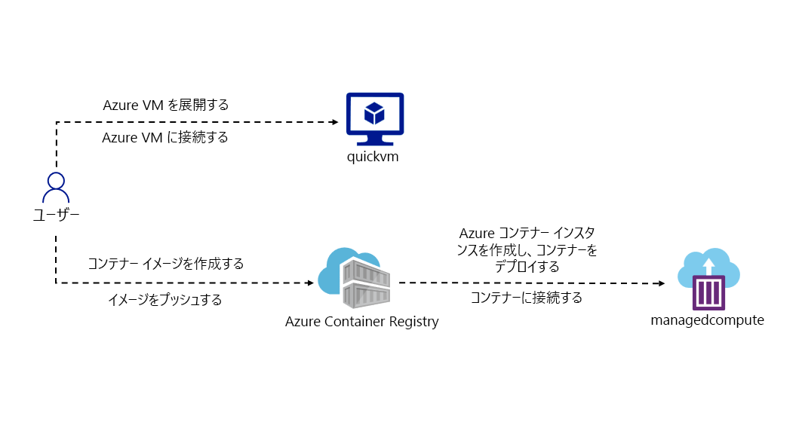

---
lab:
  az204Title: 'Lab 05: Deploy compute workloads by using images and containers'
  az204Module: 'Learning Path 05: Implement containerized solutions'
---

# ラボ 05: イメージとコンテナーを使用してコンピューティング ワークロードをデプロイする

## Microsoft Azure ユーザー インターフェイス

Microsoft クラウド ツールの動的な特性のために、このトレーニング コンテンツの開発後に Azure UI が変更される可能性があります。 その結果、ラボの指示とラボの手順が正しく整合しなくなる可能性があります。

Microsoft は、コミュニティから必要な変更の通知があったときに、このトレーニング コースを更新します。 ただし、クラウドの更新は頻繁に発生するため、このトレーニング コンテンツの更新の前に UI の変更に気付く可能性があります。 **これが発生した場合は、その変更に適応し、ラボでは必要に応じてそれらに対応してください。**

## Instructions

### 開始する前に

#### ラボ環境にサインインする

次の資格情報を使用して Windows 11 仮想マシン (VM) にサインインします。

- ユーザー名: `Admin`
- パスワード: `Pa55w.rd`

> **注**: 仮想ラボ環境に接続するための手順は、インストラクターから提供されます。

#### インストールされているアプリケーションを確認する

Windows 11 デスクトップでタスク バーを探します。 タスク バーには、このラボで使用する次のようなアプリケーションのアイコンが含まれています。

-   Microsoft Edge
-   エクスプローラー

## 課題シナリオ

このラボでは、.NET アプリケーションと Docker ファイルを使用してコンテナーを作成し、Azure Container Registry にデプロイする方法を確認します。 また、コンテナー化されたソリューションを Azure Container Apps にデプロイします。

## アーキテクチャの図




### 演習 1: Docker コンテナー イメージを作成し、それを Azure Container Registry にデプロイする

#### タスク 1: Azure portal を開く

1. タスク バーで、**Microsoft Edge** アイコンを選択します。

1. 開いたブラウザー ウィンドウで、Azure portal (`https://portal.azure.com`) に移動してから、このラボで使用するアカウントでサインインします。

   > **注**: Azure portal に初めてサインインしている場合は、ポータルのツアーが表示されます。 ツアーをスキップする場合は、 **[作業開始]** を選択してポータルの使用を開始します。

#### タスク 2: リソース グループを作成する

1. Azure portal のナビゲーション ウィンドウで、**[リソース、サービス、ドキュメントの検索]** テキスト ボックスを使用して、「**リソース グループ**」を検索し、結果のリストで **[リソース グループ]** を選択します。

1. **[リソース グループ]** ブレードで、 **[作成]** を選択します。

1. **[リソース グループの作成]** ブレードの **[基本]** タブで、次のアクションを実行し、 **[確認および作成]** を選択します。

    | 設定 | アクション |
    | -- | -- |
    | **[サブスクリプション]** ドロップダウン リスト | 既定値のままにします  |
    | **[リソース グループ]** テキスト ボックス | 「**ContainerCompute**」と入力します |
    | **[リージョン]** ドロップダウン リスト | **[(米国) 米国東部]** を選択します |

    次のスクリーンショットには、 **[リソース グループの作成]** ブレードに構成されている設定が示されています。

    ![[リソース グループの作成] ブレード](./media/l05_create_a_resource_group.png)

1. **[確認および作成]** タブで、前の手順で選択したオプションを確認します。

1. **[作成]** を選択し、指定した構成を使用してリソース グループを作成します。  

    > **注**: 作成タスクが完了するまで待ってから、このラボを進めてください。


#### タスク 3:ソース プロジェクトを開始する

1. タスク バーで、**[ターミナル]** アイコンを選択します。

1. 次のコマンドを実行して、現在のディレクトリを **Allfiles (F):\\Allfiles\\Labs\\05\\Starter** ディレクトリに変更します。

    ```powershell
    cd F:\Allfiles\Labs\05\Starter
    ```

1. 次のコマンドを実行し、.NET 8.0 を使用して、新しい .NET コンソール アプリケーションを現在のディレクトリに作成します。

    ```powershell
    dotnet new console --output . --name ipcheck --framework net8.0
    ```

1. 次のコマンドを実行して、**Dockerfile** という名前の新しいファイルを現在のディレクトリに作成します。

    ```powershell
    New-Item -ItemType File Dockerfile
    ```

1. 次のコマンドを実行して、Visual Studio Code で現在のディレクトリを開きます。

    ```powershell
    code .
    ```

#### タスク 4: .NET アプリケーションを作成してテストする

1. **[Visual Studio Code]** ウィンドウの **[エクスプローラー]** ペインで、**Program.cs** ファイルを開きます。

1. **Program.cs** ファイルの内容全体を削除します。

1. 次のコードをコピーして、**Program.cs** ファイルに貼り付けます。

    ```csharp
    // Check if network is available
    if (System.Net.NetworkInformation.NetworkInterface.GetIsNetworkAvailable())
    {
        System.Console.WriteLine("Current IP Addresses:");

        // Get host entry for current hostname
        string hostname = System.Net.Dns.GetHostName();
        System.Net.IPHostEntry host = System.Net.Dns.GetHostEntry(hostname);
        
        // Iterate over each IP address and render their values
        foreach(System.Net.IPAddress address in host.AddressList)
        {
            System.Console.WriteLine($"\t{address}");
        }
    }
    else
    {
        System.Console.WriteLine("No Network Connection");
    }
    ```

1. **Program.cs** ファイルを保存します。

1. **Starter.sln** ファイルを削除します。

    > **注**:これにより、dotnet コマンドを使用するときに .csproj ファイルを明示的に参照する必要がなくなります。

1. **[ターミナル]** アプリケーションに切り替えます。

1. 次のコマンドを実行して、アプリケーションを実行します。

    ```powershell
    dotnet run
    ```

1. 結果を確認します。 少なくとも 1 つの IP アドレスが表示されています。これは、コンピューターに割り当てられている IP アドレスを表します。

1. **Visual Studio Code** ウィンドウに戻り、**[エクスプローラー]** ペインから **Dockerfile** ファイルを開きます。

1. 次のコードをコピーし、**Dockerfile** ファイルに貼り付けます。

    ```
    # Start using the .NET 8.0 SDK container image
    FROM mcr.microsoft.com/dotnet/sdk:8.0 AS build

    # Change current working directory
    WORKDIR /app

    # Copy existing files from host machine
    COPY . ./

    # Publish application to the "out" folder
    RUN dotnet publish --configuration Release --output out

    # Start container by running application DLL
    ENTRYPOINT ["dotnet", "out/ipcheck.dll"]
    ```

1. **Dockerfile** ファイルを保存します。

    > **注**:次に、すべてのプロジェクト ファイルを含むアーカイブを作成します。 これにより、Cloud Shell へのプロジェクト ファイルのアップロードが簡単になります。

1. **[ターミナル]** アプリケーションに切り替えます。

1. 次のコマンドを実行して、アーカイブを作成します。

    ```powershell
    Compress-Archive -Path .\* -DestinationPath .\lab05.zip
    ```

#### タスク 5: Container Registry リソースを作成する

1. Azure portal が表示されているブラウザー ウィンドウに切り替えます。 

1. Azure portal で **[Cloud Shell]** アイコン  を選択して Cloud Shell を開きます。 Cloud Shell が既定で PowerShell セッションに設定されている場合は、**[Cloud Shell]** メニューの **[Bash に切り替える]** を選択し、**[確認]** を選択します。

    > **注**: **Cloud Shell** は、大なり記号 (\>) とアンダースコア文字 (\_) で表されます。

    **Cloud Shell** を初めて起動した場合は、**[作業を始める]** プロンプトが表示されます。 **[ストレージ アカウントは必要ありません]** を選択したあと、**[適用]** を選択します。

1. **[Cloud Shell]** ペインで **[ファイルの管理]** を選択し、ドロップダウン メニューで **[アップロード]** を選択します。

1. **[開く]** ダイアログ ボックスで、空の **Allfiles (F):\\Allfiles\\Labs\\05\\Starter** ディレクトリに移動し、**lab05.zip** を選択して、**[開く]** を選択します。

    > **注**:これにより、**Cloud Shell** セッション内で **/~** ディレクトリにファイルがアップロードされます。

1. ポータルの **Cloud Shell** コマンド プロンプトで、次のコマンドを実行して、**ipcheck** という名前の新しいディレクトリを **\~** ディレクトリに作成します。

    ```bash
    mkdir ~/ipcheck
    ```

1. 次のコマンドを実行して、アップロードしたアーカイブのコンテンツを、新しく作成されたディレクトリ **\~/ipcheck** に抽出します。

    ```bash
    unzip ~/lab05.zip -d ~/ipcheck
    ```

1. 次のコマンドを実行して、**\~/ipcheck** ディレクトリ内の抽出されたコンテンツ全体に対して、読み取りと実行のアクセス許可を設定します。

    ```bash
    chmod -R +xr ~/ipcheck
    ```

1. 次のコマンドを実行して、現在のディレクトリを **\~/ipcheck** に変更します。

    ```bash
    cd ~/ipcheck
    ```

1. ポータルの **Cloud Shell** コマンド プロンプトで、次のコマンドを実行して、コンテナー レジストリ リソース用の一意の値を持つ変数を作成します。 

    ```bash
    registryName=conregistry$RANDOM
    ```

1. ポータルの **Cloud Shell** コマンド プロンプトで、次のコマンドを実行して、前の手順で作成した名前が使用可能であることを確認します。 

    ```bash
    az acr check-name --name $registryName
    ```

    名前が使用可能であることが結果に表示されたら、次の手順に進みます。 名前が使用できない場合は、前の手順のコマンドを再実行し、使用できるかどうかをもう一度確認します。

1. ポータルの **Cloud Shell** コマンド プロンプトで、次のコマンドを実行して、コンテナー レジストリ リソースを作成します。 

    ```bash
    az acr create --resource-group ContainerCompute --name $registryName --sku Basic
    ```

    > **注**: 作成タスクが完了するまで待ってから、このラボを続行してください。

#### タスク 6: Container Registry のメタデータを格納する

1. ポータルの **Cloud Shell** コマンド プロンプトで、次のコマンドを実行して、サブスクリプション内のすべてのコンテナー レジストリの一覧を取得します。

    ```
    az acr list --resource-group ContainerCompute
    ```

1. 次のコマンドを実行して、レジストリの名前が出力として表示されることを確認します。 '[]' 以外の出力が表示されない場合は、1 分間待ってから、もう一度コマンドを実行してみてください。

    ```
    az acr list --resource-group ContainerCompute --query "max_by([], &creationDate).name" --output tsv
    ```

1. 次のコマンドを実行します。

    ```
    acrName=$(az acr list --resource-group ContainerCompute --query "max_by([], &creationDate).name" --output tsv)
    ```

1. 次のコマンドを実行します。

    ```
    echo $acrName
    ```

#### タスク 7: Container Registry に Docker コンテナー イメージをデプロイする

1. 次のコマンドを実行して、アクティブなディレクトリを **\~/** から **\~/ipcheck** に変更します。

    ```
    cd ~/ipcheck
    ```

1. 次のコマンドを実行して、現在のディレクトリの内容を取得します。

    ```
    dir
    ```

1. 次のコマンドを実行して、ソース コードをコンテナー レジストリにアップロードし、コンテナー イメージをコンテナー レジストリ タスクとしてビルドします。

    ```
    az acr build --registry $acrName --image ipcheck:latest .
    ```

    > **注**: ビルド タスクが完了するまで待ってから、このラボを進めてください。

1. ポータルの **[Cloud Shell]** ウィンドウを閉じます。

#### タスク 8: Container Registry のコンテナー イメージを検証する

1. Azure portal の**ナビゲーション** ウィンドウで **[リソース グループ]** リンクを選択します。

1. **[リソース グループ]** ブレードで、このラボで前に作成した **ContainerCompute** リソース グループを選択します。

1. **[ContainerCompute]** ブレードで、このラボで前に作成したコンテナー レジストリを選択します。

1. **[コンテナー レジストリ]** ブレードの **[サービス]** セクションで、 **[リポジトリ]** リンクを選択します。

1. **[リポジトリ]** セクションで、**ipcheck** コンテナー イメージ リポジトリを選択し、 **[最新]** タグを選択します。

1. **[最新]** タグを使用して、コンテナー イメージのバージョンのメタデータを確認します。

    > **注**: **[実行 ID]** リンクを選択して、ビルド タスクに関するメタデータを検索することもできます。

#### 確認

この演習では、コンピューターの現在の IP アドレスを表示する .NET コンソール アプリケーションを作成しました。 次に、Docker コンテナー イメージに変換できるように、**Dockerfile** ファイルをアプリケーションに追加しました。 最後に、コンテナー レジストリにコンテナー イメージをデプロイしました。

### 演習 2: Azure コンテナー インスタンスをデプロイする

#### タスク 1: コンテナー レジストリで管理者ユーザーを有効にする

1. [**ContainerCompute**] リソース グループで、このラボで前に作成したコンテナー レジストリを選択し、[**アクセス キー**] ブレードを選択します。

1. 管理者ユーザー セクションでスイッチを切り替えて、このコンテナー レジストリの管理者ユーザーを有効にします。

#### タスク 2: コンテナーイメージを Azure コンテナー インスタンスに自動的にデプロイする

1. **[コンテナー レジストリ]** ブレードの **[サービス]** セクションで、 **[リポジトリ]** リンクを選択します。

1. **[リポジトリ]** セクションで、**ipcheck** コンテナー イメージを含むリポジトリを選択します。

1. リポジトリ ブレードの **[設定]** セクションで、**[アクセス キー]** を選択します。

1. **[アクセス キー]** ブレードで、**[管理者ユーザー]** チェック ボックスをオンにします。

1. リポジトリ ブレードの **[サービス]** セクションで、**[リポジトリ]** を選択します。 

1. リポジトリの一覧で **ipcheck** を選択します。

1. **[ipcheck]** ペインで、**[最新]** タグ エントリに関連付けられている省略記号メニューを選択し、**[インスタンスの実行]** を選択します。

1. **[コンテナー インスタンスの作成]** ブレードで、次のアクションを実行し、 **[作成]** を選択します。

    | 設定 | アクション |
    | -- | -- |
    | **[コンテナー名]** テキスト ボックス | 「**managedcompute**」と入力します |
    | **[コンテナー イメージ]** テキスト ボックス | 既定値のままにします |
    | **[OS の種類]** セクション | **[Linux]** を選択します |
    | **[サブスクリプション]** テキスト ボックス | 既定値のままにします |
    | **[リソース グループ]** ドロップダウン リスト | **[ContainerCompute]** を選択します |
    | **[場所]** ドロップダウン リスト | **[米国東部]** を選択します。 |
    | **[コアの数]** ドロップダウン リスト | **[2]** を選択します |
    | **[メモリ (GB)]** テキスト ボックス | 「**4**」と入力します |
    | **[パブリック IP アドレス]** セクション | **[いいえ]**  を選択します |

    次のスクリーンショットには、 **[コンテナー インスタンスの作成]** ブレードに構成されている設定が示されています。

    ![[コンテナー インスタンスの作成] ブレード](./media/l05_create_container_instance.png)

    > **注**: コンテナー インスタンスが作成されるまで待ってから、このラボを続行してください。

#### タスク 3: コンテナー インスタンスにコンテナー イメージを手動でデプロイする

1. Azure portal の**ナビゲーション** ウィンドウで、 **[リソースの作成]** リンクを選択します。

1. **[リソースの作成]** ブレードで、**[サービスとマーケットプレースの検索]** テキスト ボックスに「**コンテナー インスタンス**」と入力し、Enter キーを押します。

1. **[Marketplace]** 検索結果ブレードで、 **[コンテナー インスタンス]** の結果を選択します。

1. **[コンテナー インスタンス]** ブレードで **[作成]** を選択します。

1. **[コンテナー インスタンスの作成]** ブレードの **[基本]** タブで、次のアクションを実行し、 **[確認および作成]** を選択します。

    | 設定 | アクション |
    | -- | -- |
    | **[サブスクリプション]** ドロップダウン リスト | 既定値のままにします |
    | **[リソース グループ]** ドロップダウン リスト | **[ContainerCompute]** を選択します |
    | **[コンテナー名]**  テキスト ボックス | 「**manualcompute**」と入力します |
    | **[リージョン]** ドロップダウン リスト | **[(米国) 米国東部]** を選択します |
    | **[イメージのソース]** セクション | **[Azure Container Registry]** を選択します |
    | **[レジストリ]** ドロップダウン リスト | このラボで前に作成した **Azure Container Registry** リソースを選択します |
    | **[イメージ]** ドロップダウン リスト | **[ipcheck]** を選択します |
    | **[イメージ タグ]** ドロップダウン リスト | **[最新]** を選択します |
    | **サイズ: コア**  | 「**2**」と入力します |
    | **サイズ: メモリ (GiB)** | 「**4**」と入力します |

    次のスクリーンショットには、 **[コンテナー インスタンスの作成]** ブレードに構成されている設定が示されています。

    ![[コンテナー インスタンスの作成] ブレード](./media/l05_create_container_instance_manual.png)

1. **[確認および作成]** タブ で、選択したオプションを確認します。

1. **[作成]** を選択して、指定した構成を使用してコンテナー インスタンスを作成します。  

    > **注**: コンテナー インスタンスが作成されるまで待ってから、このラボを続行してください。


#### タスク 4: コンテナー インスタンスが正常に実行されたことを検証する

1. Azure portal のナビゲーション ウィンドウで **[リソース グループ]** リンクを選択します。

1. **[リソース グループ]** ブレードで、このラボで前に作成した **ContainerCompute** リソース グループを選択します。

1. **[ContainerCompute]** ブレードで、このラボで前に作成した **manualcompute** コンテナー インスタンスを選択します。

1. **[コンテナー インスタンス]** ブレードの **[設定]** セクションで、 **[コンテナー]** リンクを選択します。

1. **[コンテナー]** セクションで **[イベント]** の一覧を確認します。

1. **[ログ]** タブを選択し、コンテナー インスタンスのテキスト ログを確認します。

> **注**: 必要に応じて、**managedcompute** コンテナー インスタンスから **[イベント]** と **[ログ]** を検索することもできます。

> **注**: この時点では、**manualcompute** と **managedcompute** にイベントが含まれていない場合があります。

> **注**: アプリケーションの実行が完了すると、コンテナーは作業が完了したため終了します。 手動で作成されたコンテナー インスタンスでは、正常終了を許容すると指定したので、コンテナーは 1 回実行されました。 自動的に作成されたインスタンスでは、このオプションはありませんでした。また、コンテナーが常に実行していることが想定されているため、コンテナーの再起動の繰り返しが見られます。

#### 確認

この演習では、複数の方法を使用して、コンテナー イメージを Azure コンテナー インスタンスにデプロイしました。 手動の方法を使用することで、デプロイをさらにカスタマイズし、コンテナーの実行の一部としてタスクベースのアプリケーションを実行できました。


### 演習 3: セキュリティで保護された Container Apps 環境を作成し、コンテナー アプリをデプロイする。

#### タスク 1: 環境を準備する

1. Azure portal にサインインします。

1. **[Cloud Shell]** アイコンを選択し、 **[Bash]** 環境を選びます。

1. ポータルの **Cloud Shell** コマンド プロンプトで、次のコマンドを実行して、CLI 用の Azure Container Apps 拡張機能をインストールします。 

    ```bash
    az extension add --name containerapp --upgrade
    ```

1. 次のコマンドを実行して、Microsoft.App 名前空間を登録します。 

    ```bash
    az provider register --namespace Microsoft.App
    ```
   
   > **注**: Azure Container Apps リソースは、**Microsoft.Web** 名前空間から **Microsoft.App** 名前空間に移行されました。

1. 次のコマンドを実行して、Azure Monitor Log Analytics ワークスペースに **Microsoft.OperationalInsights** プロバイダーを登録します (使用したことがない場合)。 

    ```bash
    az provider register --namespace Microsoft.OperationalInsights
    ```

    > **注**: **Microsoft.App** 名前空間と **Microsoft.OperationalInsights** の登録は、それぞれ完了するまでに数分かかることがあります。

1. この演習の後半で使う環境変数を設定します。 
   
   ```bash
     myRG=ContainerCompute
     myAppContEnv=az204-env-$RANDOM
    ```

CLI がアップグレードされ、環境変数が作成されたら、Container Apps 環境を作成し、コンテナー アプリをデプロイできます。

#### タスク 2: 環境を作成する

Azure Container Apps 環境では、コンテナー アプリのグループを囲むセキュリティ保護された境界が作成されます。 同じ環境にデプロイされた Container Apps は、同じ仮想ネットワークにデプロイされ、同じ Log Analytics ワークスペースにログを書き込みます。

1. ポータルの **Cloud Shell** コマンド プロンプトで、次のコマンドを実行し、`az containerapp env` create コマンドを使用して環境を作成します。 

    ```bash
    az containerapp env create \
        --name $myAppContEnv \
        --resource-group $myRG \
        --location eastus
    ```

#### タスク 3: コンテナー アプリを作成する

コンテナー アプリ環境のデプロイが完了した後、Azure Container Apps にコンテナー イメージをデプロイします。

1. ポータルの **Cloud Shell** コマンド プロンプトで、次のコマンドを実行し、`az containerapp create` コマンドを使用してサンプル アプリ コンテナー イメージをデプロイします。 

    ```bash
    az containerapp create \
        --name my-container-app \
        --resource-group $myRG \
        --environment $myAppContEnv \
        --image mcr.microsoft.com/azuredocs/containerapps-helloworld:latest \
        --target-port 80 \
        --ingress 'external' \
        --query properties.configuration.ingress.fqdn
    ```
`--ingress` を `external` に設定すると、コンテナー アプリがパブリック要求で使用できるようになります。 このコマンドから、アプリにアクセスするリンクが返されます。

2. `az containerapp create` コマンドから返されるリンクを選び、コンテナー アプリが実行されていることを確認します。

#### 確認

この演習では、セキュリティで保護されたコンテナー アプリ環境内にコンテナーをデプロイしました。
