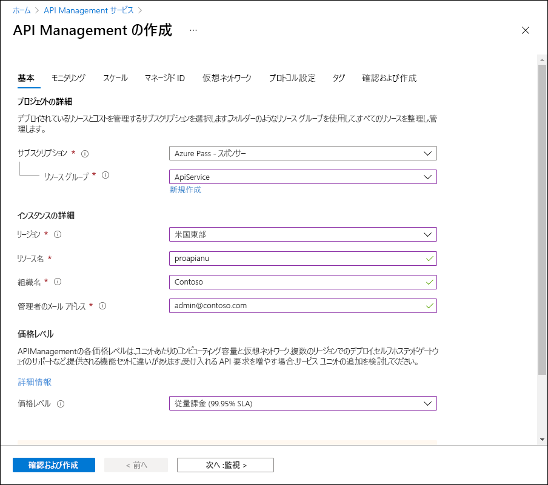
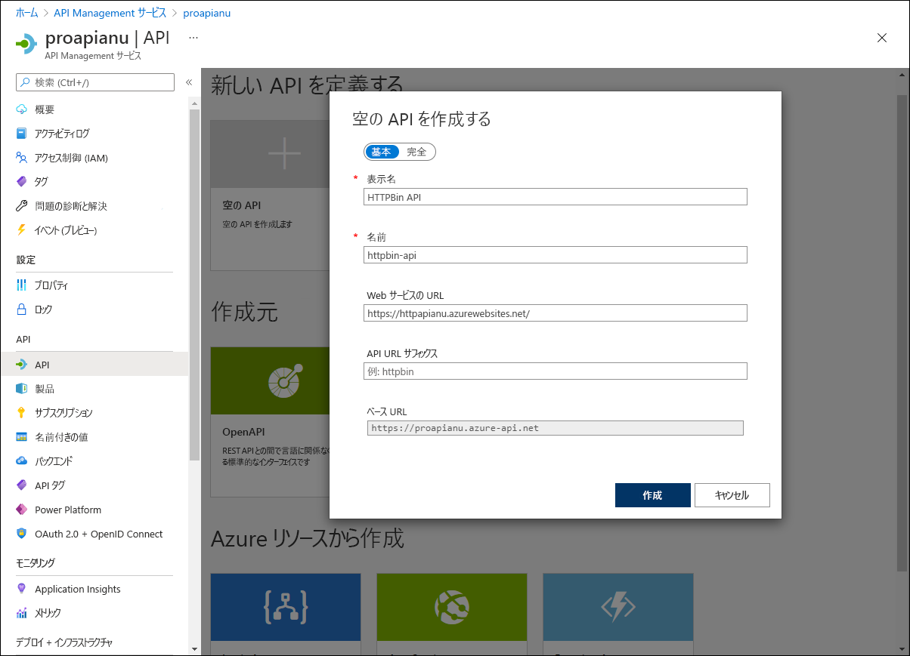
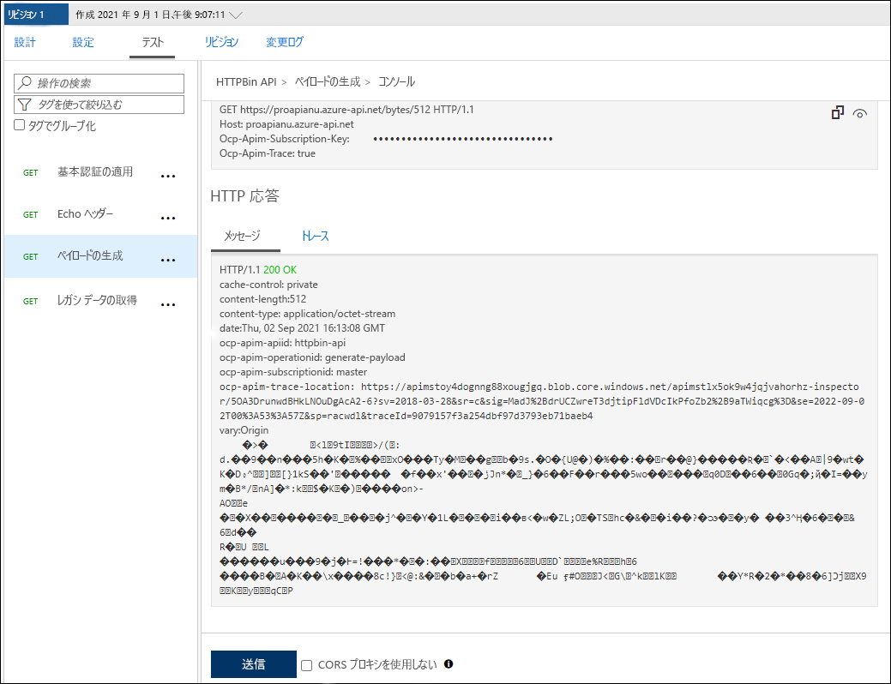

---
lab:
    az204Title: 'ラボ 08: Azure サービスを使用して多層ソリューションを作成する'
    az020Title: 'ラボ 08: Azure サービスを使用して多層ソリューションを作成する'
    az204Module: 'モジュール 08: API Management の実装'
    az020Module: 'モジュール 08: API Management の実装'
---

# ラボ 08: Azure サービスを使用して多層ソリューションを作成する

## Microsoft Azure ユーザー インターフェイス

Microsoft クラウド ツールは頻繁に更新されるため、このトレーニング コンテンツ作成後に一部の Azure UI が変更されている可能性があります。その結果、ラボの手順やステップが、正しく整合しない可能性があります。

Microsoft では、コミュニティから変更の必要性を通知されたとき、トレーニング コースを更新しています。しかし、クラウドの更新は頻繁に行われているため、このトレーニング コースを更新する前に、UI の変更に気づく場合があります。**その場合は、変更に適宜対応して、ラボで要求されている内容を処理してください。**


## 手順

### 開始する前に

#### ラボ環境へのログイン

次の認証情報を使用して、Windows 10 仮想マシン (VM) にログインします。
    
-   ユーザー名: **Admin**

-   パスワード: **Pa55w.rd**

> **注**: 講師が仮想ラボ環境に接続するための手順を説明します。

#### インストールされているアプリケーションを確認します

Windows 10 デスクトップでタスク バーを探します。タスク バーには、このラボで使用するアプリケーションのアイコンが含まれています。
    
-   Microsoft Edge

## アーキテクチャの図


### 演習 1: Docker コンテナー イメージを使用した Azure App Service リソースの作成

#### タスク 1: Azure portal を開く

1.  タスク バーで、**Microsoft Edge** アイコンを選択します。

1.  開いたブラウザー ウィンドウで、Azure portal ([portal.azure.com](https://portal.azure.com)) を閲覧してから、このラボで使用するアカウントでログインします。

    > **注**: Azure portal に初めてログインする場合は、ポータルのツアーが表示されます。ツアーをスキップしてポータルの使用を開始するには、「**開始**」を選択します。

#### タスク 2: httpbin コンテナー イメージを使用して Azure App Service リソースを使用して Web アプリを作成する

1.  Azure portal で、「**リソース、サービス、およびドキュメントの検索**」テキスト ボックスを使用して「**App Services**」を検索し、結果のリストで「**App Services**」を選択します。

1.  「**App Services**」ブレードで、「**+ 作成**」を選択します。

1.  「**Web アプリの作成**」ブレードの「**基本**」タブで、次のアクションを実行します。
    
    | 設定                         | アクション                                                       |
    | ------------------------------- | ------------------------------------------------------------ |
    | **サブスクリプション** ドロップダウン リスト | 既定値のままにします。                                    |
    | **リソース グループ** セクション      | 「**新規作成**」を選択し、「**ApiService**」と入力してから、「**OK**」を選択します。 |
    | **名前**テキスト ボックス               | 「**httpapi** *[yourname]*」と入力します。                        |
    | **公開**セクション             | **「Docker コンテナー」** を選択します。                                  |
    | **オペレーティング システム** セクション    | 「**Linux**」を選択します。                                             |
    | 「**リージョン**」ドロップダウン リスト      | Azure Web アプリをデプロイできる Azure リージョンを選択します。     |
    | 「**App Service プラン**」セクション    | 「**新規作成**」を選択し、「**名前**」テキスト ボックスに「**ApiPlan**」の値を入力してから、「**OK**」を選択します。 |
    | 「**SKU およびサイズ**」セクション        | 「**サイズの変更**」を選択し、「**スペック ピッカー**」ブレードで「**追加オプションを表示**」を選択し、「**S1**」を選択してから、「**適用**」を選択します。 |

1.  「**次へ: Docker >**」を選択します。

1.  **Docker** タブで、次のアクションを実行し、「**確認および作成**」を選択します。

    | 設定                         | アクション                                     |
    | ------------------------------- | ------------------------------------------ |
    | **オプション** ドロップダウン リスト      | **「単一コンテナー」** を選択します。           |
    | **イメージ ソース** ドロップダウン リスト | **「Docker ハブ」** を選択します。                 |
    | **アクセスの種類** ドロップダウン リスト  | **「公開」** を選択します。                  |
    | **イメージおよびタグ** テキスト ボックス      | 「**kennethreitz/httpbin:latest**」と入力します。 |

1.  **確認および作成**タブで、以前の手順で選択したオプションを確認します。

1.  指定された構成を使用して Web アプリを作成するには、「**作成**」 を選択します。

    > **注**: このラボを進める前に、作成タスクが完了するまで待ちます。

#### タスク 3: httpbin Web アプリケーションをテストする

1.  Azure portal で、「**リソース、サービス、およびドキュメントの検索**」テキスト ボックスを使用して「**App Services**」を検索し、結果のリストで「**App Services**」を選択します。

1.  「**App Services**」ブレードで、新しく作成した Web アプリを選択します。

1.  新しく作成されたアプリのプロパティを表示しているブレードで、「**参照**」を選択します。

1.  Web アプリケーション内で、次のアクションを実行します:

    a. 「**応答の形式**」を選択します。

    b. 「**GET/html**」を選択します。

    c. 「**試してみる**」を選択します。

    次のスクリーンショットは、Web アプリケーションの「**試してみる**」セクションを示しています。

    

    d. 「**実行**」を選択します。

    e. 「**応答本文**」および「**応答ヘッダー**」テキスト ボックスの値を確認します。

    f. 「**要求 URL**」 テキスト ボックスの値を確認します。

1.  Web アプリケーション内で、次のアクションを実行します:

    a. 「**動的データ**」を選択します。

    b. 「**GET/バイト/{n}**」を選択します。

    c. 「**試してみる**」を選択します。

    d. 「**n**」テキスト ボックスに「**25**」を入力します。

    e. 「**実行**」を選択します。

    f. 「**応答本文**」および「**応答ヘッダー**」テキスト ボックスの値を確認します。

    g. 「**ファイルのダウンロード**」を選択し、ファイルのダウンロード後、メモ帳でファイルを開き、内容を確認してから閉じます。

    > **注**: このファイルには、ランダムに生成された一連のバイトが含まれています。

    次のスクリーンショットは、Web アプリケーションの動的データ セクションを示しています。
  
    

1.  Web アプリケーション内で、次のアクションを実行します:

    a. 「**ステータス コード**」を選択します。

    b. 「**GET/ステータス/{codes}**」を選択します。

    c. 「**試してみる**」を選択します。

    d. 「**codes**」テキスト ボックスに「**404**」を入力します。

    e. 「**実行**」を選択します。

    f. 「**サーバーの応答**」を確認し、「**Error: NOT FOUND**」エントリが含まれていることに注意してください。
     
1.  Web アプリケーションを表示するブラウザー ウィンドウを閉じます。

1.  **httpapi**_[yourname]_ Web アプリが表示されているブラウザー タブに戻ります。

1.  「**設定**」セクションで、「**プロパティ**」リンクを選択します。 

1.  「**プロパティ**」セクションで、「**URL**」リンクの値を記録します。ラボの後半でこの値を使用して、対応する API にリクエストを送信します。

#### 確認

この演習では、Docker Hub をソースとするコンテナー イメージを使用して、新しい Azure Web アプリを作成しました。

### 演習 2: Azure API Management を使って、API プロキシ層を構築

#### タスク 1: API Management リソースを作成する

1.  Azure portal で、「**リソース、サービス、およびドキュメントの検索**」テキスト ボックスを使用して「**API Management Services**」を検索し、結果のリストで「**API Management Services**」を選択します。

1.  「**API Management Services**」ブレードで、「**+ 作成**」を選択します。

1.  「**API Management の作成**」ブレードで、次のアクションを実行してから、「**確認および作成**」を選択します。

    
    | 設定                           | アクション                                                       |
    | --------------------------------- | ------------------------------------------------------------ |
    | 「**サブスクリプション**」ドロップダウン リスト    | 既定値のままにします。                                    |
    | 「**リソース グループ**」セクション        | ラボで以前に作成した **ApiService** グループを選択します。 |
    | 「**リソース名**」テキスト ボックス        | 「**proapi** *[yourname]*」と入力します。                               |
    | 「**リージョン**」リスト                   | 前の演習で選択したのと同じリージョンを選択します。   |
    | 「**組織名**」テキスト ボックス    | 「**Contoso**」と入力します。                                           |
    | 「**管理者メール アドレス**」テキスト ボックス | `admin@contoso.com` と入力します。                                    |
    | 「**価格レベル**」ドロップダウン リスト   | **従量課金 (99.95% SLA)**.                                |

    次のスクリーンショットは、Web アプリケーションの「**API Management の作成**」ブレードの構成済み設定を示しています。
    
    

1.  「**確認および作成**」タブで、以前の手順で指定したオプションを確認してから、「**作成**」を選択します。

    > **注**: このラボを続行する前に、作成タスクが完了するまで待ちます。

#### タスク 2: 新しい API の定義

1.  Azure portal で、「**リソース、サービス、およびドキュメントの検索**」テキスト ボックスを使用して「**API Management Services**」を検索し、結果のリストで「**API Management Services**」を選択します。

1.  「**API Management Services**」ブレードで、新しく作成された API Management Services を選択します。

1.  「**API Management Service**」ブレードの「**API**」セクションで、「**API**」を選択します。

1.  「**新しい API を定義**」セクションで、「**HTTP**」を選択します。

1.  「**空白の API を作成する**」ウィンドウで、次のアクションを実行し、「**作成**」を選択します。
    
    | 設定                           | アクション                                                       |
    | --------------------------------- | ------------------------------------------------------------ |
    | 「**表示名**」テキスト ボックス    | 「**HTTPBin API**」と入力します。                                    |
    | 「**名前**」テキスト ボックス | 「**httpbin-api**」と入力します。 |
    | 「**Web サービス URL**」テキスト ボックス        | このラボの前半でコピーした Web アプリの URL を入力します。**注**: URL が https:// プレフィックスで始まることを確認してください。                              |
    | 「**API URL サフィックス**」テキスト ボックス   | 空のままにします。  |
 
    次のスクリーンショットは、Web アプリケーションの「**空の API の作成**」ウィンドウの構成済み設定を示しています。

    

    > **注**: 新しい API の作成が完了するのを待ちます。

1.  「**デザイン**」タブから、「**+ 操作の追加**」を選択します。

1.  「**操作の追加**」セクションで、次のアクションを実行してから、「**保存**」を選択します。


    | 設定                           | アクション                                                       |
    | --------------------------------- | ------------------------------------------------------------ |
    | 「**表示名**」テキスト ボックス    | 「**エコー ヘッダー**」と入力します。              |
    | 「**名前**」テキスト ボックス | その値が **echo-headers** に設定されていることを確認します。|
    | 「**URL**」リスト        | 「**GET**」を選択します。              |
    | 「**URL**」テキスト ボックス   | 「**/**」と入力します。  |

    次のスクリーンショットは、「**操作の追加**」セクションの構成済み設定を示しています。
    
    

    
1.  「**デザイン**」タブに戻り、操作の一覧で、「**エコー ヘッダー**」を選択します。

1.  「**デザイン**」セクションの「**受信処理**」タイルで、「**+ ポリシーの追加**」を選択します。

1.  「**受信ポリシーの追加**」セクションで、「**ヘッダーの設定**」タイルを選択します。

1.  「**ヘッダーの設定**」セクションで、次のアクションを実行してから、「**保存**」を選択します。
    
    | 設定                           | アクション                                                       |
    | --------------------------------- | ------------------------------------------------------------ |
    | 「**名前**」テキスト ボックス    | 「**ソース**」と入力します。                          |
    | 「**値**」テキスト ボックス | 一覧を選択し、「**値の追加**」を選択して、「**azure-api-mgmt**」を入力します。 |
    | 「**アクション**」リスト        | 「**追加**」を選択します。              |

    次のスクリーンショットは、「**デザイン**」セクションの構成済み設定を示しています。

    

1.  「**デザイン**」タブに戻り、操作の一覧で、「**エコー ヘッダー**」を選択します。

1.  「**エコー ヘッダー**」の「**デザイン**」セクションの「**バックエンド**」タイルで、鉛筆アイコンを選択します。

1.  「**バックエンド**」セクションで、次のアクションを実行してから、「**保存**」を選択します。

    | 設定                           | アクション                                                       |
    | --------------------------------- | ------------------------------------------------------------ |
    | 「**サービス URL**」セクション    | 「**オーバーライド**」チェック ボックスをオンにします。|
    | 「**サービス URL**」テキスト ボックス | 値 **/headers** を現在の値に追加します。**注**: たとえば、現在の値が `http://httpapi[yourname].azurewebsites.net` の場合、新しい値は `http://httpapi[yourname].azurewebsites.net/headers` になります。|
    
1.  「**デザイン**」タブに戻り、操作の一覧で、「**エコー ヘッダー**」を選択してから、「**テスト**」タブを選択します。

1.  「**エコー ヘッダー**」セクションで、「**送信**」を選択します。

    次のスクリーンショットは、「**エコー ヘッダー**」セクションの構成済み設定を示しています。

    
    
1.  API リクエストの結果を確認します。

    > **注**: リクエストの一部として送信され、応答にエコーされるヘッダーが多数あることを確認します。これらには、このタスクの一部として作成した新しい **Source** ヘッダーが含まれている必要があります。
     
    次のスクリーンショットは、「**エコー ヘッダー**」リクエストへの応答を示しています。

    
     
1.  「**デザイン**」タブを選択し、操作の一覧に戻ります。

#### タスク 3: API 応答の操作

1.  「**デザイン**」タブから、「**+ 操作の追加**」を選択します。

1.  「**操作の追加**」セクションで、次のアクションを実行してから、「**保存**」を選択します。

    | 設定                           | アクション                                                       |
    | --------------------------------- | ------------------------------------------------------------ |
    | 「**表示名**」テキスト ボックス    | 「**レガシー データの取得**」と入力します。|
    | 「**名前**」テキスト ボックス | その値が **get-legacy-data** に設定されていることを確認します。|
    | 「**URL**」リスト | その値が **GET** に設定されていることを確認します。|
    | 「**URL**」テキスト ボックス | 「**/xml**」と入力します。|

1.  「**デザイン**」タブに戻り、操作の一覧で、「**レガシー データの取得**」を選択します。

1.  「**テスト**」タブを選択してから、「**送信**」を選択します。

1.  API リクエストの結果を確認します。

    > **注**: この時点で、結果は XML 形式となります。

    次のスクリーンショットは、API リクエストの結果を示しています。
    
    

    
1.  「**デザイン**」タブを選択してから、「**+ レガシー データの取得**」を選択します。

1.  「**デザイン**」ペイン「**送信処理**」タイルで、「**+ ポリシーの追加**」を選択します。
    
    次のスクリーンショットは、「**送信処理**」セクションを示しています。
    
    
    
1.  「**送信ポリシーの追加**」セクションで、「**その他のポリシー**」タイルを選択します。

1.  ポリシー コード エディターで、次の XML コンテンツのブロックを検索します。

    ```
    <outbound>
        <base />
    </outbound>
    ```

1.  XML のブロックを次の XML に置き換えます。

    ```
    <outbound>
        <base />
        <xml-to-json kind="direct" apply="always" consider-accept-header="false" />
    </outbound>
    ```

1.  ポリシー コード エディターで、「**保存**」を選択します。

1.  「**デザイン**」タブに戻り、操作の一覧で、「**レガシー データの取得**」を選択してから、「**テスト**」を選択します。

1.  「**レガシー データの取得**」セクションで、「**送信**」を選択します。

1.  API リクエストの結果を確認します。

    > **注**: 新しい結果は、JavaScript Object Notation (JSON) 形式です。

1.  「**HTTP 応答**」セクションで、次の操作を実行します。

    1.  「**トレース**」を選択します。

    1.  「**バックエンド**」および「**送信**」テキスト ボックスの内容を確認し、対応する API 操作の詳細とタイミング情報が含まれていることに注意してください。

1.  「**デザイン**」タブから、「**+ 操作の追加**」を選択します。

1.  「**操作の追加**」セクションで、次のアクションを実行してから、「**保存**」を選択します。

    | 設定                           | アクション                                                       |
    | --------------------------------- | ------------------------------------------------------------ |
    | 「**表示名**」テキスト ボックス    | 「**ペイロードの生成**」と入力します。|
    | 「**名前**」テキスト ボックス | その値が **generate-payload** に設定されていることを確認します。|
    | 「**URL**」リスト | 「**GET**」を選択します。|
    | 「**URL**」テキスト ボックス | 「**/バイト/{n}**」と入力します。|
    | 「**テンプレート パラメーター**」セクション | 「**タイプ**」テキスト ボックスに、「**int**」と入力します。|


1.  「**デザイン**」タブに戻り、操作の一覧で、「**ペイロードの生成**」を選択します。

1.  「**デザイン**」セクションの「**送信処理**」タイルで、「**+ ポリシーの追加**」を選択します。

1.  「**送信ポリシーの追加**」セクションで、「**コンテンツの検証**」タイルを選択します。

1.  「**送信処理**」セクションで、次のアクションを実行してから、「**保存**」を選択します。
    
    | 設定                           | アクション                                                       |
    | --------------------------------- | ------------------------------------------------------------ |
    | 「**不特定のコンテンツ タイプ アクション**」ドロップダウン リスト    | 「**無視**」を選択します。|
    | 「**最大ペイロード サイズ (バイト単位)**」テキスト ボックス | 「**128**」と入力します。|
    | 「**サイズ超過アクション**」ドロップダウン リスト| 「**防止**」を選択します。|
    | 「**エラー変数名**」テキスト ボックス | 「**validationErrors**」と入力します。|
    

1.  「**デザイン**」タブに戻り、操作の一覧で、「**ペイロードの生成**」を選択してから、「**テスト**」タブを選択します。

1.  「**ペイロードの生成**」セクションの「**テンプレート パラメーター**」サブセクションの「**n**」パラメーターの「**値**」テキスト ボックスに「**512**と入力し、「**送信**」を選択します。

1.  API リクエストの結果を確認します。

    > **注**: ペイロードのサイズが送信ポリシーで定義されている制限を超えているため、「HTTP/1.1 502 Response Not Allowed」メッセージが表示されます。

     
       

     
1.  「**デザイン**」タブを選択してから、「**ペイロードの生成**」を選択します。

1.  「**送信処理**」タイルで、鉛筆アイコンを選択します。

1.  「**最大ペイロード サイズ (バイト単位)**」テキスト ボックスで、**128** を **1024** に置き換えます。

1.  **「保存」** を選択します。

1.  「**デザイン**」タブに戻り、操作の一覧で、「**ペイロードの生成**」を選択してから、「**テスト**」タブを選択します。

1.  「**ペイロードの生成**」セクションの「**テンプレート パラメーター**」サブセクションの「**n**」パラメーターの「**値**」テキスト ボックスに「**512**と入力し、「**送信**」を選択します。

1.  API リクエストの結果を確認します。

    > **注**: ペイロードのサイズが送信ポリシーで定義されている制限内にあるため、HTTP/1.1 200 OK 応答メッセージを受信する必要があります。

       

#### タスク 4: API リクエストの操作

1.  「**デザイン**」タブから、「**+ 操作の追加**」を選択します。

1.  「**操作の追加**」セクションで、次のアクションを実行してから、「**保存**」を選択します。

    | 設定                           | アクション                                                       |
    | --------------------------------- | ------------------------------------------------------------ |
    | 「**表示名**」テキスト ボックス    | 「**ステータ スコードの変更**」と入力します。|
    | 「**名前**」テキスト ボックス | その値が **modify-status-code** に設定されていることを確認します。|
    | 「**URL**」リスト | 「**GET**」を選択します。|
    | 「**URL**」テキスト ボックス | 「**/ステータス/404**」と入力します。|

1.  「**デザイン**」タブに戻り、操作の一覧で、「**ステータス コードの変更**」を選択します。

1.  「**デザイン**」セクションの「**受信処理**」タイルで、「**+ ポリシーの追加**」を選択します。

1.  「**受信ポリシーの追加**」セクションで、「**URL の書き換え**」タイルを選択します。

1.  「**URLの書き換え**」セクションで、次の操作を実行します。
       
    a. 「**バックエンド**」テキスト ボックスに「**/ステータス/200**」を入力します。
    
    b. 「**保存**」を選択します。

1.  「**デザイン**」タブに戻り、操作の一覧で、「**ステータス コードの変更**」を選択してから、「**テスト**」タブを選択します。
    
1.  「**ステータスコードの変更**」セクションで、「**送信**」を選択します。

1.  API リクエストの結果を確認します。

    > **注**: リクエストが **HTTP/1.1 200 OK** 応答を返したことを確認します。
   
#### 確認

この演習では、App Service リソースとその API に対してクエリを実行する開発者との間にプロキシ層を構築しました。

### 演習 3: サブスクリプションのクリーンアップ

#### タスク 1: Azure Cloud Shell を開く

1.  Azure portal で、**Cloud Shell** アイコン  を選択して、新しい Bash セッションを開始します。Cloud Shell が既定の PowerShell セッションである場合は、**「PowerShell」** を選択してから、ドロップダウン メニューで、**「Bash」** を選択します。

      >**注**: 初めての **Cloud Shell** の起動であり、プロンプトが表示された場合は、**「Bash」** または **「PowerShell」** を選択して、**「PowerShell」** を選択します。**「ストレージがマウントされていません」** というメッセージが表示されたら、このラボで使用しているサブスクリプションを選択してから、**「ストレージの作成」** を選択します。

#### タスク 2: リソース グループの削除

1.  「**Cloud Shell**」ペインで、次のコマンドを実行して、**ApiService** リソース グループを削除します。

    ```
    az group delete --name ApiService --no-wait --yes
    ```
    
     >**注**: コマンドは非同期に実行されるので (*--no-wait* パラメーターで決定される)、同じ Bash セッション内ですぐに別の Azure CLI コマンドを実行できますが、リソース グループが実際に削除されるまでに数分かかります。
  
1.  ポータルで、**Cloud Shell** ペインを閉じます。

#### タスク 3: アクティブなアプリケーションを閉じる

1.  現在実行中の Microsoft Edge アプリケーションを閉じます。

#### 確認

この実習では、このラボで使用するリソース グループを削除することで、サブスクリプションをクリーンアップしました。
