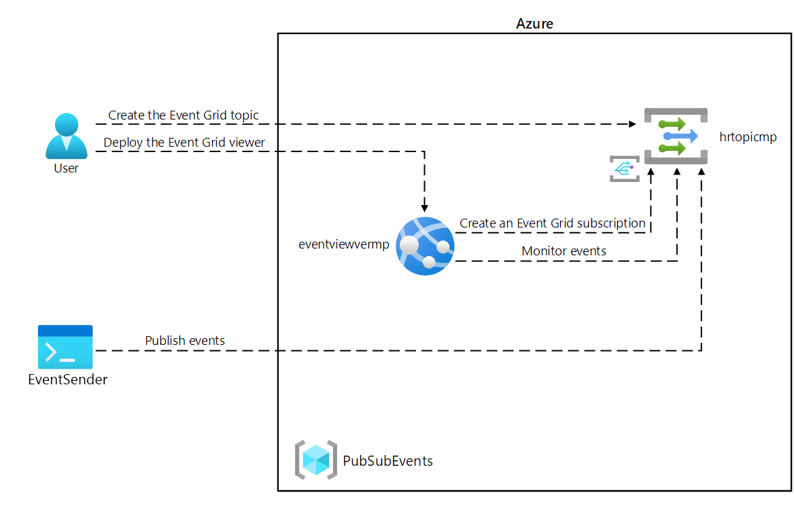

---
lab:
  az204Title: 'Lab 09: Publish and subscribe to Event Grid events'
  az204Module: 'Module 09: Develop event-based solutions'
---

# <a name="lab-09-publish-and-subscribe-to-event-grid-events"></a>ラボ 09: Event Grid イベントの発行とサブスクライブ

## <a name="microsoft-azure-user-interface"></a>Microsoft Azure ユーザー インターフェイス

Microsoft クラウド ツールの動的な性質を考慮すると、このトレーニング コンテンツの開発の後に発生する Azure UI の変更に気付くかもしれません。 その結果、ラボの指示とラボの手順が正しく整合しなくなる可能性があります。

Microsoft は、コミュニティから必要な変更の通知があったときに、このトレーニング コースを更新します。 ただし、クラウドの更新は頻繁に発生するため、このトレーニング コンテンツの更新の前に UI の変更に気付く可能性があります。 **これが発生した場合は、その変更に適応し、ラボでは必要に応じてそれらに対応してください。**

## <a name="instructions"></a>Instructions

### <a name="before-you-start"></a>開始する前に

#### <a name="sign-in-to-the-lab-environment"></a>ラボ環境にサインインする

次のサインイン情報を使用して、Windows 10 仮想マシン (VM) にサインインします。

- ユーザー名: **Admin**

- パスワード: **Pa55w.rd**

> **注**: 仮想ラボ環境に接続するための手順は、講師が説明します。

#### <a name="review-the-installed-applications"></a>インストールされているアプリケーションを確認する

Windows 10 デスクトップでタスク バーを見つけます。 タスク バーには、このラボで使用する次のようなアプリケーションのアイコンが含まれています。

- Microsoft Edge

- Microsoft Visual Studio Code

## <a name="architecture-diagram"></a>アーキテクチャの図



### <a name="exercise-1-create-azure-resources"></a>演習 1: Azure リソースを作成する

#### <a name="task-1-open-the-azure-portal"></a>タスク 1: Azure portal を開く

1. タスク バーで、**Microsoft Edge** アイコンを選択します。

1. 開いたブラウザー ウィンドウで、Azure portal (<https://portal.azure.com>) にアクセスしてから、このラボで使用するアカウントでサインインします。

    > **注**:初めて Azure portal にサインインする場合は、このポータルのツアーが表示されます。 **[はじめに]** を選択してツアーをスキップし、ポータルの使用を開始します。

#### <a name="task-2-open-azure-cloud-shell"></a>タスク 2: Azure Cloud Shell を開く

1. Azure portal で **Cloud Shell** アイコン  を選択して、新しい Bash セッションを開きます。 Cloud Shell が既定で PowerShell セッションに設定されている場合は、 **[PowerShell]** を選択し、ドロップダウン メニューで **[Bash]** を選択します。

    > **注**: 初めて **Cloud Shell** を起動する場合は、 **[Bash]** または **[PowerShell]** のいずれかを選択するよう求めるメッセージが表示されたら、 **[Bash]** を選択します。 **[ストレージがマウントされていません]** というメッセージが表示されたら、このラボで使用しているサブスクリプションを選択してから、 **[ストレージの作成]** を選択します。

1. Azure portal の **Cloud Shell** コマンド プロンプトで次のコマンドを実行して、Azure コマンド ライン インターフェイス (Azure CLI) ツールのバージョンを取得します。

    ```bash
    az --version
    ```

#### <a name="task-3-review-the-microsofteventgrid-provider-registration"></a>タスク 3: Microsoft EventGrid プロバイダーの登録を確認する

1. **[Cloud Shell] ペイン**で次のコマンドを実行して、リソース プロバイダー "Microsoft.EventGrid" が登録されたかどうかを確認します。

    ```bash
    az provider show --namespace Microsoft.EventGrid --query "registrationState"
    ```

1. **Microsoft.EventGrid** プロバイダーが登録されていることに注意してください。

1. **[Cloud Shell]** ペインを閉じます。

#### <a name="task-4-create-a-custom-event-grid-topic"></a>タスク 4: カスタム Event Grid トピックを作成する

1. Azure portal のナビゲーション ウィンドウで **[リソースの作成]** を選択します。

1. **[リソースの作成]** ブレードで、**[サービスとマーケットプレースの検索]** テキスト ボックスに「**Event Grid トピック**」と入力し、Enter キーを押します。

1. **[Marketplace](マーケットプレース)** 検索結果ブレードで "**Event Grid トピック**" という結果を選択し、 **[作成]** を選択します。

1. **[トピックの作成]** ブレードの **[基本]** タブで、次のアクションを実行してから、 **[詳細]** タブを選択します。

    | 設定 | アクション |
    | -- | -- |
    | **[サブスクリプション]** ドロップダウン リスト  | 既定値のままにします |
    | **[リソース グループ]** ドロップダウン リスト | **[新規作成]** を選択し、「**PubSubEvents**」と入力して、 **[OK]** を選択します |
    | **[名前]** テキスト ボックス | 「**hrtopic** _[ご自分の名前]_ 」と入力します |
    | **[リージョン]** ドロップダウン リスト | **[米国東部]** を選択します。 |

   次のスクリーンショットには、 **[基本]** タブに構成されている設定が示されています。

   ![[トピックの作成] ブレードで構成された設定を示すスクリーンショット](./media/l09_create_topic.png)

1. **[詳細]** タブで、 **[イベント スキーマ]** ドロップダウン リストから **[イベント グリッド スキーマ]** を選択し、 **[確認と作成]** を選択します。

1. **[確認と作成]** タブで、前の手順で選択したオプションを確認します。

1. **[作成]** を選択し、指定した構成を使用して Event Grid トピックを作成します。
  
    > **注**: ラボを続行する前に、Azure がトピックの作成を完了するまで待ってください。 トピックが作成されると、通知が届きます。

#### <a name="task-5-deploy-the-azure-event-grid-viewer-to-a-web-app"></a>タスク 5: Web アプリに Azure Event Grid ビューアーをデプロイする

1. Azure portal のナビゲーション ウィンドウで **[リソースの作成]** を選択します。

1. **[リソースの作成]** ブレードで、**[サービスとマーケットプレースの検索]** テキスト ボックスに「**Web アプリ**」と入力し、Enter キーを押します。

1. **[Marketplace](マーケットプレース)** 検索結果ブレードで "**Web アプリ**" という結果を選択し、 **[作成]** を選択します。

1. **[Web アプリの作成]** ブレードの **[基本]** タブで、次のアクションを実行してから、 **[次へ: Docker]** を選択します。

   | 設定 | アクション |
   | -- | -- |
   | **[サブスクリプション]** ドロップダウン リスト | 既定値のままにします |
   | **[リソース グループ]** ドロップダウン リスト | リストで **[PubSubEvents]** を選択します。 |
   | **[名前]**  テキスト ボックス | 「**eventviewer** _[ご自分の名前]_ 」と入力します |
   | **[公開]** セクション | **[Docker コンテナー]** を選択します |
   | **[オペレーティング システム]** セクション | **[Linux]** を選択します |
   | **[リージョン]** ドロップダウン リスト | **[米国東部] を選択します。 |
   | **[Linux Plan (East US)](Linux プラン (米国東部))** セクション | **[新規作成]** を選択し、 **[名前]** テキスト ボックスに「**EventPlan**」と入力して、 **[OK]** を選択します |
   | **[SKU とサイズ]** セクション | 既定値のままにします |

   次のスクリーンショットは、 **[Web アプリの作成]** ブレードで構成されている設定を示しています。

   ![[Web アプリの作成] ブレードで構成された設定を示すスクリーンショット](./media/l09_create_web_app.png)

1. **[Docker]** タブで、次のアクションを実行し、 **[確認と作成]** を選択します。

    | 設定 | アクション |
    | -- | -- |
    | **[オプション]** ドロップダウン リスト | **[単一コンテナー]** を選択します |
    | **[イメージのソース]** ドロップダウン リスト | **[Docker Hub]** を選択します |
    | **[アクセスの種類]** ドロップダウン リスト | **[Public]** を選択します |
    | **[イメージとタグ]** テキスト ボックス | 「**microsoftlearning/azure-event-grid-viewer:latest**」と入力します |

   次のスクリーンショットには、 **[Docker]** タブに構成されている設定が示されています。

   ![[Web アプリの作成] の [Docker] タブで構成された設定を示すスクリーンショット](./media/l09_create_web_app_docker.png)

1. **[確認と作成]** タブで、前の手順で選択したオプションを確認します。

1. **[作成]** を選択し、指定した構成を使用して Web アプリを作成します。
  
    > **注**: ラボを続行する前に、Azure が Web アプリの作成を完了するまで待ってください。 アプリが作成されると、通知が届きます。

#### <a name="review"></a>確認

この演習では、ラボの残りの部分で使用する、Event Grid トピックと Web アプリを作成しました。

### <a name="exercise-2-create-an-event-grid-subscription"></a>演習 2: Event Grid サブスクリプションを作成する

#### <a name="task-1-access-the-event-grid-viewer-web-application"></a>タスク 1: Event Grid ビューアー Web アプリにアクセスする

1. Azure portal のナビゲーション ウィンドウで **[リソース グループ]** を選択します。

1. **[リソース グループ]** ブレードで、**PubSubEvents** リソース グループを選択します。

1. **[PubSubEvents]** ブレードで、"**eventviewer** _[自分の名前]_ "Web アプリを選択します。

1. **[App Service]** ブレードの **[設定]** カテゴリで、 **[プロパティ]** リンクを選択します。

1. **[プロパティ]** セクションで、 **[URL]** リンクの値を記録します。 この値は、ラボの後半で使用します。

1. **[概要]** を選択し、 **[参照]** を選択します。

1. 現在実行中の **Azure Event Grid ビューアー** Web アプリを確認します。 ラボの残りの部分で、この Web アプリを実行したままにします。

    > **注**: この Web アプリは、イベントがエンドポイントに送信されるとリアルタイムで更新されます。 このアプリを使用して、ラボ全体でイベントを監視します。

1. Azure portal を表示する、現在開いているブラウザー ウィンドウに戻ります。

#### <a name="task-2-create-a-new-subscription"></a>タスク 2: 新しいサブスクリプションを作成する

1. Azure portal のナビゲーション ウィンドウで **[リソース グループ]** を選択します。

1. **[リソース グループ]** ブレードで、このラボで先ほど作成した **PubSubEvents** リソース グループを選択します。

1. **[PubSubEvents]** ブレードで、このラボで先ほど作成した **hrtopic** _[自分の名前]_ Event Grid トピックを選択します。

1. **[Event Grid トピック]** ブレードで、 **[+ イベント サブスクリプション]** を選択します。

1. **[イベント サブスクリプションの作成]** ブレードで、次のアクションを実行し、 **[作成]** を選択します。

    | 設定 | アクション |
    | -- | -- |
    | **[名前]**  テキスト ボックス | 「**basicsub**」と入力します |
    | **[イベント スキーマ]** ドロップダウン リスト | **[Event Grid スキーマ]** を選択します |
    | **[エンドポイントの種類]** ドロップダウン リスト | **[Web hook]** を選択します |
    | **エンドポイント** | **[エンドポイントの選択]** を選択します。 **[サブスクライバー エンドポイント]** テキスト ボックスに、前に記録しておいた **Web アプリ URL** の値を入力し、**https://** プレフィックスが使用されていることを確認し、サフィックス **/api/updates** を追加して、 **[選択の確認]** を選択します。 たとえば、**Web アプリ URL** の値が ``http://eventviewerstudent.azurewebsites.net/`` の場合は、**サブスクライバー エンドポイント**は ``https://eventviewerstudent.azurewebsites.net/api/updates`` になります。 |

   次のスクリーンショットには、 **[イベント サブスクリプションの作成]** ブレードに構成されている設定が示されています。

   ![[イベント サブスクリプションの作成] ブレードで構成された設定を示すスクリーンショット](./media/l09_create_event_subscription.png)

    > **注**: ラボを続行する前に、Azure がサブスクリプションの作成を完了するまで待ってください。 サブスクリプションが作成されると、通知が届きます。

#### <a name="task-3-observe-the-subscription-validation-event"></a>タスク 3: サブスクリプション検証イベントを確認する

1. **Azure Event Grid ビューアー** Web アプリを表示しているブラウザー ウィンドウに戻ります。

1. サブスクリプション作成プロセスの一環で作成された、**Microsoft.EventGrid.SubscriptionValidationEvent** イベントを確認します。

1. イベントを選択し、その JSON コンテンツを確認します。

1. Azure portal がある、現在開いているブラウザー ウィンドウに戻ります。

#### <a name="task-4-record-subscription-credentials"></a>タスク 4: サブスクリプションの資格情報を記録する

1. Azure portal のナビゲーション ウィンドウで **[リソース グループ]** を選択します。

1. **[リソース グループ]** ブレードで、このラボで先ほど作成した **PubSubEvents** リソース グループを選択します。

1. **[PubSubEvents]** ブレードで、このラボで先ほど作成した **hrtopic** _[自分の名前]_ Event Grid トピックを選択します。

1. **[Event Grid トピック]** ブレードで、 **[トピック エンドポイント]** フィールドの値を記録します。 この値は、ラボの後半で使用します。

1. **[設定]** カテゴリで、 **[アクセス キー]** リンクを選択します。

1. **[アクセス キー]** セクションで、 **[キー 1]** テキスト ボックスの値を記録します。 この値は、ラボの後半で使用します。

#### <a name="review"></a>確認

この演習では、新しいサブスクリプションを作成し、その登録を検証し、トピックに新しいイベントを発行するために必要な資格情報を記録しました。

### <a name="exercise-3-publish-event-grid-events-from-net"></a>演習 3: .NET から Event Grid イベントを発行する

#### <a name="task-1-create-a-net-project"></a>タスク 1: .NET プロジェクトを作成する

1. **[スタート]** 画面で、 **[Visual Studio Code]** タイルを選択します。

1. **[ファイル]** メニューの **[フォルダーを開く]** を選択します。

1. 開いた**エクスプローラー**のウィンドウで、"**Allfiles (F):\\Allfiles\\Labs\\09\\Starter\\EventPublisher**" を参照し、 **[フォルダーの選択]** を選択します。

1. **[Visual Studio Code]** ウィンドウで、上部のメニュー バーから **[ターミナル]** メニューに移動し、 **[新しいターミナル]** を選択します。

1. 次のコマンドを実行して、現在のフォルダーに **EventPublisher** という名前の新しい .NET プロジェクトを作成します。

    ```powershell
    dotnet new console --framework net6.0 --name EventPublisher --output . 
    ```

    > **注**: **dotnet new** コマンドは、プロジェクトと同じ名前のフォルダーに新しい**コンソール** プロジェクトを作成します。

1. 次のコマンドを実行して、NuGet から **Azure.Messaging.EventGrid** のバージョン 4.11.0 をインポートします。

    ```powershell
    dotnet add package Azure.Messaging.EventGrid --version 4.11.0
    ```
    

    > **注**: **dotnet add package** コマンドは、NuGet から **Microsoft.Azure.EventGrid** パッケージを追加します。 詳細については、「[Azure.Messaging.EventGrid](https://www.nuget.org/packages/Azure.Messaging.EventGrid/4.11.0)」を参照してください。


1. 次のコマンドを実行して、.NET Web アプリをビルドします。

    ```powershell
    dotnet build
    ```

1. **[ターミナルの強制終了]** または**ごみ箱** アイコンを選択して、現在開いているターミナルおよび関連プロセスを閉じます。

#### <a name="task-2-modify-the-program-class-to-connect-to-event-grid"></a>タスク 2: Event Grid に接続するように Program クラスを変更する

1. **[Visual Studio Code]** ウィンドウの **[エクスプローラー]**  ペインで、**Program.cs** ファイルを開きます。

1.  **Program.cs** ファイルのコード エディター タブで、既存のファイルのすべてのコードを削除します。

1. **Azure** と、NuGet からインポートした **Azure.Messaging.EventGrid** パッケージからの **Azure.Messaging.EventGrid** の名前空間をインポートするために、次のコード行を追加します。

    ```csharp
    using Azure;
    using Azure.Messaging.EventGrid;
    ```

1. このファイルで使用される組み込みの名前空間に対して **using** ディレクティブを追加するために、次のコード行を追加します。

    ```csharp
    using System;
    using System.Threading.Tasks;
    ```

1. 新しい **Program** クラスを作成するために、次のコードを入力します。

    ```csharp
    public class Program
    {
    }
    ```

1. **Program** クラスで、**topicEndpoint** という名前の新しい文字列定数を作成するために、次のコード行を入力します。

    ```csharp
    private const string topicEndpoint = "";
    ```

1. このラボで前に記録しておいた Event Grid トピックの **トピック エンドポイント**を値として設定することで、**topicEndpoint** 文字列定数を更新します。

1. **Program** クラスで、**topicKey** という名前の新しい文字列定数を作成するために、次のコード行を入力します。

    ```csharp
    private const string topicKey = "";
    ```

1. このラボで前に記録しておいた Event Grid トピックの **キー**を値として設定することで、**topicKey** 文字列定数を更新します。

1. **Program** クラスで、新しい非同期の **Main** メソッドを作成するために、次のコードを入力します。

    ```csharp
    public static async Task Main(string[] args)
    {
    }
    ```

1. **Program.cs** ファイルを確認します。次のコード行が含まれているはずです。

    ```csharp
    using Azure;
    using Azure.Messaging.EventGrid;
    using System;
    using System.Threading.Tasks;    
    public class Program
    {
        private const string topicEndpoint = "<topic-endpoint>";
        private const string topicKey = "<topic-key>";        
        public static async Task Main(string[] args)
        {
        }
    }
    ```

#### <a name="task-3-publish-new-events"></a>タスク 3: 新しいイベントを発行する

1. **Main** メソッドで、次のアクションを実行してイベントの一覧をトピック エンドポイントに発行します。

    a. **topicEndpoint** 文字列定数をコンストラクター パラメーターとして使用して、**Uri** 型の **endpoint** という名前の新しい変数を作成するために、次のコード行を追加します。

    ```csharp
    Uri endpoint = new Uri(topicEndpoint); 
    ```

    b. **topicKey** 文字列定数をコンストラクター パラメーターとして使用して、 **[AzureKeyCredential](https://docs.microsoft.com/dotnet/api/azure.azurekeycredential)** 型の **credential** という名前の新しい変数を作成するために、次のコード行を追加します。

    ```csharp
    AzureKeyCredential credential = new AzureKeyCredential(topicKey);
    ```

    c. **endpoint** および **credential** 変数をコンストラクター パラメーターとして使用して、 **[EventGridPublisherClient](https://docs.microsoft.com/dotnet/api/azure.messaging.eventgrid.eventgridpublisherclient)** 型の **client** という名前の新しい変数を作成するために、次のコード行を追加します。

    ```csharp
    EventGridPublisherClient client = new EventGridPublisherClient(endpoint, credential);
    ```

    d. **[EventGridEvent](https://docs.microsoft.com/dotnet/api/azure.messaging.eventgrid.eventgridevent)** 型の **firstEvent** という名前の新しい変数を作成し、その変数にサンプル データを設定するために、次のコード ブロックを追加します。

    ```csharp
    EventGridEvent firstEvent = new EventGridEvent(
        subject: $"New Employee: Alba Sutton",
        eventType: "Employees.Registration.New",
        dataVersion: "1.0",
        data: new
        {
            FullName = "Alba Sutton",
            Address = "4567 Pine Avenue, Edison, WA 97202"
         }
     );
     ```

    e. **[EventGridEvent](https://docs.microsoft.com/dotnet/api/azure.messaging.eventgrid.eventgridevent)** 型の **secondEvent** という名前の新しい変数を作成し、その変数にサンプル データを設定するために、次のコード ブロックを追加します。

     ```csharp
        EventGridEvent secondEvent = new EventGridEvent(
            subject: $"New Employee: Alexandre Doyon",
            eventType: "Employees.Registration.New",
            dataVersion: "1.0",
            data: new
            {
                FullName = "Alexandre Doyon",
                Address = "456 College Street, Bow, WA 98107"
            }
        );
     ```

    f. **firstEvent** 変数をパラメーターとして使用して、 **[EventGridPublisherClient.SendEventAsync](https://docs.microsoft.com/dotnet/api/azure.messaging.eventgrid.eventgridpublisherclient.sendeventasync)** メソッドを非同期で呼び出すために、次のコード行を追加します。

     ```csharp
     await client.SendEventAsync(firstEvent);
     ```

    g. **"First event published"** というメッセージをコンソールに表示するために、次のコード行を追加します。

     ```csharp
     Console.WriteLine("First event published");
     ```

    h. **secondEvent** 変数をパラメーターとして使用して、 **[EventGridPublisherClient.SendEventAsync](https://docs.microsoft.com/dotnet/api/azure.messaging.eventgrid.eventgridpublisherclient.sendeventasync)** メソッドを非同期で呼び出すために、次のコード行を追加します。

     ```csharp
     await client.SendEventAsync(secondEvent);
     ```

    i. **"Second event published"** というメッセージをコンソールに表示するために、次のコード行を追加します。

     ```csharp
     Console.WriteLine("Second event published");
     ```

1. **Main** メソッドを確認します。次のような内容のはずです。

    ```csharp
    public static async Task Main(string[] args)
    {
        Uri endpoint = new Uri(topicEndpoint);
        AzureKeyCredential credential = new AzureKeyCredential(topicKey);
        EventGridPublisherClient client = new EventGridPublisherClient(endpoint, credential);        
        EventGridEvent firstEvent = new EventGridEvent(
            subject: $"New Employee: Alba Sutton",
            eventType: "Employees.Registration.New",
            dataVersion: "1.0",
            data: new
            {
                FullName = "Alba Sutton",
                Address = "4567 Pine Avenue, Edison, WA 97202"
            }
        );
        EventGridEvent secondEvent = new EventGridEvent(
            subject: $"New Employee: Alexandre Doyon",
            eventType: "Employees.Registration.New",
            dataVersion: "1.0",
            data: new
            {
                FullName = "Alexandre Doyon",
                Address = "456 College Street, Bow, WA 98107"
            }
        );
        await client.SendEventAsync(firstEvent);
        Console.WriteLine("First event published");
        await client.SendEventAsync(secondEvent);
        Console.WriteLine("Second event published");
    }
    ```

1.  **Program.cs** ファイルを保存します。

1. **[Visual Studio Code]** ウィンドウで、 **[エクスプローラー]** ペインのショートカット メニューをアクティブにし、 **[統合ターミナルで開く]** を選択します。

1. 次のコマンドを実行して、.NET Web アプリを実行します。

    ```powershell
    dotnet run
    ```

    > **注**: ビルド エラーが発生した場合は、**Allfiles (F):\\Allfiles\\Labs\\09\\Solution\\EventPublisher** フォルダーにある **Program.cs** ファイルを確認してください。

1. 現在実行中のコンソール アプリケーションからの成功メッセージの出力を確認します。

1. **[ターミナルの強制終了]** または**ごみ箱** アイコンを選択して、現在開いているターミナルおよび関連プロセスを閉じます。

#### <a name="task-4-observe-published-events"></a>タスク 4: 発行されたイベントを確認する

1. **Azure Event Grid ビューアー** Web アプリがあるブラウザー ウィンドウに戻ります。

1. コンソール アプリケーションによって作成された **Employees.Registration.New** イベントを確認します。

1. 任意のイベントを選択し、その JSON コンテンツを確認します。

1. Azure portal に戻ります。

#### <a name="review"></a>確認

この演習では、.NET コンソール アプリケーションを使用して、Event Grid トピックに新しいイベントを発行しました。

### <a name="exercise-4-clean-up-your-subscription"></a>演習 4: サブスクリプションをクリーンアップする

#### <a name="task-1-open-azure-cloud-shell"></a>タスク 1: Azure Cloud Shell を開く

1. Azure portal で **Cloud Shell** アイコン  を選択して、新しい Bash セッションを開きます。 Cloud Shell が既定で PowerShell セッションに設定されている場合は、 **[PowerShell]** を選択し、ドロップダウン メニューで **[Bash]** を選択します。

    > **注**: 初めて **Cloud Shell** を起動する場合は、 **[Bash]** または **[PowerShell]** のいずれかを選択するよう求めるメッセージが表示されたら、 **[PowerShell]** を選択します。 **[ストレージがマウントされていません]** というメッセージが表示されたら、このラボで使用しているサブスクリプションを選択して、 **[ストレージの作成]** を選択します。

#### <a name="task-2-delete-a-resource-group"></a>タスク 2: リソース グループを削除する

1. **[Cloud Shell]** ペインで、次のコマンドを実行して、**PubSubEvents** リソース グループを削除します。

    ```bash
    az group delete --name PubSubEvents --no-wait --yes
    ```

     > **注**: このコマンドは非同期で実行されるため ( *--no-wait* パラメーターによって決定されます)、同じ Bash セッション内で直後に別の Azure CLI コマンドを実行できますが、リソース グループが実際に削除されるまでに数分かかります。

1. portal の **[Cloud Shell]** ペインを閉じます。

#### <a name="task-3-close-the-active-applications"></a>タスク 3: アクティブなアプリケーションを閉じる

1. 現在実行中の Microsoft Edge アプリケーションを閉じます。

1. 現在実行中の Visual Studio Code アプリケーションを終了します。

#### <a name="review"></a>確認

この演習では、このラボで使用されたリソース グループを削除することによってサブスクリプションをクリーンアップしました。
