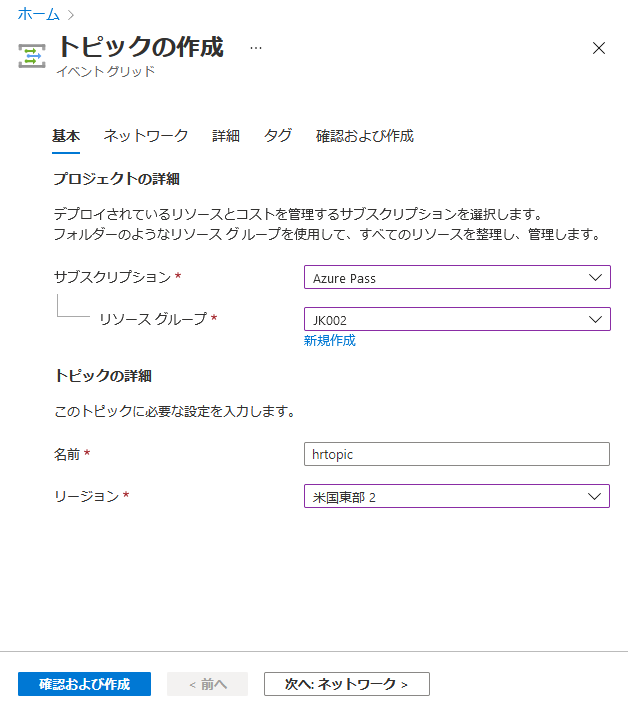
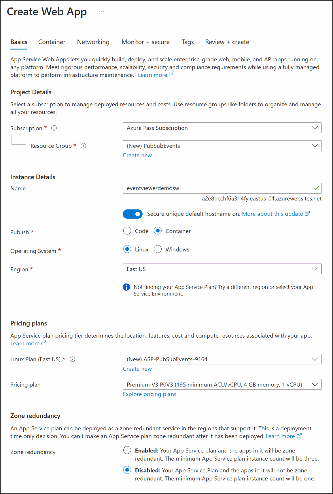

---
lab:
    az204Title: 'ラボ 09: Event Grid イベントの公開とサブスクライブ'
    az020Title: 'ラボ 09: Event Grid イベントの公開とサブスクライブ'
    az204Module: 'モジュール 09: イベントベースのソリューションの開発'
    az020Module: 'モジュール 09: イベントベースのソリューションの開発'
---

# ラボ 09: Event Grid イベントの公開とサブスクライブ

## Microsoft Azure ユーザー インターフェイス

Microsoft クラウド ツールは頻繁に更新されるため、このトレーニング コンテンツ作成後に一部の Azure UI が変更されている可能性があります。その結果、ラボの手順やステップが、正しく整合しない可能性があります。

Microsoft では、コミュニティから変更の必要性を通知されたとき、トレーニング コースを更新しています。しかし、クラウドの更新は頻繁に行われているため、このトレーニング コースを更新する前に、UI の変更に気づく場合があります。**その場合は、変更に適宜対応して、ラボで要求されている内容を処理してください。**

## 手順

### 開始する前に

#### ラボ環境へのログイン

次の認証情報を使用して Windows 10 仮想マシン (VM) にログインします。

- ユーザー名: **Admin**

- パスワード: **Pa55w.rd**

> **注**: 講師が仮想ラボ環境に接続するための手順を説明します。

#### インストールされているアプリケーションを確認します

Windows 10 デスクトップでタスク バーを探します。タスク バーには、以下をはじめとする、このラボで使用するアプリケーションのアイコンが含まれています。

- Microsoft Edge

- Microsoft Visual Studio Code

## アーキテクチャの図


### 演習 1: Azure リソースを作成する

#### タスク 1: Azure portal を開く

1. タスク バーで、**Microsoft Edge** アイコンを選択します。

1. 開いたブラウザー ウィンドウで、Azure portal (<https://portal.azure.com>) を閲覧してから、このラボで使用するアカウントでログインします。

    > **注**: Azure portal に初めてログインする場合は、ポータルのツアーが表示されます。ツアーをスキップしてポータルの使用を開始するには、**「開始」** を選択します。

#### タスク 2: Azure Cloud Shell を開く

1. Azure portal で、**Cloud Shell** アイコン  を選択して、新しい Bash セッションを開始します。Cloud Shell が既定の PowerShell セッションである場合は、**「PowerShell」**を選択し、ドロップダウン メニューで、**「Bash」** を選択します。

    > **注**: 初めての **Cloud Shell** の起動であり、プロンプトが表示された場合は、**「Bash」** または **「PowerShell」** を選択して、**「Bash」** を選択します。**「ストレージがマウントされていません」** というメッセージが表示されたら、このラボで使用しているサブスクリプションを選択してから、**「ストレージの作成」** を選択します。

1. Azure portal の **Cloud Shell** コマンド プロンプトで、次のコマンドを実行して、Azure Command-Line Interface (Azure CLI) ツールのバージョンを取得します。

    ```bash
    az --version
    ```

#### タスク 3: Microsoft.EventGrid プロバイダーの登録を確認する

1. ポータルの **Cloud Shell** コマンド プロンプトで、次のアクションを実行します。

    a. 次のコマンドを実行して、サブグループのリストと Azure CLI のルート レベルのコマンドを取得します。

    ```bash
    az --help
    ```

    b. 次のコマンドを実行して、リソース プロバイダーが利用できるコマンドのリストを取得します。

    ```bash
    az provider --help
    ```

    c. 次のコマンドを実行して、現在登録されているプロバイダーを一覧表示します。

   ```bash
   az provider list
   ```

    d. 次のコマンドを実行して、現在登録されているプロバイダーの名前空間を一覧表示します。

   ```bash
   az provider list --query "[].namespace"
   ```

    e. 現在登録されているプロバイダーのリストを確認します。プロバイダーの一覧に現在、**Microsoft.EventGrid** プロバイダーが含まれている点に注意してください。

1. **Cloud Shell** ペインを閉じます。

#### タスク 4: カスタムの Event Grid トピックの作成

1. Azure portal のナビゲーション ペインで、「**リソースの作成**」を選択します。

1. **リソースの作成**ブレードの**サービスとマーケットプレイスの検索**テキスト ボックスに、「**イベント グリッド トピック**」と入力して、Enter キーを押します。

1. **マーケットプレイス**の検索結果ブレードで、**イベント グリッド トピック**の結果を選択してから、「**作成**」を選択します。

1. **トピックの作成**ブレードの**基本**タブで、次のアクションを実行してから、**詳細**タブを選択します。

    | 設定                           | アクション                                                       |
    | --------------------------------- | ------------------------------------------------------------ |
    | **サブスクリプション** ドロップダウン リスト   | 既定値のままにします。                                    |
    | **リソース グループ** ドロップダウン リスト | 「**新規作成**」を選択し、「**PubSubEvents**」と入力してから、「**OK**」を選択します。 |
    | **名前**テキスト ボックス                 | 「**hrtopic**_[yourname]_」と入力します。                               |
    | **リージョン** ドロップダウン リスト         | 「**米国東部**」を選択します。                                          |

   次のスクリーンショットは、**基本**タブ上の構成された設定を示しています。

   

1. **詳細**タブの**イベント スキーマ** ドロップダウン リストから、「**イベント グリッド スキーマ**」を選択してから、「**確認および作成**」を選択します。

1. **確認および作成**タブで、以前の手順で選択したオプションを確認します。

1. 「**作成**」を選択し、指定された構成を使用して、イベント グリッド トピックを作成します。
  
    > **注**: Azure がトピックの作成を完了するのを待ってから、ラボを進めます。トピックが作成されると通知が届きます。

#### タスク 5: Azure Event Grid ビューアーを Web アプリにデプロイする

1. Azure portal のナビゲーション ペインで、「**リソースの作成**」を選択します。

1. **リソースの作成**ブレードの**サービスとマーケットプレイスの検索**テキスト ボックスに、「**Web アプリ**」と入力して、Enter キーを押します。

1. **マーケットプレイス**の検索結果ブレードで、**Web アプリ**の結果を選択してから、「**作成**」を選択します。

1. **Web アプリの作成**ブレードの**基本**タブで、次のアクションを実行してから、「**次へ:**」を選択します**Docker**:

   | 設定                           | アクション                                                       |
   | --------------------------------- | ------------------------------------------------------------ |
   | **サブスクリプション** ドロップダウン リスト   | 既定値のままにします。                                    |
   | **リソース グループ** ドロップダウン リスト | リストで「**PubSubEvents**」を選択します。                         |
   | **名前**テキスト ボックス                 | 「**eventviewer**_[yourname]_」と入力します。                           |
   | **公開**セクション               | 「**Docker コンテナー**」を選択します。                                 |
   | **オペレーティング システム** セクション      | 「**Linux**」を選択します。                                            |
   | **リージョン** ドロップダウン リスト         | 「**米国東部**」を選択します。                                          |
   | **Linux プラン (米国東部)** セクション  | 「**新規作成**」を選択し、**名前**テキスト ボックスに、「**EventPlan**」と入力してから、「**OK**」を選択します。 |
   | **SKU およびサイズ** セクション          | 既定値のままにします。                                    |

   次のスクリーンショットは、**Web アプリの作成**ブレード上で構成された設定を示しています。

   

1. **Docker** タブで、次のアクションを実行し、「**確認および作成**」を選択します。

    | 設定                         | アクション                                                      |
    | ------------------------------- | ----------------------------------------------------------- |
    | **オプション** ドロップダウン リスト      | 「**単一コンテナー**」を選択します。                                |
    | **イメージ ソース** ドロップダウン リスト | 「**Docker ハブ**」を選択します。                                      |
    | **アクセスの種類** ドロップダウン リスト  | 「**公開**」を選択します。                                          |
    | **イメージおよびタグ** テキスト ボックス      | 「**microsoftlearning/azure-event-grid-viewer:latest**」と入力します。 |

   次のスクリーンショットは、**Docker** タブ上の構成された設定を示しています。

   

1. **確認および作成**タブで、以前の手順で選択したオプションを確認します。

1. 指定した構成を使用して Web アプリを作成するには、「**作成**」 を選択します。
  
    > **注**: Azure が Web アプリの作成を完了するのを待ってから、ラボを進めます。アプリの作成時に通知が届きます。

#### 確認

この実習では、この課題の残りの部分で使用する Event Grid トピックと Web アプリを作成しました。

### 演習 2: Event Grid のサブスクリプションを作成する

#### タスク 1: Event Grid ビューアー Web アプリケーションにアクセスする

1. Azure portal のナビゲーション ペインで、「**リソース グループ**」を選択します。

1. **リソース グループ** ブレードで、**PubSubEvents** リソース グループを選択します。

1. **PubSubEvents** ブレードで、**eventviewer**_[yourname]_ Web アプリを選択します。

1. **App Service** ブレードの**設定**カテゴリで、**プロパティ** リンクを選択します。

1. **プロパティ** セクションで、**URL** リンクの値を記録します。この値は、このラボの後半で使用します。

1. 「**概要**」を選択してから、「**参照**」を選択します。

1. 現在実行している **Azure Event Grid ビューアー** Web アプリケーションを監視します。この Web アプリケーションは、残りのラボで実行したままにしておきます。

    > **注**: この Web アプリケーション:は、イベントがそのエンドポイントに送信されるとき、リアルタイムで更新します。このアプリケーションがラボ全体でイベントを監視していることがわかります。

1. Azure potal を表示しており、現在開いているブラウザー ウィンドウに戻ります。

#### タスク 2: 新しいサブスクリプションを作成する

1. Azure portal のナビゲーション ペインで、「**リソース グループ**」を選択します。

1. **リソース グループ** ブレードで、このラボの前半で作成した **PubSubEvents** リソース グループを選択します。

1. **PubSubEvents** ブレードで、このラボの前半で作成した **hrtopic**_[yourname]_ Event Grid トピックを選択します。

1. **イベント グリッド トピック** ブレードで、「**+ イベント サブスクリプション**」を選択します。

1. **イベント サブスクリプションの作成**ブレードで、次のアクションを実行してから、「**作成**」を選択します。

    | 設定                          | アクション                                                       |
    | -------------------------------- | ------------------------------------------------------------ |
    | **名前**テキスト ボックス                | 「**basicsub**」と入力します。                                          |
    | **イベント スキーマ** ドロップダウン リスト  | 「**イベント グリッド スキーマ**」を選択します。                                |
    | **エンドポイントの種類** ドロップダウン リスト | 「**Web フック**」を選択します。                                         |
    | **エンドポイント**                     | 「**エンドポイントの選択**」を選択します。**サブスクライバー エンドポイント** テキスト ボックスに、以前に記録した **Web アプリの URL** の値を入力し、これがプレフィックス **https://** を使用していることを確認し、サフィックス 「**/api/updates**」 を追加してから、「**選択の確認**」を選択します。たとえば、**Web App URL** の値が ``http://eventviewerstudent.azurewebsites.net/`` の場合、**サブスクライバーエンドポイン**は、 の場合、[サブスクライバー エンドポイント] は ``https://eventviewerstudent.azurewebsites.net/api/updates`` になります。 |

   次のスクリーンショットは、**イベント サブスクリプションの作成**ブレード上で構成された設定を示しています。

   

    > **注**: Azure がサブスクリプションの作成を完了するのを待ってから、ラボを進めます。サブスクリプションが作成されると通知が届きます。

#### タスク 3: サブスクリプション検証イベントを監視する

1. **Azure Event Grid  ビューアー** Web アプリケーションを表示しているブラウザー ウィンドウに戻ります。

1. サブスクリプション作成プロセスの一環として作成された **Microsoft.EventGrid.SubscriptionValidationEvent** イベントをレビューします。

1. イベントを選択して、その JSON コンテンツを確認します。

1. Azure portal で現在開いたブラウザー ウィンドウに戻ります。

#### タスク 4: サブスクリプションの認証情報を記録する

1. Azure potal の左側のナビゲーション ペインで、「**リソース グループ**」 を選択します。

1. 「**リソース グループ**」 ブレードで、この課題で以前に作成した **PubSubEvents** リソース グループを選択します。

1. 「**PubSubEvents**」 ブレードで、 このラボで以前に作成した **hrtopic**_「yourname」_ Event Grid トピックを選択します。

1. 「**Event Grid トピック**」 ブレードで 「**トピックのエンドポイント**」 フィールドの値を記録します。この値は、このラボの後半で使用します。

1. 「**設定**」 カテゴリで 「**アクセス キー**」 リンクを選択します。

1. 「**アクセス キー**」 セクションで 「**キー 1**」 テキスト ボックスの値を記録します。この値は、このラボの後半で使用します。

#### 確認

この演習では、新しいサブスクリプションを作成して登録を検証し、新しいイベントをトピックに発行するために必要な認証情報を記録しました。

### 演習 3: .NET からの Event Grid イベントの発行

#### タスク 1: .NET プロジェクトを作成する

1. **スタート**画面で、**Visual Studio Code** タイルを選択します。

1. 「**ファイル**」 メニューで、「**フォルダーを開く**」 を選択します。

1. 表示された 「**ファイル エクスプローラー**」 ウィンドウで「**Allfiles (F):\\Allfiles\\Labs\\09\\Starter\\EventPublisher**」を参照してから 「**フォルダーの選択**」 を選択します。

1. **Visual Studio Code** ウィンドウで、**エクスプローラー** ペインのショートカット メニューをアクティブ化してから、 **「統合ターミナルで開く」** を選択します。

1. 次のコマンドを実行して、現在フォルダーに **EventPublisher** という名前の新しい .NET プロジェクトを作成します。

    ```powershell
    dotnet new console --name EventPublisher --output .
    ```

    > **注**: **dotnet new** コマンドは、プロジェクトと同じ名前のフォルダーに新しい**コンソール** プロジェクトを作成します。

1. 次のコマンドを実行して、**Azure.Messaging.EventGrid** のバージョン 4.1.0 を NuGet からインポートします。

    ```powershell
    dotnet add package Azure.Messaging.EventGrid --version 4.1.0
    ```

    > **注**: **dotnet add package** コマンドは、NuGet から **Microsoft.Azure.EventGrid** パッケージを追加します。詳細については、[Azure.Messaging.EventGrid](https://www.nuget.org/packages/Azure.Messaging.EventGrid/4.1.0) を参照してください。

1. 次のコマンドを実行して、.NET Web アプリケーションをビルドします。

    ```powershell
    dotnet build
    ```

1. **「ターミナルの強制終了」**または**ごみ箱**アイコンを選択して、現在開いているターミナルと関連するプロセスを閉じます。

#### タスク 2: Event Grid に接続する Program クラスを変更する

1. **Visual Studio Code** ウィンドウの**エクスプローラー** ペインで、**Program.cs** ファイルを開きます。

1. **Program.cs** ファイルのコード エディター タブで、既存のファイルのすべてのコードを削除します。

1. 次のコード行を追加して、NuGet からインポートされた **Azure.Messaging.EventGrid** パッケージから **Azure** および **Azure.Messaging.EventGrid** 名前空間をインポートします。

    ```csharp
    using Azure;
    using Azure.Messaging.EventGrid;
    ```

1. このファイルで使用される組み込み名前空間の **using** ディレクティブを追加するために、次のコード行を追加します。

    ```csharp
    using System;
    using System.Threading.Tasks;
    ```

1. 次のコードを入力して、新しい **Program** クラスを作成します。

    ```csharp
    public class Program
    {
    }
    ```

1. **Program** クラスで次のコード行を入力して、**topicEndpoint** という新しい文字列定数を作成します。

    ```csharp
    private const string topicEndpoint = "";
    ```

1. 値をこのラボの前半で記録した Event Grid トピックの**トピック エンドポイント**に設定して、**topicEndpoint** 文字列定数を更新します。

1. **Program** クラスで次のコード行を入力して、**topicKey** という新しい文字列定数を作成します。

    ```csharp
    private const string topicKey = "";
    ```

1. 値をこのラボの前半で記録した Event Grid トピックの**キー**に設定して、**topicKey** 文字列定数を更新します。

1. **Program** クラスで、次のコードを入力して新しい非同期 **Main** メソッドを作成します。

    ```csharp
    public static async Task Main(string[] args)
    {
    }
    ```

1. **Program.cs** ファイルを監視します。この中には以下のコード行が含まれているはずです。

    ```csharp
    using System;
    using System.Threading.Tasks;
    using Azure;
    using Azure.Messaging.EventGrid;
    
    public class Program
    {
        private const string topicEndpoint = "<topic-endpoint>";
        private const string topicKey = "<topic-key>";
        
        public static async Task Main(string[] args)
        {
        }
    }
    ```

#### タスク 3: 新しいイベントを発行する

1. **Main** メソッドで次のアクションを実行して、イベントのリストをトピック エンドポイントに発行します。

    a. コードに次の行を追加して、コンストラクター パラメーターとして、**topicEndpoint** 文字列定数を使用して、型 **Uri** の **endpoint** という名前の新しい変数を作成します。

    ```csharp
    Uri endpoint = new Uri(topicEndpoint); 
    ```

    b. コードに次の行を追加して、コンストラクター パラメーターとして、**topicKey** 文字列定数を使用して、型 「**[AzureKeyCredential](https://docs.microsoft.com/dotnet/api/azure.azurekeycredential)**」 の **credential** という名前の新しい変数を作成します。

    ```csharp
    AzureKeyCredential credential = new AzureKeyCredential(topicKey);
    ```

    c. コードに次の行を追加して、コンストラクター パラメーターとして、**endpoint** および **credential** 変数を使用して、型 「**[EventGridPublisherClient](https://docs.microsoft.com/dotnet/api/azure.messaging.eventgrid.eventgridpublisherclient)**」 の **client** という名前の新しい変数を作成します。

    ```csharp
    EventGridPublisherClient client = new EventGridPublisherClient(endpoint, credential);
    ```

    d. コードに次の行を追加して、型 「**[EventGridEvent](https://docs.microsoft.com/dotnet/api/azure.messaging.eventgrid.eventgridevent)**」 の **firstEvent** という名前の新しい変数を作成し、その変数にサンプル データを入力します。

    ```csharp
    EventGridEvent firstEvent = new EventGridEvent(
        subject: $"New Employee: Alba Sutton",
        eventType: "Employees.Registration.New",
        dataVersion: "1.0",
        data: new
        {
            FullName = "Alba Sutton",
            Address = "4567 Pine Avenue, Edison, WA 97202"
         }
     );
     ```

    e. コードに次の行を追加して、型 「**[EventGridEvent](https://docs.microsoft.com/dotnet/api/azure.messaging.eventgrid.eventgridevent)**」 の **secondEvent** という名前の新しい変数を作成し、その変数にサンプル データを入力します。

     ```csharp
        EventGridEvent secondEvent = new EventGridEvent(
            subject: $"New Employee: Alexandre Doyon",
            eventType: "Employees.Registration.New",
            dataVersion: "1.0",
            data: new
            {
                FullName = "Alexandre Doyon",
                Address = "456 College Street, Bow, WA 98107"
            }
        );
     ```

    f. コードに次の行を追加して、パラメーターとして、**firstEvent** 変数を使用して、「**[EventGridPublisherClient.SendEventAsync](https://docs.microsoft.com/dotnet/api/azure.messaging.eventgrid.eventgridpublisherclient.sendeventasync)**」 メソッドを非同期的に呼び出します。

     ```csharp
     await client.SendEventAsync(firstEvent);
     ```

    g. コードに次の行を追加して、「**最初のイベントが発行されました**」メッセージをコンソールに表示します。

     ```csharp
     Console.WriteLine("First event published");
     ```

    h. コードに次の行を追加して、パラメーターとして、**secondEvent** 変数を使用して、「**[EventGridPublisherClient.SendEventAsync](https://docs.microsoft.com/dotnet/api/azure.messaging.eventgrid.eventgridpublisherclient.sendeventasync)**」 メソッドを非同期的に呼び出します。

     ```csharp
     await client.SendEventAsync(secondEvent);
     ```

    i. コードに次の行を追加して、「**2 番目のイベントが発行されました**」メッセージをコンソールに表示します。

     ```csharp
     Console.WriteLine("Second event published");
     ```

1. **Main** メソッドをレビューします。この中には以下が含まれているはずです。

    ```csharp
    public static async Task Main(string[] args)
    {
        Uri endpoint = new Uri(topicEndpoint);
        AzureKeyCredential credential = new AzureKeyCredential(topicKey);
        EventGridPublisherClient client = new EventGridPublisherClient(endpoint, credential);
        
        EventGridEvent firstEvent = new EventGridEvent(
            subject: $"New Employee: Alba Sutton",
            eventType: "Employees.Registration.New",
            dataVersion: "1.0",
            data: new
            {
                FullName = "Alba Sutton",
                Address = "4567 Pine Avenue, Edison, WA 97202"
            }
        );

        EventGridEvent secondEvent = new EventGridEvent(
            subject: $"New Employee: Alexandre Doyon",
            eventType: "Employees.Registration.New",
            dataVersion: "1.0",
            data: new
            {
                FullName = "Alexandre Doyon",
                Address = "456 College Street, Bow, WA 98107"
            }
        );

        await client.SendEventAsync(firstEvent);
        Console.WriteLine("First event published");

        await client.SendEventAsync(secondEvent);
        Console.WriteLine("Second event published");
    }
    ```

1. **Program.cs** ファイルを保存します。

1. **Visual Studio Code** ウィンドウで、**エクスプローラー** ペインのショートカット メニューをアクティブ化してから、「**統合ターミナルで開く**」を選択します。

1. 次のコマンドを実行して、.NET Webアプリケーションを実行します。

    ```powershell
    dotnet run
    ```

    > **注**: ビルド エラーがある場合は、**Allfiles (F):\\Allfiles\\Labs\\09\\Solution\\EventPublisher** フォルダーの **Program.cs** ファイルをレビューします。

1. 現在実行中のコンソール アプリケーションからの成功メッセージ出力を確認します。

1. 「**ターミナルの強制終了**」または**ごみ箱**アイコンを選択して、現在開いているターミナルと関連するプロセスを閉じます。

#### タスク 4: 公開されたイベントを監視する

1. **Azure Event Grid  ビューアー** Web アプリケーションを表示しているブラウザー ウィンドウに戻ります。

1. コンソール アプリケーションによって作成された **Employees.Registration.New** イベントをレビューします。

1. いずれかのイベントを選択し、その JSON コンテンツを確認します。

1. Azure portal に戻ります。

#### 確認

この編集では、.NET コンソール アプリケーションを使用して、新しいイベントを Event Grid トピックに発行しました。

### 演習 4: サブスクリプションのクリーンアップ

#### タスク 1: Azure Cloud Shell を開く

1. Azure portal で、**Cloud Shell** アイコン  を選択して、新しい Bash セッションを開始します。Cloud Shell が既定の PowerShell セッションである場合は、「**PowerShell**」を選択し、ドロップダウン メニューで、「**Bash**」 を選択します。

    > **注**: 初めての **Cloud Shell** の起動であり、プロンプトが表示された場合は、「**Bash**」または「**PowerShell**」を選択して、「**PowerShell**」を選択します。「**ストレージがマウントされていません**」というメッセージが表示されたら、このラボで使用しているサブスクリプションを選択して、「**ストレージの作成**」を選択します。

#### タスク 2: リソース グループの削除

1. **Cloud Shell** ペインで、次のコマンドを実行して、**PubSubEvents** リソース グループを削除します。

    ```bash
    az group delete --name PubSubEvents --no-wait --yes
    ```

     >**注**: コマンドは非同期に実行されるので (*[--no-wait]* パラメーターで決定される)、同じ Bash セッション内ですぐに別の Azure CLI コマンドを実行できますが、リソース グループが実際に削除されるまでに数分かかります。

1. ポータルで、**Cloud Shell** ペインを閉じます。

#### タスク 3: アクティブなアプリケーションを閉じる

1. 現在実行中の Microsoft Edge アプリケーションを閉じます。

1. 現在実行中の Visual Studio Code アプリケーションを閉じます。

#### 確認

この実習では、このラボで使用するリソース グループを削除することで、サブスクリプションをクリーンアップしました。
