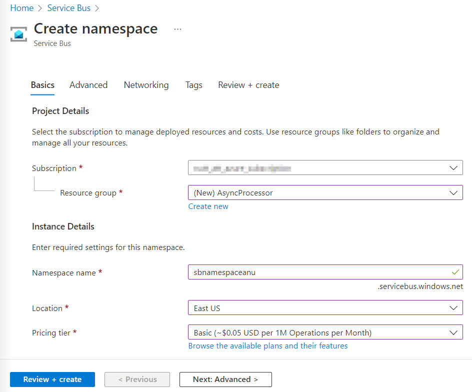

---
lab:
  az204Title: 'Lab 10: Asynchronously process messages by using Azure Service Bus Queues'
  az020Title: 'Lab 10: Asynchronously process messages by using Azure Service Bus Queues'
  az204Module: 'Module 10: Develop message-based solutions'
  az020Module: 'Module 10: Develop message-based solutions'
ms.openlocfilehash: 251f19ea16a3a55a4dfec26c82565ff2418334da
ms.sourcegitcommit: 9711ba92ee508e51804c0757218f4405df6f0f7f
ms.translationtype: HT
ms.contentlocale: ja-JP
ms.lasthandoff: 07/25/2022
ms.locfileid: "147406112"
---
# <a name="lab-10-asynchronously-process-messages-by-using-azure-service-bus-queues"></a>ラボ 10: Azure Service Bus キューを利用してメッセージを非同期に処理する

## <a name="microsoft-azure-user-interface"></a>Microsoft Azure ユーザー インターフェイス

Microsoft クラウド ツールの動的な性質を考慮すると、このトレーニング コンテンツの開発の後に発生する Azure UI の変更に気付くかもしれません。 その結果、ラボの指示とラボの手順が正しく整合しなくなる可能性があります。

Microsoft は、コミュニティから必要な変更の通知があったときに、このトレーニング コースを更新します。 ただし、クラウドの更新は頻繁に発生するため、このトレーニング コンテンツの更新の前に UI の変更に気付く可能性があります。 **これが発生した場合は、その変更に適応し、ラボでは必要に応じてそれらに対応してください。**

## <a name="instructions"></a>Instructions

### <a name="before-you-start"></a>開始する前に

#### <a name="sign-in-to-the-lab-environment"></a>ラボ環境にサインインする

次の資格情報を使用して Windows 10 仮想マシン (VM) にサインインします。
    
-   ユーザー名: **Admin**

-   パスワード: **Pa55w.rd**

> **注**: 仮想ラボ環境に接続するための手順は、インストラクターから提供されます。

#### <a name="review-the-installed-applications"></a>インストールされているアプリケーションを確認する

Windows 10 デスクトップでタスク バーを見つけます。 タスク バーには、このラボで使用する次のようなアプリケーションのアイコンが含まれています。
    
-   Microsoft Edge

-   Visual Studio Code

## <a name="architecture-diagram"></a>アーキテクチャの図


### <a name="exercise-1-create-azure-resources"></a>演習 1: Azure リソースを作成する

#### <a name="task-1-open-the-azure-portal"></a>タスク 1: Azure portal を開く

1.  タスク バーで、 **[Microsoft Edge]** アイコンを選択します。

1.  ブラウザー ウィンドウで、Azure portal ([portal.azure.com](https://portal.azure.com)) にアクセスして、このラボで使用するアカウントでサインインします。

    > **注**:初めて Azure portal にサインインする場合は、このポータルのツアーが表示されます。 **[はじめに]** を選択してツアーをスキップし、ポータルの使用を開始します。

#### <a name="task-2-create-an-azure-service-bus-queue"></a>タスク 2: Azure Service Bus キューを作成する

1.  Azure portal で、 **[リソース、サービス、ドキュメントの検索]** テキスト ボックスを使用して、**Service Bus** を検索し、結果の一覧で **[Service Bus]** を選択します。

1.  **[Service Bus]** ブレードで、 **[+ 作成]** を選択します。

1.  **[名前空間の作成]** ブレードの **[基本]** タブで、次のアクションを実行し、 **[確認および作成]** を選択します。
        
    | 設定                           | アクション                                                       |
    | --------------------------------- | ------------------------------------------------------------ |
    | **[サブスクリプション]** ドロップダウン リスト    |既定値のままにします。 |
    | **[リソース グループ]** セクション | **[新規作成]** を選択し、「**「AsyncProcessor**」と入力して、**[OK]** を選択します。|
    | **[名前空間の名前]** テキストボックス | 「**sbnamespace**_[自分の名前]_」と入力します。|
    | **[リージョン]** ドロップダウン リスト |  Azure Service Bus をデプロイ可能な Azure リージョンを選択します。|
    | **[価格レベル]** ドロップダウン リスト |  **[Basic]** を選択します。|

    次のスクリーンショットには、 **[名前空間の作成]** ブレードの **[基本]** タブに構成されている設定が表示されています。
    
       
     
1.  **[確認と作成]** タブで、前の手順で選択したオプションを確認します。

1.  **[作成]** を選択し、指定した構成を使用して、**Service Bus** 名前空間を作成します。

    > **注**: 作成タスクが完了するのを待ってから、このラボを続行してください。

1.  **[デプロイ]** ブレードで、 **[リソースに移動]** ボタンを選択して、新しく作成された **[Service Bus]** 名前空間のブレードに移動します。

1.  **[Service Bus]** 名前空間ブレードの **[設定]** セクションで、 **[共有アクセスポリシー]** を選択します。

1.  ポリシーの一覧で、**RootManageSharedAccessKey** を選択します。

1.  **[SAS ポリシー: RootManageSharedAccessKey]** ペインで、 **[プライマリ接続文字列]** エントリの横にある **[クリップボードにコピー]** ボタンを選択し、コピーした値を記録します。 この値は、このラボで後ほど使用します。

    > **注**: 利用可能な 2 つのキーのどちらを選択してもかまいません。 これらは交換可能です。

1.  **[Service Bus]** 名前空間ブレードの **[エンティティ]** セクションで、 **[キュー]** を選択し、 **[+ キュー]** を選択します。

1.  **[キューの作成]** ウィンドウで、使用可能な設定を確認し、**[名前]** テキスト ボックスに「**messagequeue**」と入力して、**[作成]** を選択します。

1.  **[messagequeue]** を選択して、 **[Service Bus]** キューのプロパティを表示します。

1.  ブラウザー ウィンドウは開いたままにしておきます。 このウィンドウは、このラボで後ほどもう一度使用します。

#### <a name="review"></a>確認

この演習では、Azure **Service Bus** 名前空間と、ラボの残りの部分で使用する **Service Bus** キューを作成しました。

### <a name="exercise-2-create-a-net-core-project-to-publish-messages-to-a-service-bus-queue"></a>演習 2: Service Bus キューにメッセージを発行する .NET Core プロジェクトを作成する

#### <a name="task-1-create-a-net-core-project"></a>タスク 1: .NET Core プロジェクトを作成する

1.  ラボ コンピューターから Visual Studio Code を起動します。

1.  Visual Studio Code の **[ファイル]** メニューで、 **[フォルダーを開く]** を選択します。

1.  **[フォルダーを開く]** ウィンドウで、**Allfiles (F):\\Allfiles\\Labs\\10\\Starter\\MessagePublisher** に移動し、 **[フォルダーの選択]** を選択します。

1.  **[Visual Studio Code]** ウィンドウで、ショートカット メニューをアクティブにし、 **[統合ターミナルで開く]** を選択します。

1.  ターミナル プロンプトで、次のコマンドを実行して、現在のフォルダーに **MessagePublisher** という名前の新しい .NET プロジェクトを作成します。

    ```
    dotnet new console --name MessagePublisher --output .
    ```

    > **注**: **dotnet new** コマンドは、プロジェクトと同じ名前のフォルダーに新しい **コンソール** プロジェクトを作成します。

1.  次のコマンドを実行して、NuGet から **Azure.Messaging.ServiceBus** パッケージのバージョン 7.2.1 をインポートします。

    ```
    dotnet add package Azure.Messaging.ServiceBus --version 7.2.1
    ```

    > **注**: **dotnet add package** コマンドを実行すると、NuGet から **Azure.Messaging.ServiceBus** が追加されます。 詳細については、「[Azure.Messaging.ServiceBus](https://www.nuget.org/packages/Azure.Messaging.ServiceBus/)」を参照してください。

1.  ターミナル プロンプトで、次のコマンドを実行して、.NET Core コンソール アプリケーションをビルドします。

    ```
    dotnet build
    ```

1.  **[ターミナルの強制終了]** (**ごみ箱** アイコン) を選択して、ターミナル ペインと関連プロセスを閉じます。

#### <a name="task-2-publish-messages-to-an-azure-service-bus-queue"></a>タスク 2: Azure Service Bus キューにメッセージを発行する

1.  **[Visual Studio Code]** ウィンドウの **[エクスプローラー]** ペインで、**Program.cs** ファイルを開きます。

1.  **Program.cs** ファイルの [コード エディター] タブで、既存のファイル内のすべてのコードを削除します。

1.  次のコード行を追加して、このファイルで参照される組み込みの名前空間を簡単に使用できるようにします。

    ```csharp
    using System;
    using System.Threading.Tasks;
    ```

1.  次のコード行を追加して、NuGet からインポートした **Azure.Storage.Queues** パッケージに含まれる **Azure.Messaging.ServiceBus** 名前空間をインポートします。

    ```csharp
    using Azure.Messaging.ServiceBus;
    ```
    
1.  次のコードを入力して、MessagePublisher 名前空間に新しい **Program** クラスを作成します。

    ```csharp
    namespace MessagePublisher
    {
       public class Program
       {
       }
    }
    ```

1.  **Program** クラスで、次のコードを入力して、**storageConnectionString** という名前の文字列定数を作成します。

    ```csharp
    private const string storageConnectionString = "";
    ```

1.  このラボの前述の手順で記録した Service Bus 名前空間の **プライマリ接続文字列** に値を設定して、**storageConnectionString** 文字列定数を更新します。

1.  次のコードを入力して、値が **messagequeue** の **queueName** という名前の文字列定数を作成します。この名前は、この演習で前に作成した Service Bus キューの名前と一致させます。

    ```csharp
    private const string queueName = "messagequeue";
    ```

1.  次のコードを入力して、ターゲット キューに送信されるメッセージの数を保存する整数定数を作成します。

    ```csharp
    private const int numOfMessages = 3;
    ```

1.  次のコードを入力して、ターゲット キューへの接続を所有する Service Bus クライアントを作成します。

    ```csharp
    static ServiceBusClient client;
    ```

1.  次のコードを入力して、ターゲット キューにメッセージを発行するために使用される Service Bus センダーを作成します。

    ```csharp
    static ServiceBusSender sender;
    ```

1.  次のコードを入力して、非同期の **Main** メソッドを作成します。

    ```csharp
    public static async Task Main(string[] args)
    {
    }
    ```

1.  **Program.cs** ファイルを確認すると、次のコードが含まれていることがわかります。 `<storage-connection-string>` プレースホルダーは、ターゲットの Azure Service Bus 名前空間への接続文字列を表すことに注意してください。

    ```csharp
    using System;
    using System.Threading.Tasks;
    using Azure.Messaging.ServiceBus;
    namespace MessagePublisher
    {
        public class Program
        {
            private const string storageConnectionString = "<storage-connection-string>";
            private const string queueName = "messagequeue";
            private const int numOfMessages = 3;
            static ServiceBusClient client;
            static ServiceBusSender sender;
            public static async Task Main(string[] args)
            {
            }
        }
    }
    ```

1.  **Main** メソッドで、次のコードを追加して、Service Bus 名前空間への接続を提供する型 **ServiceBusClient** の *クライアント* と、メッセージの送信を担当する **センダー** を初期化します。

    ```csharp
    client = new ServiceBusClient(storageConnectionString);
    sender = client.CreateSender(queueName);  
    ```

    > **注**: アプリケーションの有効期間中は、Service Bus クライアントをシングルトンとしてキャッシュして使用しても安全です。 これは、メッセージを定期的に発行および読み取りする際のベストプラクティスの 1 つと見なされています。

1.  **Main** メソッドで、次のコードを追加して、**ServiceBusMessageBatch** オブジェクトを作成すると、**TryAddMessage** メソッドを使用して、複数のメッセージを 1 つのバッチにまとめることができるようになります。

    ```csharp
    using ServiceBusMessageBatch messageBatch = await sender.CreateMessageBatchAsync();
    ```

1.  **Main** メソッドで、次のコード行を追加して、メッセージをバッチに追加し、メッセージ サイズがバッチでサポートされている制限を超えた場合に例外をスローします。

    ```csharp
    for (int i = 1; i <= numOfMessages; i++)
    {
        if (!messageBatch.TryAddMessage(new ServiceBusMessage($"Message {i}")))
        {
            throw new Exception($"The message {i} is too large to fit in the batch.");
        }
    }
    ```

1.  **Main** メソッドで、次のコード行を追加し、バッチ内のメッセージを非同期的にターゲット キューに発行する **センダー** を指定して、try ブロックを作成します。

    ```csharp
    try
    {
        await sender.SendMessagesAsync(messageBatch);
        Console.WriteLine($"A batch of {numOfMessages} messages has been published to the queue.");
    }
    ```

1.  **Main** メソッドで、次のコード行を追加して、**センダー** オブジェクトと **クライアント** オブジェクトを非同期的に破棄する finally ブロックを作成して、ネットワークとアンマネージ リソースを解放します。

    ```csharp
    finally
    {
        await sender.DisposeAsync();
        await client.DisposeAsync();
    }
    ```

1.  **Main** メソッドを確認すると、次のコードで構成されていることがわかります。 

    ```csharp
    public static async Task Main(string[] args)
    {
        client = new ServiceBusClient(storageConnectionString);
        sender = client.CreateSender(queueName);
        using ServiceBusMessageBatch messageBatch = await sender.CreateMessageBatchAsync();
        for (int i = 1; i <= numOfMessages; i++)
        {
            if (!messageBatch.TryAddMessage(new ServiceBusMessage($"Message {i}")))
            {
                throw new Exception($"The message {i} is too large to fit in the batch.");
            }
        }
        try
        {
            await sender.SendMessagesAsync(messageBatch);
            Console.WriteLine($"A batch of {numOfMessages} messages has been published to the queue.");
        }
        finally
        {
            await sender.DisposeAsync();
            await client.DisposeAsync();
        }
    }
    ```

1.  **Program.cs** ファイルを保存します。

1.  **[Visual Studio Code]** ウィンドウで、ショートカット メニューをアクティブにし、 **[統合ターミナルで開く]** を選択します。

1.  ターミナル プロンプトで、次のコマンドを実行して、.NET Core コンソール アプリを起動します。

    ```
    dotnet run
    ```

    > **注**: エラーが発生した場合は、**Allfiles (F):\\Allfiles\\Labs\\10\\Solution\\MessagePublisher** フォルダーにある **Program.cs** ファイルを確認してください。

1.  ターミナル プロンプトに表示されているコンソール メッセージに、3 つのメッセージのバッチがキューにパブリッシュされたことが記載されていることを確認します。

1.  **[ターミナルの強制終了]** (**ごみ箱** アイコン) を選択して、ターミナル ペインと関連プロセスを閉じます。

1.  Azure portal の Service Bus キュー **messagequeue** を表示する Microsoft Edge ブラウザーに切り替えます。

1.  **[要点]** ペインを確認すると、キューにアクティブなメッセージが 3 つ含まれていることがわかります。

    次のスクリーンショットには、Service Bus キュー メトリックとメッセージ数が表示されています。
     
       
     
1.  **[Service Bus Explorer (プレビュー)]** ウィンドウを選択します。

1.  **[ピーク モード]** タブ ヘッダーを選択し、 **[キュー]** タブで **[開始からピーク]** ボタンを選択します。

1.  キューに 3 つのメッセージが含まれていることを確認します。

1.  最初のメッセージを選択し、 **[メッセージ]** ペインで内容を確認します。

    次のスクリーンショットには、最初のメッセージの内容が表示されています。
         
       

     
1.  **[メッセージ]** ペインを閉じます。

#### <a name="review"></a>確認

この演習では、Azure Service Bus キューにメッセージを発行する .NET プロジェクトを構成しました。

### <a name="exercise-3-create-a-net-core-project-to-read-messages-from-a-service-bus-queue"></a>演習 3: Service Bus キューからメッセージを読み取る .NET Core プロジェクトを作成する

#### <a name="task-1-create-a-net-project"></a>タスク 1: .NET プロジェクトを作成する

1.  ラボ コンピューターから Visual Studio Code を起動します。

1.  Visual Studio Code の **[ファイル]** メニューで、 **[フォルダーを開く]** を選択します。

1.  **[フォルダーを開く]** ウィンドウで、**Allfiles (F):\\Allfiles\\Labs\\10\\Starter\\MessageReader** に移動し、 **[フォルダーの選択]** を選択します。

1.  **[Visual Studio Code]** ウィンドウで、ショートカット メニューをアクティブにし、 **[統合ターミナルで開く]** を選択します。

1.  ターミナル プロンプトで、次のコマンドを実行して、現在のフォルダーに **MessageReader** という名前の新しい .NET プロジェクトを作成します。

    ```
    dotnet new console --name MessageReader --output .
    ```

1.  次のコマンドを実行して、NuGet から **Azure.Messaging.ServiceBus** パッケージのバージョン 7.2.1 をインポートします。

    ```
    dotnet add package Azure.Messaging.ServiceBus --version 7.2.1
    ```

1.  ターミナル プロンプトで、次のコマンドを実行して、.NET Core コンソール アプリケーションをビルドします。

    ```
    dotnet build
    ```

1.  **[ターミナルの強制終了]** (**ごみ箱** アイコン) を選択して、ターミナル ペインと関連プロセスを閉じます。

#### <a name="task-2-read-messages-from-an-azure-service-bus-queue"></a>タスク 2:Azure Service Bus キューからメッセージを読み取る

1.  **[Visual Studio Code]** ウィンドウの **[エクスプローラー]** ペインで、**Program.cs** ファイルを開きます。

1.  **Program.cs** ファイルの [コード エディター] タブで、既存のファイル内のすべてのコードを削除します。

1.  Program.cs ファイルに含まれていたコードと同じコードを追加して、Azure Service Bus キューとの対話を可能にます。ただし、名前空間は **[MessageReader]** に設定します。

    ```csharp
    using System;
    using System.Threading.Tasks;
    using Azure.Messaging.ServiceBus;
    namespace MessageReader
    {
       public class Program
       {
          private const string storageConnectionString = "";
          static string queueName = "messagequeue";
          static ServiceBusClient client;
       }
    }
    ```

1.  前述のように、このラボの以前の手順で記録した **Service Bus** 名前空間の **プライマリ接続文字列** に値を設定して、**storageConnectionString** 文字列定数を更新します。

1.  次のコードを入力して、キューからのメッセージの処理に使用する ServiceBusProcessor を作成します。

    ```csharp
    static ServiceBusProcessor processor;
    ```

1.  次のコードを入力して、静的な非同期 **MessageHandler** タスクを作成し、メッセージの処理中にキュー内にその本文を表示し、処理完了後に削除します。

    ```csharp
    static async Task MessageHandler(ProcessMessageEventArgs args)
    {
        string body = args.Message.Body.ToString();
        Console.WriteLine($"Received: {body}");
        await args.CompleteMessageAsync(args.Message);
    }
    ```

1.  次のコードを入力して、メッセージの処理中に発生した例外を管理する静的な非同期 **ErrorHandler** タスクを作成します。

    ```csharp
    static Task ErrorHandler(ProcessErrorEventArgs args)
    {
        Console.WriteLine(args.Exception.ToString());
        return Task.CompletedTask;
    }
    ```

1.  次のコードを入力して、非同期の **Main** メソッドを作成します。

    ```csharp
    static async Task Main(string[] args)
    {
    }
    ```

1.  **Program.cs** ファイルを確認すると、次のコードが含まれていることがわかります。 `<storage-connection-string>` プレースホルダーは、ターゲットの Azure Service Bus 名前空間への接続文字列を表します。

    ```csharp
    using System;
    using System.Threading.Tasks;
    using Azure.Messaging.ServiceBus;
    namespace MessageReader
    {
        class Program
        {
            static string storageConnectionString = "";
            static string queueName = "messagequeue";
            static ServiceBusClient client;
            static ServiceBusProcessor processor;
            static async Task MessageHandler(ProcessMessageEventArgs args)
            {
                string body = args.Message.Body.ToString();
                Console.WriteLine($"Received: {body}");
                await args.CompleteMessageAsync(args.Message);
            }
            static Task ErrorHandler(ProcessErrorEventArgs args)
            {
                Console.WriteLine(args.Exception.ToString());
                return Task.CompletedTask;
            }
            static async Task Main()
            {
            }
        }
    }
    ```

1.  **Main** メソッドで、次のコードを追加して、Service Bus 名前空間への接続を提供する型 **ServiceBusClient** の *クライアント* と、メッセージの処理を担当する **プロセッサ** を初期化します。

    ```csharp
    client = new ServiceBusClient(storageConnectionString);
    processor = client.CreateProcessor(queueName, new ServiceBusProcessorOptions());
    ```

    > **注**: 前述のように、アプリケーションの有効期間中は、Service Bus クライアントをシングルトンとしてキャッシュして使用しても安全です。 これは、メッセージを定期的に発行および読み取りする際のベストプラクティスの 1 つと見なされています。

1.  **Main** メソッドで、次のコード行を追加して、try ブロックを作成します。このブロックは、最初にメッセージとエラーの処理ハンドラーを実装し、メッセージ処理を開始し、ユーザー入力に従って処理を停止します。

    ```csharp
    try
    {
        processor.ProcessMessageAsync += MessageHandler;
        processor.ProcessErrorAsync += ErrorHandler;
        await processor.StartProcessingAsync();
        Console.WriteLine("Wait for a minute and then press any key to end the processing");
        Console.ReadKey();
        Console.WriteLine("\nStopping the receiver...");
        await processor.StopProcessingAsync();
        Console.WriteLine("Stopped receiving messages");
    }
    ```

1.  **Main** メソッドで、次のコード行を追加して、**processor** と **client** の各オブジェクトを非同期的に破棄する finally ブロックを作成して、ネットワークとアンマネージ リソースを解放します。

    ```csharp
    finally
    {
        await processor.DisposeAsync();
        await client.DisposeAsync();
    }
    ```

1.  **Main** メソッドを確認すると、次のコードで構成されていることがわかります。

    ```csharp
    static async Task Main()
    {
        client = new ServiceBusClient(storageConnectionString);
        processor = client.CreateProcessor(queueName, new ServiceBusProcessorOptions());
        try
        {
            processor.ProcessMessageAsync += MessageHandler;
            processor.ProcessErrorAsync += ErrorHandler;
            await processor.StartProcessingAsync();
            Console.WriteLine("Wait for a minute and then press any key to end the processing");
            Console.ReadKey();
            Console.WriteLine("\nStopping the receiver...");
            await processor.StopProcessingAsync();
            Console.WriteLine("Stopped receiving messages");
        }
        finally
        {
            await processor.DisposeAsync();
            await client.DisposeAsync();
        }
    }
    ```

1.  **Program.cs** ファイルを保存します。

1.  **[Visual Studio Code]** ウィンドウで、ショートカット メニューをアクティブにし、 **[統合ターミナルで開く]** を選択します。

1.  ターミナル プロンプトで、次のコマンドを実行して、.NET Core コンソール アプリを起動します。

    ```
    dotnet run
    ```

    > **注**: エラーが発生した場合は、**Allfiles (F):\\Allfiles\\Labs\\10\\Solution\\MessageReader** フォルダーにある **Program.cs** ファイルを確認してください。

1.  ターミナル プロンプトに表示されているコンソール メッセージに、キュー内の 3 つの各メッセージが受信されたことが記載されていることを確認します。

1.  ターミナル プロンプトで、任意のキーを押してレシーバーを停止し、アプリの実行を終了します。

1.  **[ターミナルの強制終了]** (**ごみ箱** アイコン) を選択して、ターミナル ペインと関連プロセスを閉じます。

1.  Azure portal の Service Bus キュー **messagequeue** を表示する Microsoft Edge ブラウザーに戻ります。

1.  **[Service Bus Explorer (プレビュー)]** ブレードで **[最新の情報に更新]** を選択し、キュー内のアクティブなメッセージの数が **0** に変更されていることを確認してください。

#### <a name="review"></a>確認

この演習では、.NET ライブラリを使用して、Azure Service Bus キューからメッセージを読み取り、削除しました。

### <a name="exercise-4-clean-up-your-subscription"></a>演習 4: サブスクリプションをクリーンアップする

#### <a name="task-1-open-azure-cloud-shell"></a>タスク 1: Azure Cloud Shell を開く

1.  Azure portal で **[Cloud Shell]** アイコン ![[Cloud Shell] アイコン](./media/az204_lab_CloudShell.png) を選択して、新しい Bash セッションを開きます。 Cloud Shell が既定で PowerShell セッションに設定されている場合は、 **[PowerShell]** を選択し、ドロップダウン メニューで **[Bash]** を選択します。

    > **注**: 初めて **Cloud Shell** を起動する場合は、 **[Bash]** または **[PowerShell]** のいずれかを選択するよう求めるメッセージが表示されたら、 **[PowerShell]** を選択します。 **[ストレージがマウントされていません]** というメッセージが表示されたら、このラボで使用しているサブスクリプションを選択して、 **[ストレージの作成]** を選択します。

#### <a name="task-2-delete-resource-groups"></a>タスク 2: リソース グループを削除する

1.  **[Cloud Shell]** ペインで、次のコマンドを実行して、**AsyncProcessor** リソース グループを削除します。

    ```
    az group delete --name AsyncProcessor --no-wait --yes
    ```
    
     > **注**: このコマンドは非同期で実行されるため ( *--no-wait* パラメーターによって決定されます)、同じ Bash セッション内で直後に別の Azure CLI コマンドを実行できますが、リソース グループが実際に削除されるまでに数分かかります。
  
1.  ポータルで **[Cloud Shell]** ペインを閉じます。

#### <a name="task-3-close-the-active-applications"></a>タスク 3: アクティブなアプリケーションを閉じる

1.  現在実行中の Microsoft Edge アプリケーションを閉じます。

1.  現在実行中の Visual Studio Code アプリケーションを終了します。

#### <a name="review"></a>確認

この演習では、このラボで使用されたリソース グループを削除することによってサブスクリプションをクリーンアップしました。
