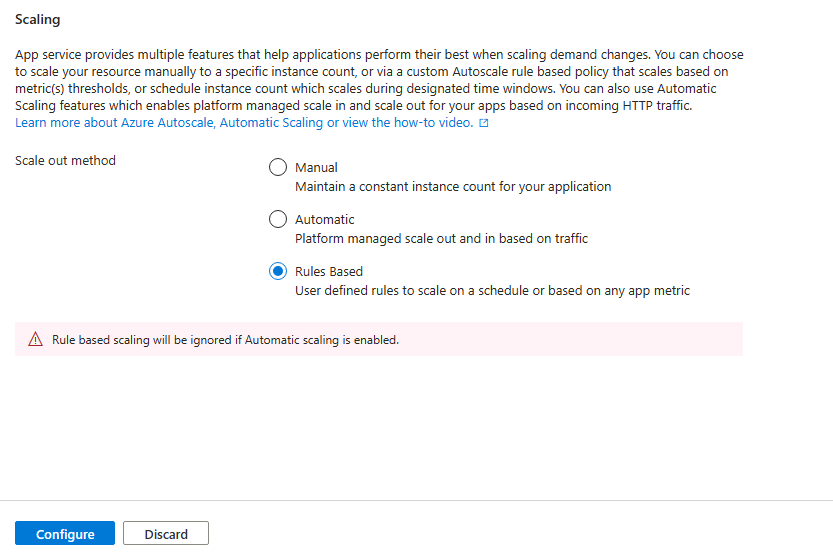
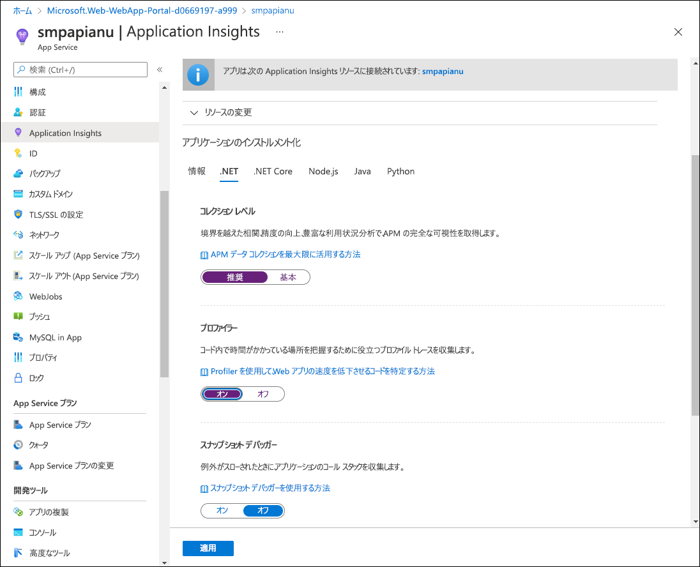

---
lab:
  az204Title: 'Lab 11: Monitor services that are deployed to Azure'
  az204Module: 'Learning Path 11: Troubleshoot solutions by using Application Insights'
---

# ラボ 11: Azure にデプロイされたサービスを監視する

## Microsoft Azure ユーザー インターフェイス

Microsoft クラウド ツールの動的な性質を考慮すると、このトレーニング コンテンツの開発の後に発生する Azure UI の変更に気付くかもしれません。 その結果、ラボの指示とラボの手順が正しく整合しなくなる可能性があります。

Microsoft は、コミュニティから必要な変更の通知があったときに、このトレーニング コースを更新します。 ただし、クラウドの更新は頻繁に発生するため、このトレーニング コンテンツの更新の前に UI の変更に気付く可能性があります。 **これが発生した場合は、その変更に適応し、ラボでは必要に応じてそれらに対応してください。**

## Instructions

### 開始する前に

#### ラボ環境にサインインする

次の資格情報を使用して Windows 11 仮想マシン (VM) にサインインします。

- ユーザー名: `Admin`
- パスワード: `Pa55w.rd`

> **注**: 仮想ラボ環境に接続するための手順は、インストラクターから提供されます。

#### インストールされているアプリケーションを確認する

Windows 11 デスクトップでタスク バーを探します。 タスク バーには、このラボで使用する次のようなアプリケーションのアイコンが含まれています。
    
-   Microsoft Edge
-   エクスプローラー
-   Visual Studio Code
-   Azure PowerShell

## 課題シナリオ

このラボでは、後で確認するために Application Insights データの監視とログ記録に使用する Application Insights リソースを Azure に作成します。 API は、需要が特定のしきい値まで増加した場合に自動的にスケーリングするように設定されます。データのログ記録は、サービスがどのように利用されているかを判断するのに役立ちます。

## アーキテクチャの図


### 演習 1: Azure リソースをデプロイして構成する

#### タスク 1: Azure portal を開く

1. タスク バーで、**Microsoft Edge** アイコンを選択します。

1. ブラウザー ウィンドウで、Azure portal (`https://portal.azure.com`) に移動してから、このラボで使用するアカウントでサインインします。

    > **注**:初めて Azure portal にサインインする場合は、このポータルのツアーが表示されます。 **[はじめに]** を選択してツアーをスキップし、ポータルの使用を開始します。

#### タスク 2: Application Insights リソースを作成する

1. Azure portal で、ページの上部にある **[リソース、サービス、ドキュメントの検索]** テキスト ボックスを使用して、「**Application Insights**」を検索してから、結果のリストで **[Application Insights]** を選択します。

1. **[Application Insights]** ブレードで、 **[+ 作成]** を選択します。

1. **[Application Insights]** ブレードの **[基本]** タブで、次のアクションを実行し、**[確認および作成]** を選択します。
    
    | 設定 | アクション |
    | -- | -- |
    | **[サブスクリプション]** ドロップダウン リスト | 既定値のままにします |
    | **[リソース グループ]** セクション | **[新規作成]** を選択して、「**MonitoredAssets**」と入力してから、 **[OK]** を選択します。 |
    | **[名前]**  テキスト ボックス | **instrm** _[ご自分の名前]_ |
    | **[リージョン]** ドロップダウン リスト | Application Insights リソースをデプロイできる Azure リージョンを選択します。 |
    | **[リソース モード]** セクション | **[ワークスペースベース]** オプションを選択します。 |
    | **[ワークスペースの詳細]** セクション | **[サブスクリプション]** ドロップダウン リストと **[Log Analytics ワークスペース]** ドロップダウン リストの既定値をそのまま使用します。 |
    
    次のスクリーンショットは、 **[Application Insights]** ブレードで構成された設定を示しています。

    
     
1. **[確認と作成]** タブで、前の手順で選択したオプションを確認します。

1. **[作成]** を選択し、指定した構成を使用して **Application Insights** インスタンスを作成します。

    > **注**: 作成タスクが完了するのを待ってから、このラボを続行してください。

1. **[Microsoft.AppInsights \| 概要]** ブレードで、 **[リソースに移動]** ボタンを選択し、新しく作成された **Application Insights** リソースのブレードに移動します。

1. **[Application Insights]** ブレードの **[構成]** セクションで、 **[プロパティ]** リンクを選択します。

1. **[プロパティ]** ブレードで、 **[インストルメンテーション キー]** エントリの横にある **[クリップボードにコピー]** ボタンを選択してから、コピーした値を記録します。 この値は、このラボで後ほど使用します。

    > **注**: キーは、クライアント アプリケーションで特定の **Application Insights** リソースに接続するために使用されます。

### タスク 3: Azure Web API リソースを作成する

1. Azure portal で、ページの上部にある **[リソース、サービス、ドキュメントの検索]** テキスト ボックスを使用して、「**App Services**」を検索し、結果のリストで **[App Services]** を選択します。

1. **[App Services]** ブレードで、**[+ 作成]** を選択し、**[+ Web アプリ]** を選択します。
    
1. **[Web アプリの作成]** ブレードの **[基本]** タブで、次のアクションを実行してから、**[監視およびセキュリティで保護]** タブを選択します。

    | 設定 | アクション |
    | -- | -- |
    | **[サブスクリプション]** ドロップダウン リスト | 既定値のままにします |
    | **[リソース グループ]** ドロップダウン リスト |**[MonitoredAssets]** を選択します。 |
    | **[名前]**  テキスト ボックス | 「**smpapi**_[ご自分の名前]_」と入力します |
    | **[公開]** セクション | **[コード]** を選択します |
    | **[ランタイム スタック]** ドロップダウン リスト | **[.NET 8 (LTS)]** を選びます |
    | **[オペレーティング システム]** セクション |  **[Windows]** を選択します |
    | **[リージョン]**  ドロップダウン リスト |  **Application Insights** リソースの場所として選択したのと同じリージョンを選択します。 |
    | **[Windows プラン (米国東部)]** セクション | **[新規作成]** を選び、 **[名前]** テキスト ボックスに「**MonitoredPlan**」と入力してから、 **[OK]** を選択します |
    | **[価格プラン]** セクション |  既定値のままにします |

1. **[監視およびセキュリティで保護]** タブで、次のアクションを実行してから、**[確認および作成]** を選択します。
    
    | 設定 | アクション |
    | -- | -- |
    | **[Application Insights を有効にする]** セクション | **[はい]** が選択されていることを確認します |
    | **[Application Insights]** ドロップダウン リスト | このラボで前に作成した **instrm** _[ご自分の名前]_ Application Insights リソースを選択します。 |
    
1. **[Web アプリの作成]** タブで、前の手順で選択したオプションを確認します。

1. **[作成]** を選択し、指定した構成を使用して Web API を作成します。

    > **注**: 作成タスクが完了するのを待ってから、このラボを続行してください。

1. デプロイの **[概要]** ブレードで、 **[リソースに移動]** ボタンを選択して、新しく作成された Azure Web API のブレードに移動します。

1. **[App Service]** ブレードの **[設定]** セクションで、**[環境変数]** リンクを選択します。

1. **[環境変数]** セクションで、次のアクションを実行します。
    
    a.  **[アプリの設定]** タブで、**[値の表示]** を選択して、Web API に関連付けられたシークレットを表示します。

    b.  **APPLICATIONINSIGHTS_CONNECTION_STRING** キーを表す値に注目してください。 この値は、Web API リソースをビルドするときに自動的に設定されたものです。

1. **[App Service]** ブレードで、サービス メニューの上部にある **[概要]** を選択します。

1. **[App Service]** ブレードの **[要点]** セクションで、**[既定のドメイン]** リンクの値を記録します。 この値は、ラボの後半で Web API に要求を送信するために使用します。

#### タスク 4: Web API 自動スケーリング オプションを構成する

1. **[App Service]** ブレードの **[設定]** セクションで、 **[スケール アウト (App Service プラン)]** リンクを選択します。

1. **スケールアウト方法**が表示されるまで下にスクロールします。 **[ルール ベース]** オプションを選択してから、**[構成]** を選択します。



1. **[スケール アウト]** セクションで、次のアクションを実行してから、 **[保存]** を選択します。
    
    | 設定 | アクション |
    | -- | -- |
    | **[スケール アウト]** セクション | **[カスタム自動スケーリング]** を選択します |
    | **[自動スケーリング設定の名前]** テキスト ボックス | 「**ComputeScaler**」と入力します |
    | **[リソース グループ]** ドロップダウン リスト |**[MonitoredAssets]** を選択します。 |
    | **[スケール モード]** セクション | **[メトリックに基づいてスケーリングする]** を選択します |
    | **[インスタンスの制限]** セクションの **[最小値]** テキスト ボックス | 「**1**」と入力します |
    | **[インスタンスの制限]** セクションの **[最大値]** テキスト ボックス | 「**8**」と入力します |
    | **[インスタンスの制限]** セクションの **[既定値]** テキスト ボックス | 「**3**」と入力します |
   
    次のスクリーンショットは、 **[App Service]** ブレードの **[スケール アウト]** セクションで構成された設定を示しています。
    
    

    | 設定 | アクション |
    | -- | -- |
    | **[ルール]** セクション | **[ルールの追加]** を選択します |
    | **[スケール ルール]** ブレード | すべての設定の既定値を保持したまま、 **[追加]** を選択します |

    次のスクリーンショットは、 **[App Service]** ブレードの **[スケール アウト]** セクションの追加の設定を示しています。

   ![Azure Web API ブレード上の既定のスケール条件の [スケール ルール] ブレード](./media/l11_scale_web_app_rule.png)

    > **注**: 保存操作が完了するまで待ってから、このラボを続行してください。

#### 確認

この演習では、ラボの残りの部分で使用する Azure リソースを作成しました。

### 演習 2: Application Insights を使用してローカル Web API を監視する

#### タスク 1: .NET Web API プロジェクトをビルドする

1. ラボ コンピューターから、**Visual Studio Code** を起動します。

1. Visual Studio Code の **[ファイル]** メニューで、 **[フォルダーを開く]** を選択します。

1. **[フォルダーを開く]** ウィンドウで、**Allfiles (F):\\Allfiles\\Labs\\11\\Starter\\Api** に移動してから、 **[フォルダーの選択]** を選択します。

1. **Visual Studio Code** ウィンドウのメニュー バーで、[**ターミナル**] を選択し、**新しいターミナル***を選択します。

1. ターミナル プロンプトで、次のコマンドを実行し、現在のディレクトリに **SimpleApi** という名前の新しい .NET Web API アプリケーションを作成します。

    ```
    dotnet new webapi --output . --name SimpleApi --framework net8.0
    ```

1. 次のコマンドを実行して、バージョン 2.21.0 の **Microsoft.ApplicationInsights** を NuGet から現在のプロジェクトにインポートします。

    ```
    dotnet add package Microsoft.ApplicationInsights --version 2.21.0
    ```

    > **注**: **dotnet add package** コマンドは、NuGet から **Microsoft.ApplicationInsights** パッケージを追加します。 詳細については、「[Microsoft.ApplicationInsights](https://www.nuget.org/packages/Microsoft.ApplicationInsights/)」を参照してください。

1. 次のコマンドを実行して、バージョン 2.21.0 の **Microsoft.ApplicationInsights.AspNetCore** を NuGet から現在のプロジェクトにインポートします。

    ```
    dotnet add package Microsoft.ApplicationInsights.AspNetCore --version 2.21.0
    ```

    > **注**: **dotnet add package** コマンドは、NuGet から **Microsoft.ApplicationInsights.AspNetCore** パッケージを追加します。 詳細については、「[Microsoft.ApplicationInsights.AspNetCore](https://www.nuget.org/packages/Microsoft.ApplicationInsights.AspNetCore)」を参照してください。

1. ターミナル プロンプトで、次のコマンドを実行し、バージョン 2.21.0 の **Microsoft.ApplicationInsights.PerfCounterCollector** を NuGet から現在のプロジェクトにインポートします。

    ```
    dotnet add package Microsoft.ApplicationInsights.PerfCounterCollector --version 2.21.0
    ```

    > **注**: **dotnet add package** コマンドは、NuGet から **Microsoft.ApplicationInsights.PerfCounterCollector** パッケージを追加します。 詳細については、「[Microsoft.ApplicationInsights.PerfCounterCollector](https://www.nuget.org/packages/Microsoft.ApplicationInsights.PerfCounterCollector/)」を参照してください。

1. ターミナル プロンプトで、次のコマンドを実行し、バージョン 2.4.0 の **Microsoft.ApplicationInsights.Profiler.AspNetCore** を NuGet から現在のプロジェクトにインポートします。

    ```
    dotnet add package Microsoft.ApplicationInsights.Profiler.AspNetCore --version 2.4.0
    ```

    > **注**: **dotnet add package** コマンドにより、NuGet から **Microsoft.ApplicationInsights.Profiler.AspNetCore** パッケージが追加されます。 詳細については、「[Microsoft.ApplicationInsights.Profiler.AspNetCore](https://www.nuget.org/packages/Microsoft.ApplicationInsights.Profiler.AspNetCore/)」を参照してください。

1. ターミナル プロンプトで、次のコマンドを実行して、.NET Web API をビルドします。

    ```
    dotnet build
    ```
    
#### タスク 2: HTTPS を無効にし、Application Insights を使用するようにアプリ コードを更新する

1. **[Visual Studio Code]** ウィンドウの **[エクスプローラー]** ペインで、**Program.cs** ファイルを選択して、 **[エディター]** ペインでそのファイルを開きます。

1. **[エディター]** ペインで、次のコードを 17 行目で見つけて削除します。

    ```csharp
    app.UseHttpsRedirection();
    ```

    > **注**: このコード行は、Web API に HTTPS の使用を強制します。 このラボでは、この処理は必要がありません。

1. **Program.cs** ファイルで、次の 7 行目以降の 2 行を追加し、Application Insights と共に Service コレクションに登録して Profiler を有効にします。

    ```csharp
    builder.Services.AddApplicationInsightsTelemetry();
    builder.Services.AddServiceProfiler();
    ```

1. **Program.cs** ファイルを保存して閉じます。

1. **[Visual Studio Code]** ウィンドウの **[エクスプローラー]** ペインで、**appsettings.json** ファイルを選択して、 **[エディター]** ペインでそのファイルを開きます。

1. **appsettings.json** ファイルに追加し、**Logging** 要素の直後に次の要素を追加し、`instrumentation-key` プレースホルダーを、このラボで前に記録した Application Insights リソース インストルメンテーション キーの値に置き換えます。

    ```json
       "ApplicationInsights":
       {
          "InstrumentationKey": "instrumentation-key"
       },
    ```

    > **注**: 追加するセクションがファイルの最後の要素である場合は、末尾のコンマを削除します。

1. これで、appsettings.json ファイルの構造は次のようになります。

    ```json
    {
        "Logging":{
            "LogLevel": {
                "Default": "Information",
                "Microsoft.AspNetCore": "Warning"
            }
        },
       "ApplicationInsights":
       {
          "InstrumentationKey": "instrumentation-key"
       },
       "AllowedHosts": "*"
    }
    ```

    > **注** プレースホルダーは、前に記録した独自のインストルメンテーション キーに置き換えてください。

1. **appsettings.json** ファイルへの変更を保存して閉じます。

1. ターミナル プロンプトで、次のコマンドを実行して、.NET Web API をビルドします。

    ```
    dotnet publish -c Release -r win-x86 --self-contained -p:PublishReadyToRun=true .\SimpleApi.csproj
    ```

#### タスク 3: API アプリケーションをローカルでテストする

1. ターミナル プロンプトで、次のコマンドを実行して、.NET Web API を起動します。

    ```
    dotnet run
    ```

1. コマンドの出力を確認し、サイトがリッスンしている HTTPS URL をメモします。

1. タスク バーから、**Microsoft Edge** アイコンのコンテキスト メニューを開いてから、新しいブラウザー ウィンドウを開きます。

1. 開いたブラウザー ウィンドウで、`http://localhost` の URL に移動し、ご自分の Web API の **/weatherforecast** 相対パスを追加します。
    
    > **注**: 完全な URL は `http://localhost:[port-number]/weatherforecast` であり、プレースホルダー `[port-number]` は HTTPS プロトコルを介して Web アプリにアクセスできるポート番号を識別します。

    > **注**: ページには、出力が次の形式で含まれているはずです。 実際の値は異なる**場合があります**。 

    ```json
    [
        {
            "date": "2023-10-29",
            "temperatureC": -8,
            "summary": "Sweltering",
            "temperatureF": 18
        },
        {
            "date": "2023-10-30",
            "temperatureC": -12,
            "summary": "Hot",
            "temperatureF": 11
        },
        {
            "date": "2023-10-31",
            "temperatureC": 50,
            "summary": "Chilly",
            "temperatureF": 121
        },
        {
            "date": "2023-11-01",
            "temperatureC": 51,
            "summary": "Chilly",
            "temperatureF": 123
        },
        {
            "date": "2023-11-02",
            "temperatureC": 29,
            "summary": "Balmy",
            "temperatureF": 84
        }
    ]
    ```

1. ブラウザー ページを何回か更新して、いくつかの応答をシミュレートします。

1. `http://localhost:[port-number]/weatherforecast` によって生成されたページを表示しているブラウザー ウィンドウを閉じます。

1. Visual Studio Code で、 **[ターミナルの強制終了]** (**ごみ箱** アイコン) を選択して、 **[ターミナル]** ペインと関連するプロセスを閉じます。

#### region タスク 4: Application Insights でメトリックを確認する

1. ラボ コンピューターで、Azure portal が表示されている **Microsoft Edge** ブラウザー ウィンドウに切り替えます。

1. Azure portal で、このラボで前に作成した **instrm** _[yourname]_ Application Insights リソースのブレードに戻ります。

1. **[Application Insights]** ブレードの中央にあるタイルで、表示されたメトリックを探します。 具体的には、発生したサーバー要求の数と平均サーバー応答時間を探します。

    次のスクリーンショットは、ローカル Web アプリの **Application Insights** メトリックを示しています。

    

    > **注**: Application Insights メトリック グラフで要求を観察するには、最大で 5 分かかる場合があります。

#### 確認

この演習では、ASP.NET を使用して API アプリを作成し、それを、アプリケーション メトリックを Application Insights にストリーム配信するように構成しました。 その後で、Application Insights ダッシュボードを使用して、API に関するパフォーマンスの詳細を確認しました。

### 演習 3: Application Insights を使用して Web API を監視する

#### タスク 1: Web API にアプリケーションをデプロイする

1. ラボ コンピューターで、Visual Studio Code に切り替えます。

1. **Visual Studio Code** ウィンドウのメニュー バーで、 **[ターミナル]** を選択し、 **[新しいターミナル]** を選択します。

1. ターミナル プロンプトで、次のコマンドを実行して、現在のディレクトリが **Allfiles (F):\\Allfiles\\Labs\\11\\Starter\\Api\\bin\\Release\\net8.0\\net8.0\\win-x86\\publish** に設定されていることを確認します。ここに、デプロイ ファイルが格納されています。

    ```
    cd F:\Allfiles\Labs\11\Starter\Api\bin\Release\net8.0\win-x86\publish\
    ```

1. 次のコマンドを実行して、Azure Web API の横にデプロイするスターター プロジェクトを含む zip ファイルを作成します。

    ```powershell
    Compress-Archive -Path * -DestinationPath api.zip
    ```

1. ターミナル プロンプトで、次のコマンドを実行し、Azure PowerShell を使用して Azure サブスクリプションにサインインします。

    ```powershell
    Connect-AzAccount
    ```

1. メッセージが表示されたら、このラボで使用している Azure サブスクリプションにアクセスするための資格情報を入力して、認証を行います。

    > **注**: サインイン プロセスが完了するまで待ちます。

1. 次のコマンドを実行して、**MonitoredAssets** リソース グループ内のすべての Web アプリの一覧を表示します。

    ```powershell
    Get-AzWebApp -ResourceGroupName MonitoredAssets
    ```

1. 次のコマンドを実行して、**MonitoredAssets** リソース グループ内の Web アプリの一覧 (名前が **smpapi\*** で始まる) を表示します。

    ```powershell
    Get-AzWebApp -ResourceGroupName MonitoredAssets | Where-Object {$_.Name -like 'smpapi*'}
    ```

1. 次のコマンドを実行して、前の手順で特定した最初の Web アプリの名前を表示し、 **$webAppName** という名前の変数に格納します。

    ```powershell
    Get-AzWebApp -ResourceGroupName MonitoredAssets | Where-Object {$_.Name -like 'smpapi*'} | Select-Object -ExpandProperty Name
    $webAppName = (Get-AzWebApp -ResourceGroupName MonitoredAssets | Where-Object {$_.Name -like 'smpapi*'})[0] | Select-Object -ExpandProperty Name
    ```

1. 次のコマンドを実行して、このタスクで前に作成した **api.zip** ファイルを前の手順で特定した名前の Web API にデプロイします。

    ```powershell
    Publish-AzWebApp -ResourceGroupName MonitoredAssets -Name $webAppName -ArchivePath "F:\Allfiles\Labs\11\Starter\Api\bin\Release\net8.0\win-x86\publish\api.zip" -force
    ```

    > **注**: デプロイが完了するまで待ってから、このラボを続行してください。

1. ラボ コンピューターで、別の Microsoft Edge ブラウザー ウィンドウ起動します。

1. ブラウザー ウィンドウで、このタスクで前に API アプリをデプロイした Azure Web API アプリの URL (このラボで前に記録した URL) にサフィックス **/weatherforecast** を付加し、そのアプリに移動します。

    > **注**: たとえば、URL が `https://smpapianu.azurewebsites.net` の場合、新しい URL は `https://smpapianu.azurewebsites.net/weatherforecast` のようになります。

1. API アプリをローカルで実行したときに生成された出力に似ていることを確認してください。

    > **注**: 値は違いますが、形式は同じはずです。

#### タスク 2: Web Apps の詳細なメトリック コレクションを構成する

1. ラボ コンピューターで、Azure portal が表示されている **Microsoft Edge** ブラウザー ウィンドウに切り替えます。

1. Azure portal で、このラボで前に作成した **instrm** _[yourname]_ Web アプリ リソースのブレードに戻ります。

1. **[App Service]** ブレードで **[Application Insights]** を選択します。

1. **[Application Insights]** ブレードで、次のアクションを実行し、 **[適用]** を選択してから、確認ダイアログで **[はい]** を選択します。

    | 設定 | アクション |
    | -- | -- |
    | **[Application Insights]** スライダー | **[有効]** に設定されていることを確認します |
    | **[アプリケーションのインストルメンテーション]** セクション | **[.NET]** タブを選択します |
    | **[コレクション レベル]** セクション | **[推奨]** を選択します |
    | **[プロファイラー]** セクション | **[オン]** を選択します |
    | **[スナップショット デバッガー]** セクション | **[オフ]** を選択します |
    | **[SQL コマンド]** セクション | **[オフ]** を選択します |

    
    次のスクリーンショットは、Azure Web API の **Application Insights** 設定を示しています。
    
    

1. 前のタスクで開いたブラウザー タブに切り替えて、ターゲット Azure API アプリ (ターゲット URL 内の **/weatherforecast** 相対パスを含む) への API アプリのデプロイ結果を表示し、ブラウザー ページを数回更新します。

1. API によって生成された JSON 形式の出力を確認します。

1. JSON 形式の出力へのアクセスに使用した URL を記録します。

    > **注**: **smpapianu** が前に作成したサイト名の場合、URL は `https://smpapianu.azurewebsites.net/weatherforecast` の形式になっているはずです。

#### タスク 3: Application Insights で更新されたメトリックを取得する

1. Azure portal に Azure Web アプリが表示されるブラウザー ウィンドウに戻ります。

1. Web アプリの **[Application Insights]** ブレードで、 **[Application Insights データの表示]** リンクを選択します。

1. **[Application Insights]** ブレードの中央にあるタイルで、収集されたメトリック (発生したサーバー要求の数や平均サーバー応答時間など) を確認します。
 
    次のスクリーンショットは、Azure portal での Azure Web アプリの **Application Insights** メトリックを示しています。
     
    

    > **注**: 更新されたメトリックが Application Insights メトリック グラフに表示されるまで、最大で 5 分かかる場合があります。

#### タスク 4: Application Insights でリアルタイム メトリックを表示する

1. **[Application Insights]** ブレードの **[調査]** セクションで、 **[ライブ メトリック]** を選択します。

1. ターゲット Azure Web アプリ (ターゲット URL 内の **/weatherforecast** 相対パスを対象とする) で実行されているターゲット API アプリが表示されているブラウザー ウィンドウに戻ってから、ブラウザー ページを数回更新します。

1. **[ライブ メトリック]** ブレードが表示されているブラウザー ウィンドウに切り替えて、その内容を確認します。

    > **注**: **[受信した要求]** セクションが数秒以内に更新され、Web API に対して行われた要求が表示されるはずです。

#### 確認

この演習では、Web API アプリの Application Insights ログを構成してテストしました。また、作成されている要求に関するライブ情報を表示しました。
