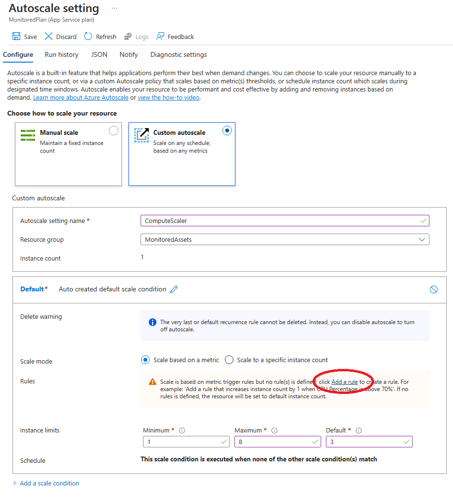

---
lab:
    az204Title: 'ラボ 11: Azure にデプロイされたサービスの監視'
    az020Title: 'ラボ 11: Azure にデプロイされたサービスの監視'
    az204Module: 'モジュール 11: Azure ソリューションの監視と最適化'
    az020Module: 'モジュール 11: Azure ソリューションの監視と最適化'
---

# ラボ 11: Azure にデプロイされたサービスの監視

## Microsoft Azure ユーザー インターフェイス

Microsoft クラウド ツールは頻繁に更新されるため、このトレーニング コンテンツ作成後に一部の Azure UI が変更されている可能性があります。その結果、ラボの手順やステップが、正しく整合しない可能性があります。

Microsoft では、コミュニティから変更の必要性を通知されたとき、トレーニング コースを更新しています。しかし、クラウドの更新は頻繁に行われているため、このトレーニング コースを更新する前に、UI の変更に気づく場合があります。**その場合は、変更に適宜対応して、ラボで要求されている内容を処理してください。**

## 手順

### 開始する前に

#### ラボ環境へのログイン

次の認証情報を使用して、Windows 10 仮想マシン (VM) にログインします。
    
-   ユーザー名: **Admin**

-   パスワード: **Pa55w.rd**

> **注**: 講師が仮想ラボ環境に接続するための手順を説明します。

#### インストールされているアプリケーションを確認します

Windows 10 デスクトップでタスク バーを探します。タスク バーには、以下をはじめとする、このラボで使用するアプリケーションのアイコンが含まれています。
    
-   Microsoft Edge

-   エクスプローラー

-   Visual Studio Code

-   Azure PowerShell

## アーキテクチャの図


### 演習 1: Azure リソースの作成と構成

#### タスク 1: Azure portal を開く

1.  タスク バーで、**Microsoft Edge** アイコンを選択します。

1.  ブラウザー ウィンドウで、Azure portal ([portal.azure.com](https://portal.azure.com)) を閲覧してから、このラボで使用するアカウントでログインします。

    > **注**: Azure portal に初めてログインする場合は、ポータルのツアーが表示されます。ツアーをスキップしてポータルの使用を開始するには、「**開始**」を選択します。

#### タスク 2: Application Insights リソースの作成

1.  Azure portal で、ページ上部の「**リソース、サービス、およびドキュメントの検索**」テキスト ボックスを使用して、「**Application Insights**」を検索してから、結果のリストで、「**Application Insights**」を選択します。

1.  「**Application Insights**」ブレードで、「**+ 作成**」を選択します。

1.  「**Application Insights**」ブレードの「**基本**」タブで、次のアクションを実行し、**「確認および作成」** を選択します。
    
    | 設定                         | アクション                                                       |
    | ------------------------------- | ------------------------------------------------------------ |
    | **サブスクリプション** ドロップダウン リスト | 既定値のままにします。                                    |
    | **リソース グループ** セクション      | 「**新規作成**」を選択し、「**MonitoredAssets**」と入力してから、「**OK**」を選択します。 |
    | **名前**テキスト ボックス     | **instrm**_[yourname]_。                           |
    | **リージョン** ドロップダウン リスト       | Azure Service Bus をデプロイできる Azure リージョンを選択します。 |
    | 「**リソース モード**」セクション | 「**ワークスペースベース**」のオプションを選択します。|
    | 「**ワークスペースの詳細**」セクション | 「**サブスクリプション**」および「**Log Analytics ワークスペース**」ドロップダウン リストの既定値を保持します。|
    
    次のスクリーンショットは、「**Application Insights**」ブレード上で構成された設定を示しています。

       
     
1.  「**確認および作成**」タブで、前の手順で選択したオプションをレビューします。

1.  「**作成**」を選択し、指定された構成を使用して **Application Insights** インスタンスを作成します。

    > **注**: このラボを進める前に、作成タスクが完了するまで待ちます。

1.  「**Microsoft.AppInsights \| 概要**」ブレードで、「**リソースに移動**」ボタンを選択して、新しく作成された「**Application Insights**」リソースのブレードに移動します。

1.  「**Application Insights**」ブレードの「**構成**」セクションで、「**プロパティ**」リンクを選択します。

1.  「**プロパティ**」ブレードで、「**インストルメント化キー**」エントリの横の「**クリップボードにコピー**」ボタンを選択して、コピーした値を記録します。これは、このラボの後半で使用します。

    > **注**: キーは、特定の **Application Insights** リソースに接続するためにクライアント アプリケーションによって使用されます。

### タスク 3: Azure Web API リソースを作成する

1.  Azure portal で、ページの上部にある「**リソース、サービス、およびドキュメントの検索**」テキストボックスを使用して、「**App Services**」を検索し、結果のリストで「**App Services**」を選択します。

1.  「**App Services**」ブレードで、「**+ 作成**」を選択します。
    
1.  **Web アプリの作成**ブレードの**基本**タブで、次のアクションを実行してから、**「次へ:」** を選択します**デプロイ**:

    | 設定                         | アクション                                                       |
    | ------------------------------- | ------------------------------------------------------------ |
    | 「**サブスクリプション**」ドロップダウン リスト | 既定値のままにします。                                    |
    | 「**リソース グループ**」ドロップダウン リスト      |「**MonitoredAssets**」を選択します。 |
    | 「**名前**」テキスト ボックス     | 「**smpapi**_[yourname]_」と入力します。                           |
    | 「**公開**」セクション       | 「**コード**」を選択します。 |
    | 「**ランタイム スタック**」ドロップダウン リスト | 「**.NET Core 3.1 (LTS)**」を選択します。|
    | **オペレーティング システム** セクション |  「**Windows**」を選択します。|
    | 「**リージョン**」ドロップダウン リスト |  **Application Instance** リソースの場所として選択したのと同じリージョンを選択します。 |
    | 「**App Service プラン**」セクション |  「**新規作成**」を選択します。 |
    | 「**名前**」テキスト ボックス |  **MonitoredPlan** と入力してから、「**OK**」を選択します。|
    |  「**SKU およびサイズ**」セクション |  既定値のままにします。 |
    
1.  「**バックエンド**」タブで、「**次へ: 監視**」を選択します。

1.  「**監視**」タブで、次のアクションを実行してから、「**確認および作成**」を選択します。
    
    | 設定                         | アクション                                                       |
    | ------------------------------- | ------------------------------------------------------------ |
    | 「**Application Insights の有効化**」セクション | 「**はい**」が選択されていることを確認します。                                    |
    | 「**Application Insights**」ドロップダウン リスト     | このラボで前に作成した **instrm**_[yourname]_ Application Insights リソースを選択します。|
    
1.  「**確認および作成**」タブで、前の手順で選択したオプションをレビューします。

1.  指定された構成を使用して Web アプリを作成するには、「**作成**」を選択します。

    > **注**: このラボを進める前に、作成タスクが完了するまで待ちます。

1.  「**デプロイの概要**」ブレードで、「**リソースに移動**」ボタンを選択して、新しく作成された Azure Web API のブレードに移動します。

1.  「**App Service**」ブレードの「**設定**」セクションで、「**構成**」リンクを選択します。

1.  「**構成**」セクションで、次の操作を実行します:
    
    a. 「**アプリケーション設定**」タブで、「**値の表示**」を選択して、Web API に関連付けられているシークレットを表示します。

    b. **APPINSIGHTS\_INSTRUMENTATIONKEY** キーを表す値に注意してください。この値は、Web API リソースを構築したときに自動的に設定されました。

1.  「**App Service**」ブレードの「**設定**」セクションで、「**プロパティ**」リンクを選択します。

1.  「**プロパティ**」セクションで、「**URL**」リンクの値を記録します。ラボの後半でこの値を使用して、Web API にリクエストを送信します。

#### タスク 4: Web API 自動スケーリング オプションを構成する

1.  「**App Services**」ブレードの「**設定**」セクションで、「**スケール アウト (App Service プラン)**」リンクを選択します。

1.  「**スケール アウト**」セクションで、次のアクションを実行してから、「**保存**」を選択します。
    
    | 設定                         | アクション                                                       |
    | ------------------------------- | ------------------------------------------------------------ |
    | 「**スケール アウト**」セクション | 「**カスタム自動スケーリング**」を選択します。|
    | 「**自動スケーリング設定名**」テキスト ボックス     | 「**ComputeScaler**」と入力します。|
    | 「**リソース グループ**」ドロップダウン リスト     |「**MonitoredAssets**」を選択します。 |
    | 「**スケール モード**」セクション      | 「**メトリックに基づくスケーリング**」を選択します。 |
    | 「**インスタンスの制限**」セクション内の「**最小**」テキスト ボックス | 「**2**」と入力します。|
    | 「**インスタンスの制限**」セクション内の「**最大**」テキスト ボックス | 「**8**」と入力します。|
    | 「**インスタンスの制限**」セクション内の「**既定**」テキスト ボックス | 「**3**」と入力します。 |
   
    次のスクリーンショットは、「**App Service**」ブレードの「**スケール アウト**」セクションで構成された設定を示しています。
    
       

    | 設定                         | アクション                                                       |
    | ------------------------------- | ------------------------------------------------------------ |
    | **規則**選択 |  「**規則の追加**」を選択します。|
    | 「**スケール規則**」ブレード | すべての設定の既定値を保持してから、「**追加**」を選択します。|

    次のスクリーンショットは、「**App Service**」ブレードの「**スケール アウト**」セクションの追加設定を示しています。

       

    > **注**: このラボを続行する前に、保存操作が完了するまで待ちます。

#### 確認

この演習では、このラボの残りの部分で使用する Azure リソースを作成しました。

### 演習 2: Application Insights を使用してローカル Web API を監視する

#### タスク 1: .NET Core Web API プロジェクトを構築する

1.  ラボ コンピューターで、**Visual Studio Code** を起動します。

1.  Visual Studio Code の「**ファイル**」メニューで、**「フォルダーを開く」** を選択します。

1.  「**フォルダーを開く**」ウィンドウで、**Allfiles (F):\\Allfiles\\Labs\\11\\Starter\\Api** を参照してから、**「フォルダーの選択」** を選択します。

1.  **Visual Studio Code** ウィンドウで、ショートカット メニューをアクティブ化してから、**「統合ターミナルで開く」** を選択します。

1.  ターミナル プロンプトで、次のコマンドを実行して、現在フォルダーに **SimpleApi** という名前の新しい .NET Web API アプリケーションを作成します。

    ```
    dotnet new webapi --output . --name SimpleApi
    ```

1.  次のコマンドを実行して、**Microsoft.ApplicationInsights** のバージョン 2.18.0 を NuGet から現在のプロジェクトにインポートします。

    ```
    dotnet add package Microsoft.ApplicationInsights --version 2.18.0
    ```

    > **注**: **dotnet add package** コマンドは、NuGet から **Microsoft.ApplicationInsights** パッケージを追加します。詳細については、[Microsoft.ApplicationInsights](https://www.nuget.org/packages/Microsoft.ApplicationInsights/) を参照してください。

1.  次のコマンドを実行して、**Microsoft.ApplicationInsights.AspNetCore** のバージョン 2.18.0 を NuGet からインポートします。

    ```
    dotnet add package Microsoft.ApplicationInsights.AspNetCore --version 2.18.0
    ```

    > **注**: **dotnet add package** コマンドは、NuGet から **Microsoft.ApplicationInsights.AspNetCore** パッケージを追加します。詳細については、[Microsoft.ApplicationInsights.AspNetCore](https://www.nuget.org/packages/Microsoft.ApplicationInsights.AspNetCore) を参照してください。

1.  ターミナル プロンプトで、次のコマンドを実行して、**Microsoft.ApplicationInsights.PerfCounterCollector** のバージョン 2.18.0 を NuGet から現在のプロジェクトにインポートします。

    ```
    dotnet add package Microsoft.ApplicationInsights.PerfCounterCollector --version 2.18.0
    ```

    > **注**: **dotnet add package** コマンドは、NuGet から **Microsoft.ApplicationInsights.PerfCounterCollector** パッケージを追加します。詳細については、[Microsoft.ApplicationInsights.PerfCounterCollector](https://www.nuget.org/packages/Microsoft.ApplicationInsights.PerfCounterCollector/) を参照してください。

1.  ターミナル プロンプトで、次のコマンドを実行して、.NET Web API をビルドします。

    ```
    dotnet build
    ```
    
#### タスク 2: HTTPS を無効にして Application Insights を使用するようにアプリ コードを更新する

1.  「**Visual Studio Code**」ウィンドウの「**エクスプローラー**」ペインで、**Startup.cs** ファイルを選択して、「**エディター**」ペインでファイルを開きます。

1.  「**エディター**」ペインの **Startup** クラスで、39 行目の次のコードを見つけて削除します。

    ```csharp
    app.UseHttpsRedirection();
    ```

    > **注**: このコード行は、HTTPS を使用するよう Web API に強制します。この課題では不要です。

1.  **Startup** クラスの定義の最初に、**INSTRUMENTATION_KEY** という名前の新しい静的文字列定数を追加します。この値は、このラボで以前に記録した Application Insights リソース インストルメント化キーに設定されています。

    ```csharp
    private const string INSTRUMENTATION_KEY = "instrumentation_key";
    ```

    > **注**: たとえば、 インストルメンテーション キーが `d2bb0eed-1342-4394-9b0c-8a56d21aaa43` の場合、そのコード行は `private const string INSTRUMENTATION_KEY = "d2bb0eed-1342-4394-9b0c-8a56d21aaa43";` になります。

1.  **Startup** クラス内で **ConfigureServices** メソッドを見つけます。

    ```csharp
    public void ConfigureServices(IServiceCollection services)
    {
        services.AddControllers();
    }
    ```

1.  新しい行から開始して、**ConfigureServices** メソッドの最後に次のコードを追加し、提供されたインストルメント化キーを使用して Application Insights を構成します。

    ```csharp
    services.AddApplicationInsightsTelemetry(INSTRUMENTATION_KEY);
    ```

1.  **ConfigureServices** メソッドを確認します。このメソッドには、次のコードが含まれているはずです。

    ```csharp
    public void ConfigureServices(IServiceCollection services)
    {
        services.AddControllers();
        services.AddApplicationInsightsTelemetry(INSTRUMENTATION_KEY);        
    }
    ```

1.  **Startup.cs** ファイルを保存します。

1.  ターミナル プロンプトで、次のコマンドを実行して、.NET Web API をビルドします。

    ```
    dotnet build
    ```

#### タスク 3: API アプリケーションをローカルでテストする

1.  ターミナル プロンプトで、次のコマンドを実行して、.NET Web API を起動します。

    ```
    dotnet run
    ```

1.  タスク バーから、**Microsoft Edge** アイコンのコンテキスト メニューを開き、新しいブラウザー ウィンドウを開きます。

1.  開いたブラウザー ウィンドウで、URL に Web API の **/weatherforecast** 相対パスが含まれているページに移動します。この時点で、ポート **5000** の**ローカルホスト**でホストされています。
    
    > **注**: 完全な URL は `http://localhost:5000/weatherforecast` です。

    > **注**: このページには、次の形式の出力が含まれている必要があります。

    ```
    [{"date":"2021-09-04T10:15:04.0969996-07:00","temperatureC":54,"temperatureF":129,"summary":"Sweltering"},{"date":"2021-09-05T10:15:04.0972401-07:00","temperatureC":44,"temperatureF":111,"summary":"Balmy"},{"date":"2021-09-06T10:15:04.0976549-07:00","temperatureC":41,"temperatureF":105,"summary":"Scorching"},{"date":"2021-09-07T10:15:04.0976613-07:00","temperatureC":-4,"temperatureF":25,"summary":"Freezing"},{"date":"2021-09-08T10:15:04.0976618-07:00","temperatureC":33,"temperatureF":91,"summary":"Balmy"}]
    ```

1.  `http://localhost:5000/weatherforecast` によって生成されたページを表示しているブラウザー ウィンドウを閉じます。

1.  Visual Studio Code で、**「ターミナルの強制終了」** (**ごみ箱**アイコン) を選択して、「**ターミナル**」ペインと関連するプロセスを閉じます。

#### タスク 4: Application Insights でメトリックを確認する

1.  ラボ コンピューターで、Azure portal を表示している **Microsoft Edge** ブラウザー ウィンドウに切り替えます。

1.  Azure portal で、このラボで以前に作成した **instrm**_[yourname]_ Application Insights リソースのブレードに戻ります。

1.  「**Application Insights**」ブレードで、ブレードの中央にあるタイルで、表示されているメトリックを確認します。具体的には、発生したサーバー要求の数と平均サーバー応答時間を確認します。

    次のスクリーンショットは、ローカル Web アプリの **Application Insights** メトリックを示しています。

       

    > **注**: 要求が Application Insights のメトリック グラフに表示されるまでに、最大 5 分かかる場合があります。

#### 確認

この演習では、ASP.NET を使用して API アプリを作成し、アプリケーション メトリックを Application Insights にストリームするよう構成しました。次に、Application Insights ダッシュボードを使用して、API のパフォーマンスの詳細を確認しました。

### 演習 3: Application Insights を使用して Web API を監視する

#### タスク 1: Web API にアプリケーションをデプロイする

1.  ラボ コンピューターで、Visual Studio Code に切り替えます。

1.  「**Visual Studio Code**」ウィンドウの「**エクスプローラー**」ペインで、**bin\Debug\netcoreapp3.1** ディレクトリに移動します。

1.  ディレクトリに **web.config** という名前のファイルを追加します。

1.  **web.config** ファイルを開き、次の内容を追加します。

    ```
    <?xml version="1.0" encoding="utf-8"?>
    <configuration>
      <location path="." inheritInChildApplications="false">
        <system.webServer>
          <handlers>
            <add name="aspNetCore" path="*" verb="*" modules="AspNetCoreModuleV2" resourceType="Unspecified" />
          </handlers>
          <aspNetCore processPath="dotnet" arguments=".\SimpleApi.dll" stdoutLogEnabled="false" stdoutLogFile=".\logs\stdout" hostingModel="inprocess" />
        </system.webServer>
      </location>
    </configuration>
    ```

1.  ファイルを保存して閉じます。

1.  **Visual Studio Code** ウィンドウで、ショートカット メニューをアクティブ化してから、**「統合ターミナルで開く」** を選択します。

1.  ターミナル プロンプトで、次のコマンドを実行して、現在のディレクトリが **Allfiles (F):\\Allfiles\\Labs\\11\\Starter\\Api\\bin\\Debug\\netcoreapp3.1** に設定されていることを確認します。ここは、デプロイ ファイルが存在する場所です。

    ```
    cd F:\Allfiles\Labs\11\Starter\Api\bin\Debug\netcoreapp3.1
    ```

1.  次のコマンドを実行して、Azure Web API の横にデプロイするスターター プロジェクトを含む zip ファイルを作成します。

    ```powershell
    Compress-Archive -Path * -DestinationPath api.zip
    ```

1.  ターミナル プロンプトで、次のコマンドを実行して、Azure Power Shell を使用して Azure サブスクリプションにサインインします。

    ```powershell
    Connect-AzAccount
    ```

1.  ターミナル プロンプトに表示される指示に従って、Azure portal を表示している Microsoft Edge ブラウザーに切り替え、ブラウザー ウィンドウで別のタブを開き、`https://microsoft.com/devicelogin` に移動します。プロンプトが表示されたら、提供されたコードを入力し、このラボで使用するアカウントでサインインします。

    > **注**: サインイン プロセスが完了するのを待ちます。

1.  新しく開いたブラウザー タブを閉じて、Visual StudioCode ウィンドウのターミナル プロンプトに戻ります。

1.  次のコマンドを実行して、**MonitoredAssets** リソース グループ内のすべての Web アプリのリストを表示します。

    ```powershell
    Get-AzWebApp -ResourceGroupName MonitoredAssets
    ```

1.  次のコマンドを実行して、**MonitoredAssets** リソース グループ内の Web アプリのリストを表示します。名前は **smpapi\*** で始まります。

    ```powershell
    Get-AzWebApp -ResourceGroupName MonitoredAssets | Where-Object {$_.Name -like 'smpapi*'}
    ```

1.  次のコマンドを実行して、前の手順で識別した最初の Web アプリの名前を表示し、**$webAppName** という名前の変数に格納します。

    ```powershell
    Get-AzWebApp -ResourceGroupName MonitoredAssets | Where-Object {$_.Name -like 'smpapi*'} | Select-Object -ExpandProperty Name
    $webAppName = (Get-AzWebApp -ResourceGroupName MonitoredAssets | Where-Object {$_.Name -like 'smpapi*'})[0] | Select-Object -ExpandProperty Name
    ```

1.  次のコマンドを実行して、このタスクで前に作成した **api.zip** ファイルを前の手順で識別した名前の Web API にデプロイします。

    ```powershell
    az webapp deployment source config-zip --resource-group MonitoredAssets --src api.zip --name $webAppName
    ```
    > **注**: 認証を求められたら、`az login` を実行し、指示に従ってサインイン プロセスを完了します。

    > **注**: このラボを続行する前に、デプロイが完了するのを待ちます。

    > **注**: コマンドの出力を確認し、`provisioningState` が `Succeeded` に設定されていることを確認します。コマンドの出力は、次の形式である必要があります。

    ```
    Getting scm site credentials for zip deployment
    Starting zip deployment. This operation can take a while to complete ...
    Deployment endpoint responded with status code 202
    {
      "active": true,
      "author": "N/A",
      "author_email": "N/A",
      "complete": true,
      "deployer": "ZipDeploy",
      "end_time": "2021-09-03T17:02:18.124062Z",
      "id": "f5fb8ef6a11d4f8387f09dc47628007e",
      "is_readonly": true,
      "is_temp": false,
      "last_success_end_time": "2021-09-03T17:02:18.124062Z",
      "log_url": "https://smpapianu.scm.azurewebsites.net/api/deployments/latest/log",
      "message": "Created via a push deployment",
      "progress": "",
      "provisioningState": "Succeeded",
      "received_time": "2021-09-03T17:02:11.942626Z",
      "site_name": "smpapianu",
      "start_time": "2021-09-03T17:02:12.1613438Z",
      "status": 4,
      "status_text": "",
      "url": "https://smpapianu.scm.azurewebsites.net/api/deployments/latest"
    }
    ```

1.  ラボ コンピューターで、別の Microsoft Edge ブラウザー ウィンドウを起動します。

1.  ブラウザー ウィンドウで、このタスクで以前に API アプリをデプロイした Azure Web API アプリに移動し、その URL (このラボで以前に記録したもの) にサフィックス **/weatherforecast** を追加します。

    > **注**: たとえば、URL が `https://smpapianu.azurewebsites.net` の場合、新しい URL は `https://smpapianu.azurewebsites.net/weatherforecast` となります。

1.  出力が、API アプリをローカルで実行したときに生成されたものと似ていることを確認します。

    > **注**: 出力には異なる値が含まれますが、同じ形式である必要があります。

#### タスク 2: Web Apps の詳細なメトリック コレクションを構成する

1.  ラボ コンピューターで、Azure portal を表示している **Microsoft Edge** ブラウザー ウィンドウに切り替えます。

1.  Azure portal で、このラボで以前に作成した **smpapi**_[yourname]_ Web アプリ リソースのブレードに戻ります。

1.  「**App Service**」ブレードで、「**Application Insights**」を選択してから、「**Application Insights をオンにする**」を選択します。

1.  「**Application Insights**」ブレードで、次のアクションを実行し、「**適用**」を選択してから、確認ダイアログで「**はい**」を選択します。

    | 設定                         | アクション                                                       |
    | ------------------------------- | ------------------------------------------------------------ |
    | **Application Insights** スライダー | 「**有効**」に設定されていることを確認します。|
    | 「**アプリケーションをインストルメント化する**」セクション    | **「.NET Core」** タブを選択します。|
    | 「**コレクション レベル**」セクション    | 「**推奨事項**」を選択します。 |
    | 「**プロファイラー**」セクション      | 「**オン**」を選択します。|
    | 「**スナップショット デバッガー**」セクション | 「**オフ**」を選択します。|
    | 「**SQL コマンド**」セクション | 「**オフ**」を選択します。|

    
    次のスクリーンショットは、Azure Web API の **Application Insights** 設定を示しています。
    
       

1.  前のタスクで開いたブラウザー タブに切り替えて、API アプリをターゲット Azure API アプリにデプロイした結果 (ターゲット URL の **/weatherforecast** 相対パスを含む) を表示し、ブラウザー ページを数回更新します。

1.  API によって生成された JSON 形式の出力を確認します。

1.  JSON 形式の出力へのアクセスに使用した URL を記録します。

    > **注**: URL は `https://smpapianu.azurewebsites.net/weatherforecast` の形式である必要があります。

#### タスク 3: Application Insights で更新されたメトリックを取得する

1.  Azure portal に Azure Web アプリを表示しているブラウザー ウィンドウに戻ります。

1.  Web アプリの「**Application Insights**」ブレードで、「**Application Insights データの表示**」リンクを選択します。

1.  「**Application Insights**」ブレードで、発生したサーバー リクエストの数や平均サーバー応答時間など、ブレードの中央にあるタイルで収集されたメトリックを確認します。
 
    次のスクリーンショットは、Azure portal の Azure Web アプリの **Application Insights** メトリックを示しています。
     
       

    > **注**: 更新されたメトリックが Application Insights メトリック グラフに表示されるまでに最大 5 分かかる場合があります。

#### タスク 4: Application Insights でリアルタイムのメトリックスを表示する

1.  「**Application Insights**」ブレードの「**調査**」セクションで、「**ライブ メトリック**」を選択します。

1.  ターゲット Azure Web アプリ (ターゲット URL の **/weatherforecast** 相対パスをターゲットとする) で実行されているターゲット API アプリを表示しているブラウザー ウィンドウに戻り、ブラウザー ページを数回更新します。

1.  「**ライブ メトリック**」ブレードを表示しているブラウザー ウィンドウに切り替えて、その内容を確認します。

    > **注**: 「**受信要求**」セクションは数秒以内に更新され、Web API に対して行った要求が表示されます。

### 演習 4: .NET Core を使用した Application Insights のログ

#### タスク 1: .NET Core API アプリのログを構成する

1.  「**Visual Studio Code**」ウィンドウに切り替えます。

1.  ターミナル プロンプトで、次のコマンドを実行して、現在のディレクトリを **Allfiles (F):\\Allfiles\\Labs\\11\\Starter\\Api** に設定します。ここには、デプロイ ファイルが存在します。

    ```
    cd F:\Allfiles\Labs\11\Starter\Api
    ```

1.  次のコマンドを実行して、**Microsoft.Extensions.Logging.ApplicationInsights** のバージョン 2.18.0 を NuGet から現在のプロジェクトにインポートします。

    ```
    dotnet add package Microsoft.Extensions.Logging.ApplicationInsights --version 2.18.0
    ```

    > **注**: **dotnet add package** コマンドは、NuGet から **Microsoft.ApplicationInsights** パッケージを追加します。詳細については、[Microsoft.Extensions.Logging.ApplicationInsights](https://www.nuget.org/packages/Microsoft.Extensions.Logging.ApplicationInsights) を参照してください。

1.  「**Visual Studio Code**」ウィンドウの「**エクスプローラー**」ペインで、**Controllers** ディレクトリに移動し、**WeatherForecastController.cs** ファイルを開きます。

1.  ファイルの内容を確認し、`using Microsoft.Extensions.Logging` ディレクティブと、汎用 ILogger <WeatherForecastController> インターフェイスのコンストラクター インジェクションが含まれていることに注意してください。

    ```csharp
    using System;
    using System.Collections.Generic;
    using System.Linq;
    using System.Threading.Tasks;
    using Microsoft.AspNetCore.Mvc;
    using Microsoft.Extensions.Logging;

    namespace SimpleApi.Controllers
    {
        [ApiController]
        [Route("[controller]")]
        public class WeatherForecastController : ControllerBase
        {
            private static readonly string[] Summaries = new[]
            {
                "Freezing", "Bracing", "Chilly", "Cool", "Mild", "Warm", "Balmy", "Hot", "Sweltering", "Scorching"
            };

            private readonly ILogger<WeatherForecastController> _logger;

            public WeatherForecastController(ILogger<WeatherForecastController> logger)
            {
                _logger = logger;
            }

            [HttpGet]
            public IEnumerable<WeatherForecast> Get()
            {
                var rng = new Random();
                return Enumerable.Range(1, 5).Select(index => new WeatherForecast
                {
                    Date = DateTime.Now.AddDays(index),
                    TemperatureC = rng.Next(-20, 55),
                    Summary = Summaries[rng.Next(Summaries.Length)]
                })
                .ToArray();
            }
        }
    }
    ```

    > **注**: この構成を利用して、カスタム ログを実装します。現在、コンストラクターはランダムに生成された 5 つの天気予報のグループを表示します。一度に 1 つの予測を表示するようにコントローラーを変更します。予測ごとに、天気のタイプ (軽度、重度、極度) を示す情報、警告、またはエラーのログ エントリを生成します。これらのログ エントリが Application Insights によって対応する Log Analytics ワークスペースに記録されると、各エントリには自動的に割り当てられた重大度レベル 1、2、または 3 が割り当てられます。 

1.  **WeatherForecastController.cs** ファイルの `public IEnumerable <WeatherForecast> Get()` メソッドで `var rng = new Random();` 行を見つけ、次の行から次のコードを追加します。

    ```csharp
            int temperatureC = rng.Next(-20, 55);
            var summaryId = rng.Next(Summaries.Length);

            switch (summaryId)
            {
                case 0: case 9:
                _logger.LogError("WeatherForecast: extreme weather");
                break;
                case 1: case 2: case 7: case 8:
                _logger.LogWarning("WeatherForecast: severe weather");
                break;
                default:
                _logger.LogInformation("WeatherForecast: mild weather");
                break;
            }
    ```

1.  `return` ステートメントを変更して、次の内容になるようにします。

    ```csharp
            return Enumerable.Range(1, 1).Select(index => new WeatherForecast
            {
                Date = DateTime.Now.AddDays(index),
                TemperatureC = temperatureC,
                Summary = Summaries[summaryId]
            })
            .ToArray();
    ```

1.   ファイルを保存して閉じます。

1.  ターミナル プロンプトで、次のコマンドを実行して、.NET Web API をビルドします。

    ```
    dotnet build
    ```

#### タスク 2: .NET Core API アプリのログのテスト

1.  次のコマンドを実行して、.NET Web API を起動します。

    ```
    dotnet run
    ```

    > **注**: このタスクの次の手順を実行するときは、Web API を実行し続け、「Visual StudioCode **ターミナル**」ペインの出力を監視します。

1.  ラボ コンピューターで、タスクバーから **Microsoft Edge** アイコンのコンテキスト メニューを開き、新しいブラウザー ウィンドウを開きます。

    > **注**: 「Visual StudioCode **ターミナル**」ペインをブロックしないようにブラウザー ウィンドウを配置します。

1.  開いているブラウザー ウィンドウで、`http://localhost：5000/weatherforecast` に移動し、ページを数回更新します。
    
    > **注**: ページを更新するたびに、次の形式で異なる天気予報が表示されます。

    ```
    [{"date":"2021-09-04T14:35:29.0789168-07:00","temperatureC":2,"temperatureF":35,"summary":"Sweltering"}]
    ```

    > **注**: ページを更新するたびに、ターミナル プロンプトに次の形式で情報、警告、またはエラー メッセージが表示されます。

    ```
    warn: SimpleApi.Controllers.WeatherForecastController[0]
      WeatherForecast: severe weather
    ```

    > **注**: ページを数回更新して、各タイプ (**info**、**warn**、および **fail**) のメッセージを少なくとも 1 つ生成したことを確認します。

1.  API アプリは終了しないでください。

#### タスク 3: Application Insights ログを確認する

1.  ラボ コンピューターで、Azure portal を表示している **Microsoft Edge** ブラウザー ウィンドウに切り替えます。

1.  Azure portal で、このラボで以前に作成した **instrm**_[yourname]_ Application Insights リソースのブレードに戻ります。

1.  「**Application Insights**」ブレードの「**監視**」セクションで、「**ログ**」を選択します。

1.  必要に応じて、「**Log Analytics へようこそ**」ペインと「**クエリ**」ペインを閉じます。

1.  「**新しいクエリ**」ペインで、次のクエリを入力し、「**実行**」を選択します。

    ```
    traces
    | order by timestamp desc
    ```

1.  クエリの結果を確認します。

    > **注**: 結果には、.NET Core api アプリによって生成された警告メッセージとエラー メッセージに対応するログ エントリと、それぞれの重大度レベル (2 および 3) が含まれている必要があります。

    > **注**: 要求が Application Insights のメトリック グラフに表示されるまでに、最大 5 分かかる場合があります。

    次のスクリーンショットは、「**Application Insights Logs**」ブレードでのログ クエリの結果を示しています。

       

    > **注**: 更新された API アプリを Azure Web アプリにデプロイして、同等の方法で Application Insights を使用してログを収集できます。

    > **注**: 次のコード リストに示すように、**appsettings.Development.json** (または **appsettings.json**) ファイルを変更することで、Application Insights のログ レベルを拡張して情報イベントを含めることができます。ただし、これによりログ量が大幅に増加し、ネットワーク パフォーマンスと価格設定に影響を与える可能性があることに注意してください。

    ```
    {
      "Logging": {
        "LogLevel": {
          "Default": "Information",
          "Microsoft": "Warning",
          "Microsoft.Hosting.Lifetime": "Information"
        },
        "ApplicationInsights": {
          "LogLevel": {
            "Microsoft": "Information"
          }
        }
      }
    }
    ```

1.  API アプリの出力を表示しているブラウザー ウィンドウを閉じます。

1.  「**Visual Studio Code**」ウィンドウに切り替え、「**Kill Terminal**」または「**Recycle Bin**」アイコンを選択して、「**ターミナル**」ペインと関連付けられているプロセスを閉じます。

#### 確認

この演習では、Web API アプリの Application Insights ログを構成してテストしました。

### 演習 5: サブスクリプションのクリーンアップ

#### タスク 1: Azure Cloud Shell を開く

1.  Azure portal で、「**Cloud Shell**」アイコン  を選択して、新しい PowerShell セッションを開始します。Cloud Shell が既定の PowerShell セッションである場合は、**「PowerShell」** を選択し、ドロップダウン メニューで、**「Bash」** を選択します。

    > **注**: 初めての **Cloud Shell** の起動であり、プロンプトが表示された場合は、**「Bash」** または **「PowerShell」** を選択して、**「Bash」** を選択します。**「ストレージがマウントされていません」** というメッセージが表示されたら、このラボで使用しているサブスクリプションを選択して、**「ストレージの作成」** を選択します。

#### タスク 2: リソース グループの削除

1.  「**Cloud Shell**」ペインで、次のコマンドを実行して、**MonitoredAssets** リソース グループを削除します。

    ```
    az group delete --name MonitoredAssets --no-wait --yes
    ```

     >**注**: コマンドは非同期に実行されるので (*--no-wait* パラメーターで決定される)、同じ Bash セッション内ですぐに別の Azure CLI コマンドを実行できますが、リソース グループが実際に削除されるまでに数分かかります。

1.  ポータルで、**Cloud Shell** ペインを閉じます。

#### タスク 3: アクティブなアプリケーションを閉じる

1.  現在実行中の Microsoft Edge アプリケーションを閉じます。

1.  現在実行中の Visual Studio Code アプリケーションを閉じます。

#### 確認

この実習では、このラボで使用するリソース グループを削除することで、サブスクリプションをクリーンアップしました。
