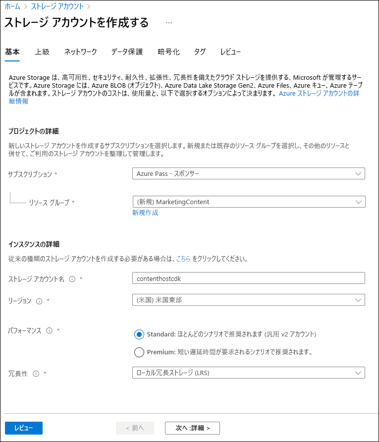
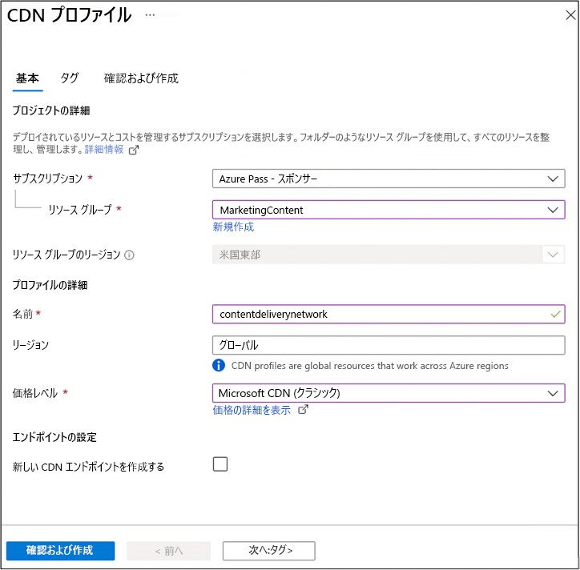

---
lab:
    az204Title: 'ラボ 12: Azure Content Delivery Network を使用して Web アプリケーションを強化する'
    az204Module: 'モジュール 12: キャッシュとコンテンツ配信をソリューション内で統合する'
---

# ラボ 12: Azure Content Delivery Network を使用して Web アプリケーションを強化する

## Microsoft Azure ユーザー インターフェイス

Microsoft クラウド ツールは時間の経過の共に更新されるため、このトレーニング コンテンツを作成した後に実施された Azure UI の変更に気づく場合があります。その結果、ラボの手順やステップが、正しく整合しない可能性があります。

Microsoft では、コミュニティから変更の必要性を通知されたとき、トレーニング コースを更新しています。しかし、クラウドの更新は頻繁に行われているため、このトレーニング コースを更新する前に、UI の変更に気づく場合があります。**その場合は、変更に適宜対応して、ラボで要求されている内容を処理してください。**

## 手順

### 開始する前に

#### ラボ環境へのログイン

次の認証情報を使用して、Windows 10 仮想マシン (VM) にログインします。

- ユーザー名: **Admin**

- パスワード: **Pa55w.rd**

> **注**: 講師が仮想ラボ環境に接続するための手順を説明します。

#### インストールされているアプリケーションを確認します

Windows 10 デスクトップでタスク バーを探します。タスク バーには、このラボで使用するアプリケーションのアイコンが含まれています。

- Microsoft Edge

## アーキテクチャの図


### 演習 1: Azure リソースを作成する

#### タスク 1: Azure portal を開く

1. タスク バーで、**Microsoft Edge** アイコンを選択します。

1. 開いたブラウザー ウィンドウで、Azure portal (<https://portal.azure.com>) を閲覧してから、このラボで使用するアカウントでログインします。

   > **注**: Azure portal に初めてログインする場合は、ポータルのツアーが表示されます。ツアーをスキップしてポータルの使用を開始するには、**開始**を選択します。

#### タスク 2: ストレージ アカウントを作成します

1. Azure portal で、**リソース、サービス、ドキュメントの検索**テキスト ボックスを使用して、**ストレージ アカウント**を検索してから、結果のリストで、「**ストレージ アカウント**」を選択します。

1. **ストレージ アカウント** ブレードで、「**+ 作成**」を選択します。

1. **ストレージ アカウントの作成**ブレードの**基本**タブで、次のアクションを実行してから、「**確認および作成**」を選択します。

   | 設定                           | アクション                                                       |
   | --------------------------------- | ------------------------------------------------------------ |
   | **サブスクリプション** ドロップダウン リスト   | 既定値のままにします。                                    |
   | **リソース グループ** セクション        | 「**新規作成**」を選択し、「**MarketingContent**」と入力してから、「**OK**」を選択します。 |
   | **ストレージ アカウント名**テキスト ボックス | **contenthost**_[yourname]_ を入力します。                           |
   | **リージョン** ドロップダウン リスト         | 「**米国東部**」を選択します。                                     |
   | **パフォーマンス** セクション           | **Standard** オプションを選択します。                              |
   | **冗長性**ドロップダウン リスト     | 「**ローカル冗長ストレージ (LRS)**」 を選択します。                  |

    次のスクリーンショットは、**ストレージ アカウントの作成**ブレード上で構成された設定を示しています。

    

1. **確認および作成**タブで、以前の手順で選択したオプションを確認します。

1. 指定した構成を使用してストレージ アカウントを作成するには、「**作成**」 を選択します。

    > **注**: 演習を進める前に、作成タスクが完了するまで待ちます。

#### タスク 3: Azure App Service を使用して Web アプリを作成する

1. Azure portal のナビゲーション ペインで、「**リソースの作成**」を選択します。

1. **リソースの作成**ブレードの**サービスとマーケットプレイスの検索**テキスト ボックスに、「**Web アプリ**」と入力して、Enter キーを押します。

1. 検索結果ブレードで、**Web アプリ**の結果を選択してから、「**作成**」を選択します。

1. **Web アプリの作成**ブレードの**基本**タブで、次のアクションを実行してから、「**次へ:**」を選択します**Docker**:

   | 設定                           | アクション                                                       |
   | --------------------------------- | ------------------------------------------------------------ |
   | **サブスクリプション** ドロップダウン リスト   | 既定値のままにします。                                    |
   | **リソース グループ** ドロップダウン リスト | リストで「**MarketingContent**」を選択します。                     |
   | **名前**テキスト ボックス                 | **landingpage**_[yourname]_ と入力します。                           |
   | **公開**セクション               | 「**Docker コンテナー**」を選択します。                                 |
   | **オペレーティング システム** セクション      | 「**Linux**」を選択します。                                            |
   | **リージョン** ドロップダウン リスト         | 「**米国東部**」を選択します。                                          |
   | **Linux プラン (米国東部)** セクション  | 「**新規作成**」を選択します。**名前**テキスト ボックスに、「**MarketingPlan**」と入力してから、「**OK**」を選択します。 |
   | **SKU およびサイズ** セクション          | 既定値のままにします。                                    |

   次のスクリーンショットは、**Web アプリの作成**ブレード上で構成された設定を示しています。

   

1. **Docker** タブで、次のアクションを実行し、「**確認および作成**」を選択します。

   | 設定                         | アクション                                                    |
   | ------------------------------- | --------------------------------------------------------- |
   | **オプション** ドロップダウン リスト      | 「**単一コンテナー**」を選択します。                              |
   | **イメージ ソース** ドロップダウン リスト | 「**Docker ハブ**」を選択します。                                    |
   | **アクセスの種類** ドロップダウン リスト  | 「**公開**」を選択します。                                        |
   | **イメージおよびタグ** テキスト ボックス      | **microsoftlearning/edx-html-landing-page:latest** と入力します。 |

   次のスクリーンショットは、**Docker** タブ上の構成された設定を示しています。

   

1. **確認および作成**タブで、以前の手順で選択したオプションを確認します。

1. 指定された構成を使用して Web アプリを作成するには、「**作成**」 を選択します。

    > **注**: 演習を進める前に、作成タスクが完了するまで待ちます。

1. Azure portal のナビゲーション ペインで、「**リソース グループ**」を選択します。

1. **リソース グループ** ブレードで、このラボの前半で作成した **MarketingContent** リソース グループを選択します。

1. **MarketingContent** ブレードで、このラボの前半で作成した **landingpage**_[yourname]_ Web アプリを選択します。

1. 「**App Service**」 ブレードの 「**設定**」 で、「**プロパティ**」 リンクを選択します。

1. **プロパティ** セクションで、**URL** リンクの値を記録します。この値は、このラボの後半で使用します。

#### 確認

この演習では、この課題の後で使用する Azure ストレージ アカウントと Azure Web アプリを作成しました。

### 演習 2: コンテンツ配信ネットワークとエンドポイントを構成する

#### タスク 1: Azure Cloud Shell を開く

1. Azure portal で、**Cloud Shell** アイコン  を選択して、新しい Bash セッションを開始します。Cloud Shell が既定の PowerShell セッションである場合は、「**PowerShell**」を選択し、ドロップダウン メニューで、「**Bash**」を選択します。

    > **注**: 初めての **Cloud Shell** の起動であり、プロンプトが表示された場合は、「**Bash**」または「**PowerShell**」を選択して、「**Bash**」を選択します。「**ストレージがマウントされていません**」というメッセージが表示されたら、このラボで使用しているサブスクリプションを選択して、「**ストレージの作成**」を選択します。

1. Azure portal の **Cloud Shell** コマンド プロンプトで、次のコマンドを実行して、Azure Command-Line Interface (Azure CLI) ツールのバージョンを取得します。

    ```bash
    az --version
    ```

#### タスク 2: Microsoft.CDN プロバイダーを登録する

1. ポータルの **Cloud Shell** コマンド プロンプトで、次の操作を実行します。

    次のコマンドを入力してから、Enter キーを押して、サブグループのリストと Azure CLI のルート レベルのコマンドを取得します。

    ```bash
    az --help
    ```

    b. 次のコマンドを入力してから、Enter キーを押して、リソース プロバイダーが利用できるコマンドのリストを取得します。

    ```bash
    az provider --help
    ```

    c. 次のコマンドを入力してから、Enter キーを押して、現在登録されているプロバイダーを一覧表示します。

     ```bash
     az provider list
     ```

    d. 次のコマンドを入力してから、Enter キーを押して、現在登録されているプロバイダーの名前空間のみを一覧表示します。

     ```bash
     az provider list --query "[].namespace"
     ```

    e. 現在登録されているプロバイダーのリストを監視します。**Microsoft.CDN** プロバイダーは、現在プロバイダーのリストに含まれていません。

    f. 次のコマンドを入力してから、Enter キーを押して、新しいプロバイダーを登録するために必要なフラグを取得します。

     ```bash
     az provider register --help
     ```

    g. 次のコマンドを入力してから、Enter キーを押して**Microsoft.CDN** 名前空間を現在のサブスクリプションに登録します。

     ```bash
     az provider register --namespace Microsoft.CDN
     ```

1. ポータルで、**Cloud Shell** ペインを閉じます。

#### タスク 3: コンテンツ配信ネットワーク プロファイルを作成する

1. Azure portal のナビゲーション ペインで、「**リソースの作成**」を選択します。

1. **リソースの作成**ブレードの**サービスとマーケットプレイスの検索**テキスト ボックスに、「**CDN**」と入力して、Enter キーを押します。

1. **マーケットプレイス**の検索結果ブレードで、**CDN** の結果を選択してから、「**作成**」を選択します。

1. **CDN プロファイル** ブレードの**基本**タブで、次のアクションを実行し、「**確認および作成**」を選択します。

   | 設定                                     | アクション                                   |
   | ------------------------------------------- | ---------------------------------------- |
   | **サブスクリプション** ドロップダウン リスト             | 既定値のままにします。                |
   | **リソース グループ** ドロップダウン リスト           | リストで「**MarketingContent**」を選択します。 |
   | **名前**テキスト ボックス                           | **contentdeliverynetwork** と入力します。        |
   | **リージョン**テキスト ボックス                         | 既定値のままにします (グローバル)。       |
   | **価格レベル** ドロップダウン リスト             | 「**Standard Akamai**」を選択します。              |
   | **今すぐ新しい CDN エンドポイントを作成する**チェック ボックス | 選択されていません                            |

   次のスクリーンショットは、**CDN プロファイル** ブレード上で構成された設定を示しています。

   

1. **確認および作成**タブで、以前の手順で選択したオプションを確認します。

1. 「**作成**」を選択し、指定した構成を使用して CDN プロファイルを作成します。
  
    > **注**: Azure がCDN アプリの作成を完了するのを待ってから、ラボに進みます。アプリの作成時に通知が届きます。

#### タスク 4: ストレージ コンテナーの構成

1. Azure portal のナビゲーション ペインで、「**リソース グループ**」を選択します。

1. **リソース グループ** ブレードで、このラボの前半で作成した **MarketingContent** リソース グループを選択します。

1. **MarketingContent** ブレードで、このラボの前半で作成した **contenthost**_[yourname]_ ストレージ アカウントを選択します。

1. 「**ストレージ アカウント**」 ブレードで、「**データ ストレージ**」 セクションにある 「**コンテナー**」 を選択します。

1. 「**コンテナー**」 セクションで、「**+ コンテナー**」 を選択します。

1. **新規コンテナー** ポップアップ ウィンドウ、次のアクションを実行してから、「**作成**」を選択します。

   | 設定                                | アクション                                                  |
   | -------------------------------------- | ------------------------------------------------------- |
   | **名前**テキスト ボックス                      | **media** と入力します。                                        |
   | **パブリック アクセス レベル** ドロップダウン リスト | **Blob (BLOB の場合のみ匿名読み取りアクセス)** を選択します。 |

1. **Containers** セクションで、**+ コンテナー**をもう一度選択します。

1. **新規コンテナー** ポップアップ ウィンドウ、次のアクションを実行してから、「**作成**」を選択します。

   | 設定                                | アクション                                                  |
   | -------------------------------------- | ------------------------------------------------------- |
   | **名前**テキスト ボックス                      | **video** と入力します。                                        |
   | **パブリック アクセス レベル** ドロップダウン リスト | **Blob (BLOB の場合のみ匿名読み取りアクセス)** を選択します。 |

1. コンテナーの更新されたリストを監視し、**media** および **video** コンテナーが一覧表示されます。

#### タスク 5: コンテンツ配信ネットワーク エンドポイントの作成

1. Azure portal のナビゲーション ペインで、「**リソース グループ**」リンクを選択します。

1. **リソース グループ** ブレードで、このラボの前半で作成した **MarketingContent** リソース グループを選択します。

1. **MarketingContent** ブレードで、このラボの前半で作成した **contentdeliverynetwork** CDN プロファイルを選択します。

1. **CDN プロファイル** ブレードで、「**+ エンドポイント**」 を選択 します。

1. **エンドポイントの追加**ポップアップ ウィンドウ、次のアクションを実行してから、「**追加**」を選択します。

   | 設定                                   | アクション                                                       |
   | ----------------------------------------- | ------------------------------------------------------------ |
   | **名前**テキスト ボックス                         | **cdnmedia**_[yourname]_ 入力します。                              |
   | **配信元の種類** ドロップダウン リスト            | **ストレージ** を選択します。                                          |
   | **配信元のホスト名** ドロップダウン リスト        | このラボの前半で作成したストレージ アカウントの場合、**contenthost*[yourname]*.blob.core.windows.net** オプションを選択します。 |
   | **配信元のパス** テキスト ボックス                  | **/media** と入力します。                                            |
   | **配信元のホスト ヘッダー** テキスト ボックス           | 既定値のままにします。                                    |
   | **プロトコル** および **配信元のポート** セクション | 既定値のままにします。                                   |
   | **最適化** ドロップダウン リスト          | 「**一般的な Web 配信**」を選択します。                             |

   次のスクリーンショットは、**エンドポイントの追加**ダイアログ ボックスで構成された設定を示しています。

   

1. **CDN プロファイル** ブレードで、「**+ エンドポイント**」を猛威日選択します。

1. **エンドポイントの追加**ポップアップ ウィンドウ、次のアクションを実行してから、「**追加**」を選択します。

   | 設定                                   | アクション                                                       |
   | ----------------------------------------- | ------------------------------------------------------------ |
   | **名前**テキスト ボックス                         | **cdnvideo**_[yourname]_ と入力します。                              |
   | **配信元の種類** ドロップダウン リスト            | **ストレージ** を選択します。                                          |
   | **配信元のホスト名** ドロップダウン リスト        | このラボの前半で作成したストレージ アカウントの場合、**contenthost*[yourname]*.blob.core.windows.net** オプションを選択します。 |
   | **配信元のパス** テキスト ボックス                  | **/video** と入力します。                                            |
   | **配信元のホスト ヘッダー** テキスト ボックス           | 既定値のままにします。                                    |
   | **プロトコル** および **配信元のポート** セクション | 既定値のままにします。                                   |
   | **最適化** ドロップダウン リスト          | 「**ビデオ オンデマンド ストリーミング**」を選択します。                  |

   次のスクリーンショットは、**エンドポイントの追加**ダイアログ ボックスで構成された設定を示しています。

   

1. **CDN プロファイル** ブレードで、「**+ エンドポイント**」を猛威日選択します。

1. **エンドポイントの追加**ポップアップ ウィンドウ、次のアクションを実行してから、「**追加**」を選択します。

   | 設定                                   | アクション                                                       |
   | ----------------------------------------- | ------------------------------------------------------------ |
   | **名前**テキスト ボックス                         | **cdnweb**_[yourname]_ と入力します。                                |
   | **配信元の種類** ドロップダウン リスト            | 「**Web アプリ**」を選択します。                                          |
   | **配信元のホスト名** ドロップダウン リスト        | このラボの前半で作成した Web アプリの場合、**landingpage*[yourname]*.azurewebsites.net** オプションを選択します。 |
   | **配信元のパス** テキスト ボックス                  | 既定値のままにします。                                    |
   | **配信元のホスト ヘッダー** テキスト ボックス           | 既定値のままにします。                                    |
   | **プロトコル** および **配信元のポート** セクション | 既定値のままにします。                                   |
   | **最適化** ドロップダウン リスト          | 「**一般的な Web 配信**」を選択します。                             |

   次のスクリーンショットは、**エンドポイントの追加**ダイアログ ボックスで構成された設定を示しています。

   

#### 確認

この演習では、Content Delivery Network (CDN) のリソース プロバイダーを登録してから、プロバイダーを使用して、CDN プロファイルとエンドポイント リソースの両方を作成しました。

### 演習 3: 静的 Web コンテンツ をアップロード、構成する

#### タスク 1: ランディング ページを監視する

1. Azure portal のナビゲーション ペインで、「**リソース グループ**」を選択します。

1. **リソース グループ** ブレードで、このラボの前半で作成した **MarketingContent** リソース グループを選択します。

1. **MarketingContent** ブレードで、このラボの前半で作成した **landingpage**_[yourname]_ Web アプリを選択します。

1. 「**App サービス**」 ブレードで、「**Browse**」 を選択します。新しいブラウザー タブが開き、現在の Web サイトに戻ります。画面に表示されるエラー メッセージを監視します。マルチメディア コンテンツを参照するように指定した設定を構成するまで、Web サイトは機能しません。

1. Azure potal を表示しており、現在開いているブラウザー ウィンドウに戻ります。

#### タスク 2: ストレージ BLOB のアップロード

1. Azure portal のナビゲーション ペインで、「**リソース グループ**」を選択します。

1. **リソース グループ** ブレードで、このラボの前半で作成した **MarketingContent** リソース グループを選択します。

1. **MarketingContent** ブレードで、このラボの前半で作成した **contenthost**_[yourname]_ ストレージ アカウントを選択します。

1. 「**ストレージ アカウント**」 ブレードで、「**データ ストレージ**」 セクションにある 「**コンテナー**」 を選択します。

1. **コンテナー** セクションで、**メディア** コンテナーを選択してから、「**アップロード**」を選択します。

1. 「**BLOB のアップロード**」 ポップアップ ウィンドウで、次の操作を実行します。

    a.  「**ファイル**」セクションで、「**フォルダ－**」アイコンを選択します。

    b. **ファイル エクスプローラー** ウィンドウで、**Allfiles (F):\\Allfiles\\Labs\\12\\Starter** を参照し、次のファイルを選択してから、「**開く**」を選択します。

    - **campus.jpg**

    - **conference.jpg**

    - **poster.jpg**

    c.  「**ファイルが存在する場合は上書きする**」が選択されていること確認してから、「**アップロード**」を選択します。  

    > **注**: この演習を続行する前に、BLOB がアップロードされるのを待ちます。

1. **コンテナー** ブレードの**設定**セクションで、「**プロパティ**」を選択します。

1. 「**URL**」 テキスト ボックスの値を記録します。この値は、このラボの後半で使用します。

1. **コンテナー** ブレードを閉じます。

1. **コンテナー** ブレードで、**video** コンテナーを選択してから、「**アップロード**」を選択します。

1. 「**BLOB のアップロード**」 ポップアップ ウィンドウで、次の操作を実行します。

    a.  「**ファイル**」セクションで、「**フォルダ－**」アイコンを選択します。

    b. **ファイル エクスプローラー** ウィンドウで、**Allfiles (F):\\Allfiles\\Labs\\12\\Starter** を参照し、**welcome.mp4** ファイルを選択してから、「**開く**」を選択します。

    c.  「**ファイルが存在する場合は上書きする**」が選択されていること確認してから、「**アップロード**」を選択します。  

    > **注**: この演習を続行する前に、BLOB がアップロードされるのを待ちます。

1. **コンテナー** ブレードの**設定**セクションで、「**プロパティ**」を選択します。

1. 「**URL**」 テキスト ボックスの値を記録します。この値は、このラボの後半で使用します。

#### タスク 3: Web アプリの設定を構成する

1. Azure portal のナビゲーション ペインで、「**リソース グループ**」を選択します。

1. **リソース グループ** ブレードで、このラボの前半で作成した **MarketingContent** リソース グループを選択します。

1. **MarketingContent** ブレードで、このラボの前半で作成した **landingpage**_[yourname]_ Web アプリを選択します。

1. **App Service** ブレードの**設定**カテゴリで**構成**リンクを選択します。

1. **構成**セクションで、**アプリケーション設定**タブを選択してから、「**新しいアプリケーション設定**」を選択します。

1. **アプリケーション設定の追加/編集**ポップアップ ウィンドウで、次の設定を構成してから、「**OK**」を選択します。

   | 設定                               | アクション                                                       |
   | ------------------------------------- | ------------------------------------------------------------ |
   | **名前**テキスト ボックス                     | **CDNMediaEndpoint** と入力します。                                  |
   | **値**テキスト ボックス                    | このラボの前半で作成した **contenthost**_[yourname]_ ストレージ アカウントの **media** コンテナーの **URI** 値を入力します。 |
   | **Deployment slot setting** チェック ボックス | 選択しません。                                               |

1. 「**構成**」セクションに戻り、「**新しいアプリケーション設定**」 を選択します。

1. **アプリケーション設定の追加/編集**ポップアップ ウィンドウで、次の設定を構成してから、「**OK**」を選択します。

   | 設定                               | アクション                                                       |
   | ------------------------------------- | ------------------------------------------------------------ |
   | **名前**テキスト ボックス                     | **CDNVideoEndpoint** と入力します。                                  |
   | **値**テキスト ボックス                    | このラボの前半で作成した **contenthost**_[yourname]_ ストレージ アカウントの **video** コンテナーの **URI** 値を入力します。 |
   | **Deployment slot setting** チェック ボックス | 選択しません。                                               |

1. 「**構成**」セクションに戻り、「**保存**」 を選択します。「**続行**」 を選択して変更を確定します。

   > **注**: 課題を進める前に、アプリケーションの設定が保持されるまで待ちます。

#### タスク 4: 修正されたランディング ページの検証

1. Azure portal のナビゲーション ペインで、「**リソース グループ**」を選択します。

1. **リソース グループ** ブレードで、このラボの前半で作成した **MarketingContent** リソース グループを選択します。

1. **MarketingContent** ブレードで、このラボの前半で作成した **landingpage**_[yourname]_ Web アプリを選択します。

1. **App Service** ブレードで、「**再起動**」を選択してから、「**はい」**」を選択して、アプリの再起動プロセスを確認します。

   > **注**: ラボを進める前に、再起動操作が完了するまで待ちます。操作の完了時に通知が届きます。

1. 「**App サービス**」 ブレードで、「**Browse**」 を選択します。新しいブラウザーウィンドウまたはタブが開き、現在の Web サイトに戻ります。さまざまな種類のマルチメディア コンテンツをレンダリングする更新された Web サイトを監視します。

1. Azure potal を表示しており、現在開いているブラウザー ウィンドウに戻ります。

#### 確認

この演習では、マルチメディア コンテンツを BLOB として、ストレージ コンテナーにアップロードしてから、Web アプリを更新して、ストレージ BLOB を直接ポイントしました。

### 演習 4: コンテンツ配信ネットワーク エンドポイントを使用する

#### タスク 1: エンドポイントの Uniform Resource Identifier (URI) を取得する

1. Azure portal のナビゲーション ペインで、「**リソース グループ**」リンクを選択します。

1. **リソース グループ** ブレードで、このラボの前半で作成した **MarketingContent** リソース グループを選択します。

1. **MarketingContent** ブレードで、このラボの前半で作成した **contentdeliverynetwork** CDN プロファイルを選択します。

1. **CDN プロファイル** ブレードで、**cdnmedia**_[yourname]_ エンドポイントを選択します。

1. **エンドポイント** ブレードで、**エンドポイント ホスト名**リンクの値をコピーします。この値は、このラボの後半で使用します。

1. **エンド ポイント** ブレードを閉じます。

1. **CDN プロファイル** ブレードで、**cdnvideo**_[yourname]_ エンドポイントを選択します。

1. **エンドポイント** ブレードで、**エンドポイント ホスト名**リンクの値をコピーします。この値は、このラボの後半で使用します。

1. **エンド ポイント** ブレードを閉じます。

#### タスク 2: マルチメディア コンテンツのテスト

1. ラボの前半でコピーした **cdnmedia**_[yourname]_ エンドポイントの**エンドポイント ホスト名** URLと相対パス **/campus.jpg** を組み合わせて、**campus.jpg** リソースの URL を構築します。

    > **注**: たとえば、**エンドポイント ホスト名** URL が `https://cdnmediastudent.azureedge.net/` である場合、新しく構成した URL は、`https://cdnmediastudent.azureedge.net/campus.jpg` になります。

1. ラボの前半でコピーした **cdnmedia**_[yourname]_ エンドポイントの**エンドポイント ホスト名** URLと相対パス **/conference.jpg** を組み合わせて、**conference.jpg** リソースの URL を構築します。

    > **注**: たとえば、**エンドポイント ホスト名** URL が `https://cdnmediastudent.azureedge.net/` である場合、新しく構成した URL は、`https://cdnmediastudent.azureedge.net/conference.jpg` になります。

1. ラボの前半でコピーした **cdnmedia**_[yourname]_ エンドポイントの**エンドポイント ホスト名** URLと相対パス **/poster.jpg** を組み合わせて、**poster.jpg** リソースの URL を構築します。

    > **注**: たとえば、**エンドポイント ホスト名** URL が `https://cdnmediastudent.azureedge.net/` である場合、新しく構成した URL は、`https://cdnmediastudent.azureedge.net/poster.jpg` になります。

1. ラボの前半でコピーした **cdnvideo**_[yourname]_ エンドポイントの**エンドポイント ホスト名** URLと相対パス **/welcome.jpg** を組み合わせて、**welcome.jpg** リソースの URL を構築します。

    > **注**: たとえば、**エンドポイント ホスト名** URL が `https://cdnvideostudent.azureedge.net/` である場合、新しく構成した URL は、`https://cdnvideostudent.azureedge.net/welcome.jpg` になります。


1. タスクバーで、**Microsoft Edge** アイコンのショートカット メニューをアクティブ化してから、「**新しいウィンドウ**」を選択します。

1. 新しいブラウザー ウィンドウで、**campus.jpg** メディア リソースに構築した URL を参照してから、リソースが正常に検索されたことを確認します。

    > **注**: コンテンツがまだ利用できない場合、CDN エンドポイントは初期化中です。この初期化プロセスは、5 分から 15 分かかり任意の場所で実行できます。

1. **conference.jpg** メディア リソースに構築した URL を参照してから、リソースが正常に検索されたことを確認します。

1. **poster.jpg** メディア リソースに構築した URL を参照してから、リソースが正常に検索されたことを確認します。

1. **welcome.jpg** ビデオ リソースに構築した URL を参照してから、リソースが正常に検索されたことを確認します。

1. このタスクで作成したブラウザー ウィンドウを閉じます。

#### タスク 3: Web アプリの設定を更新する

1. Azure portal のナビゲーション ペインで、「**リソース グループ**」を選択します。

1. **リソース グループ** ブレードで、このラボの前半で作成した **MarketingContent** リソース グループを選択します。

1. **MarketingContent** ブレードで、このラボの前半で作成した **landingpage**_[yourname]_ Web アプリを選択します。

1. **App Service** ブレードの**設定**カテゴリで**構成**リンクを選択します。

1. 「**構成**」セクションで、「**アプリケーション設定**」タブを選択します。

1. 既存の **CDN メディア エンドポイント** アプリケーション設定を選択します。

1. **アプリケーション設定の追加/編集**ポップアップ ダイアログ ボックスで、ラボの前半でコピーした **cdnmedia**_[yourname]_ エンドポイントの**エンドポイント ホスト名** URL を入力して、**値**テキスト ボックスを更新してから、「**OK**」を選択します。

1. 既存の **CDN ビデオ エンドポイント** アプリケーション設定を選択します。

1. **アプリケーション設定の追加/編集**ポップアップ ダイアログ ボックスで、ラボの前半でコピーした **cdnvideo**_[yourname]_ エンドポイントの**エンドポイント ホスト名** URL を入力して、**値**テキスト ボックスを更新してから、「**OK**」を選択します。

1. 「**保存**」を選択してから、「**続行**」を選択して、変更を確認します。  

   > **注**: 課題を進める前に、アプリケーションの設定が保持されるまで待ちます。

1. **構成**セクションで、「**概要**」を選択します。

1. 「**概要**」セクションで、「**再起動**」を選択してから、「**はい**」を選択して、アプリの再起動プロセスを確認します。

   > **注**: ラボを続行する前に、再起動操作が完了するまで待ちます。操作の完了時に通知が届きます。

#### タスク 4: Web コンテンツをテストする

1. Azure portal のナビゲーション ペインで、「**リソース グループ**」リンクを選択します。

1. **リソース グループ** ブレードで、このラボの前半で作成した **MarketingContent** リソース グループを選択します。

1. **MarketingContent** ブレードで、このラボの前半で作成した **contentdeliverynetwork** CDN プロファイルを選択します。

1. **CDN プロファイル** ブレードで、**cdnweb**_[yourname]_ エンドポイントを選択します。

1. **エンドポイント** ブレードで、**エンドポイント ホスト名**リンクの値をコピーします。


1. タスクバーで、**Microsoft Edge** アイコンのショートカット メニューをアクティブ化してから、「**新しいウィンドウ**」を選択します。


1. 新しいブラウザー ウィンドウで、**cdnweb**_[yourname]_ エンドポイントの**エンドポイント ホスト名** URL を参照します。

1. コンテンツ配信ネットワークを使用して提供される Web サイトとマルチメディア コンテンツを確認します。

#### 確認

この演習では、Web アプリを更新して、Content Delivery Network を使用して、マルチメディア コンテンツを提供し、Web アプリケーションを提供しました。

### 演習 5: サブスクリプションのクリーンアップ

#### タスク 1: Azure Cloud Shell を開く

1. Azure portal で、**Cloud Shell** アイコン  を選択して、新しい Bash セッションを開始します。Cloud Shell が既定の PowerShell セッションである場合は、「**PowerShell**」を選択してから、ドロップダウン メニューで、「**Bash**」を選択します。

    > **注**: 初めての **Cloud Shell** の起動であり、プロンプトが表示された場合は、「**Bash**」または「**PowerShell**」を選択して、「**PowerShell**」を選択します。「**ストレージがマウントされていません**」というメッセージが表示されたら、このラボで使用しているサブスクリプションを選択して、「**ストレージの作成**」を選択します。

#### タスク 2: リソース グループの削除

1. **Cloud Shell** ペインで、次のコマンドを実行して、**MarketingContent** リソース グループを削除します。

    ```bash
    az group delete --name MarketingContent --no-wait --yes
    ```

     >**注**: コマンドは非同期に実行されるので (*--no-wait* パラメーターで決定される)、同じ Bash セッション内ですぐに別の Azure CLI コマンドを実行できますが、リソース グループが実際に削除されるまでに数分かかります。

1. ポータルで、**Cloud Shell** ペインを閉じます。

#### タスク 3: アクティブなアプリケーションを閉じる

1. 現在実行中の Microsoft Edge アプリケーションを閉じます。

#### 確認

この実習では、この演習で使用したリソース グループを削除してサブスクリプションをクリーンアップしました。
